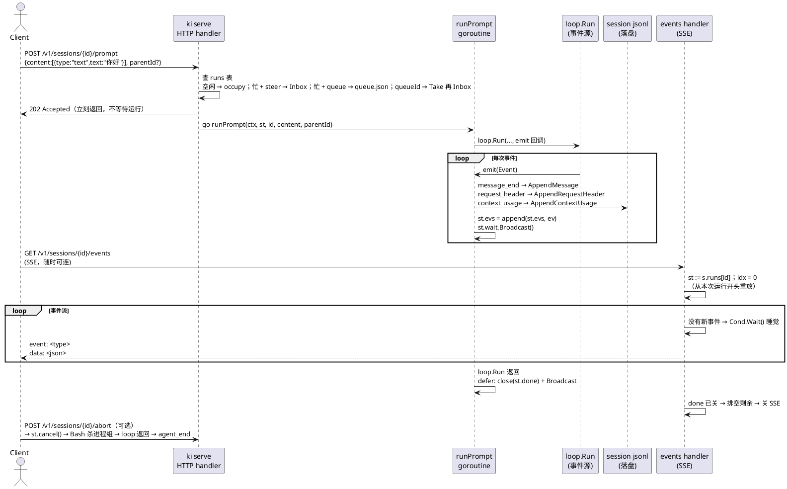
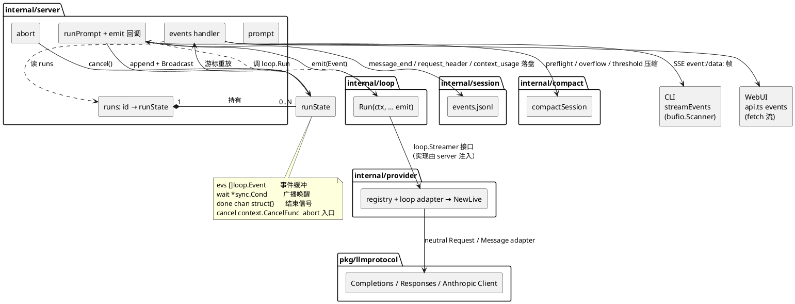

# 一次 prompt 怎么走

跨 `cli` → `server` → `loop` 的编排。包内不变量见各自 `doc.go`。

## 进程

- `ki`：后台启动或复用 HTTP server，尝试打开同源 WebUI。
- `ki serve [--addr]`：前台 HTTP，默认 `127.0.0.1:19800`，写 `~/.ki/server.json`（addr + token）。
- `ki serve -d`：后台启动或复用 server，CLI 退出后 server 继续运行。
- `ki run [flags] <text>`：client。`server.json` health 通则连；否则本进程听 `127.0.0.1:0`，退出带走。
- `ki session compact|fork --session <id>`：对已有 session 执行管理操作。
- `ki reload`：对已运行的 daemon 发 `POST /v1/reload`（不在本进程起 server）。
- `ki extension list`：列出全局发现的扩展。
- `ki provider login|logout <provider>`：provider 扩展登录 / 清除凭据。
- `ki config path` / `ki version`：查看配置位置和版本。
- CLI 命令和 flags 由 Cobra 管理；TOML 由 Viper 解析，只管理 server、session、compaction 和 logging 等运行参数。模型与供应商由 provider registry 的 `models.json` / `credentials.json` 管理。`ki serve --addr` 通过 Cobra flag 绑定到 Viper 的 `server.addr`，优先级高于配置文件和环境变量。

进程诊断日志由 `internal/logging` 初始化为 JSONL，同时写 stderr 和 `{KI_HOME}/ki.jsonl`；日志按大小轮转，默认保留 3 个备份，可由 `[log]` 的 `max_size_mb` / `max_backups` 调整。日志带 `pid` / `role`，禁止记录 API key、token、prompt 和文件内容。HTTP、prompt 后台任务和进程入口会记录 panic 值与 stack。

续聊必须 `--session <id>`。`--model` 随 prompt 发给 server，写回**该 session** 的 `config.json`，不改 toml。`KI_FAKE=1` 用假模型。

系统提示词由 `internal/prompt` 从预加载的资源快照纯渲染，其中含 ki 自身配置布局（`KI_HOME`、ki.toml、skills/、models.json 等路径，对应 pi 系统提示词里指向自身 docs 的段落；ki 是单二进制、无内置文档，所以直接列出路径）、项目/全局追加 system prompt、启用扩展的 `prompt.append`、运行 OS/架构、cwd 和本地日期时区。后面这些运行环境字段在 session 首次加载资源时计算一次，普通消息不会重复探测；reload 后随新快照更新。模型被问及"去哪改 server / 扩展 / skills 设置"时读这段，配合 `ki config path`。完整分层与缓存边界见 [system_prompt.md](system_prompt.md)。

`internal/resources.Loader` 由 Server 持有，把运行环境、skills、AGENTS/CLAUDE 和 prompt 模板合并成 session 级不可变快照。设置页没有 session，只用不缓存的 `Scan(cwd)` 展示配置。每轮 prompt 在渲染前准备当前 session 的 extension view；扩展工具与内置工具一起进入 prompt、loop 和 `request_header`，单个扩展失败不阻断本轮。

Provider 协议形状来自嵌入式离线 catalog、`{KI_HOME}/models.json` 和启用的 provider 扩展目录的合并结果。自定义 provider/model 和协议兼容字段通过设置 UI 或 provider API 管理；不从网络刷新目录。provider 扩展以进程级 sidecar 接管完整 streamer，普通 provider 仍由 ki 内置 HTTP adapter 处理；`--model provider/model` 只写回 session 配置。

每轮 `runPrompt` 解析模型后，将 `input` 和 `applyPatchToolType` 映射为 provider-neutral `tools.Profile`，再一次性构造本轮内置工具。`input` 含 `image` 才使用富媒体 `Read`；`applyPatchToolType=freeform` 使用 `apply_patch`，否则使用 `Write` + `Edit`。同一份工具集进入 prompt、loop 和 `request_header`，模型切换后的下一轮立即重建。provider 扩展收到完整 `loop.Request`，在 sidecar 内完成请求构造、传输和响应解析，Host adapter 只把紧凑事件还原成 loop 增量。

`Agent` 是同一工具链中的 session-scoped delegation：在工具调用所在 parent leaf 上执行 `session.ForkAt(..., forkMode=tree)`，注册 child 的 stable agent/task id 后由独立 `runState` 运行 `loop.RunMessage`。前台调用等待 child 完成并把最终 assistant 文本作为 tool result；后台调用立即返回 task id/output file，`TaskOutput` / `TaskStop` 通过统一 task store 查询或取消 shell 与 agent 任务。child 自己重新 Prepare 资源并拥有完整内置工具集，所以可递归形成 tree，但主会话为深度 0，Agent child 最多到深度 3，深度 3 不再暴露 `Agent`。`SendMessage` 对 live child 写入 Inbox，对 completed/stopped/interrupted child 复用原 transcript 续跑；child 旁的 `agent.json` 让 server 重启后能重建索引。

## HTTP

除 `GET /v1/health`、`GET /v1/auth/status` 和 `POST /v1/auth/login` 外，API 要么带 `Authorization: Bearer`，要么带 WebUI 登录后设置的 HttpOnly browser session cookie。浏览器写请求还要带 `X-Ki-CSRF`，CLI 继续使用 Bearer。非 `/v1` 路径是同域 WebUI，SPA HTML 不再注入 server token；登录时由用户显式输入 token，服务端换发短期 cookie。不要把 token 放进 URL。登录会话仅保存在 server 内存中，server 重启后失效。

| 方法 | 路径 | 作用 |
|---|---|---|
| GET | `/v1/auth/status` | 返回当前 browser session 是否已登录，不返回 token |
| POST | `/v1/auth/login` | 校验 body 中的 token，换发 HttpOnly browser session 和 CSRF cookie |
| POST | `/v1/auth/logout` | 清除当前 browser session 和 CSRF cookie |
| GET | `/v1/models` | registry 的可选模型扁平视图（含 `thinkingLevels` / `defaultThinking`） |
| GET/POST/PATCH/DELETE | `/v1/providers…` | provider、credential、OAuth login/logout 和 model 管理；扩展 provider 目录只读 |
| PUT | `/v1/default-model` | 显式记住上次选用的模型；WebUI 切模型时 server 也会写 |
| GET | `/v1/meta` | 上次选用的模型（不可用则第一个可用项）、该模型 default thinking、用户 home（无进程 cwd） |
| GET | `/v1/commands` | 按可选 `workspaceId` 扫描的内置、prompt template 和 skill 命令；用于尚未创建 session 的 WebUI composer |
| GET | `/v1/sessions` | 列出全部 session（含 title / running / workspaceId / pinned / parentSessionId / forkMode） |
| POST | `/v1/sessions` | 新建：`workspaceId` → `cwd` → 临时 `{KI_HOME}/workspace/tmp+…`；可选 `model` / `thinkingEffort`，省略则用上次选用的模型和该模型 default thinking。WebUI 传入当前 composer 的模型配置 |
| GET | `/v1/sessions/search` | 正文字面搜索普通/flat session，最多 20 条；tree child 通过全量 session list 的 Tree 浏览器访问 |
| GET | `/v1/sessions/{id}` | header、leaf、模型、`entries`、`messages`、running、只读 `availableSkills` / `availableExtensions` / `commands` / `queued` / `extQueued` / `extensionUi` / `runtime.ready`；并后台 Prepare 全局 extension 的 session view |
| PATCH | `/v1/sessions/{id}` | 写 `model` / `thinkingEffort` / `title` / `pinned` / `leafId` / `queued`（保留 id 列表） |
| DELETE | `/v1/sessions/{id}` | 删该会话目录 |
| POST | `/v1/sessions/{id}/prompt` | `content[]` + 可选 `parentId` / `delivery` / `queueId`；空闲 `202 started`；忙时 `steer` 插入本轮或 `queue` 排队，省略则用 `toggles.json` `message.busy`；`queueId`+`delivery=steer` 从 `queue.json` 取出插入本轮；`parentId` 且 busy 仍 **409** |
| GET/PATCH | `/v1/message` | 全局忙碌发送默认（`steer` / `queue`） |
| GET | `/v1/sessions/{id}/events` | SSE，按游标重放本次 run 的事件 |
| POST | `/v1/sessions/{id}/extension-ui` | 面板 action / submit / confirm / select 回传 sidecar |
| POST | `/v1/sessions/{id}/abort` | cancel |
| POST | `/v1/sessions/{id}/compact` | 手动 compaction（占 `s.runs`） |
| POST | `/v1/reload` | 清空闲 session 的资源快照并重载 extension catalog；body 可带 `sessionId` 只重载该 session |
| GET/PATCH | `/v1/skills` `/v1/extensions` | 全局启用开关（`toggles.json`） |
| GET/PATCH | `/v1/extensions/{name}/config` | 扩展配置（脱敏读写） |
| POST | `/v1/sessions/{id}/fork` | 以 `entryId` 新建 session 目录，只复制 root → target 路径；body 可传 `forkMode=flat|tree`，返回 `parentSessionId` / `forkMode`，删除时仅沿 tree 边级联 |
| POST | `/v1/sessions/{id}/attachments` | multipart `file`；内容寻址保存到该 session，返回结构化 content 引用 |
| GET | `/v1/workspaces` | 工作区登记（含 `sessionIds` / `temp`） |
| POST | `/v1/workspaces` | 登记 path（可 mkdir） |
| PATCH | `/v1/workspaces/{id}` | 改 title |
| DELETE | `/v1/workspaces/{id}` | 删组内会话日志和登记，不删工作区磁盘目录 |
| POST | `/v1/workspaces/{id}/move` | 工作区排序 |
| POST | `/v1/workspaces/{id}/sessions/move` | 组内会话排序 |
| GET | `/v1/fs` | 列目录；`files=1` 时也列普通文件供附件选择；`preview=1` 同源预览图片、文本/代码和 PDF |
| POST | `/v1/fs` | 在已有目录下建子文件夹 |

`message_end` 上 await 写 jsonl。`agent_end` 上按阈值自动 compact。SSE 在 run `done` 后先排空剩余事件，再结束（等待循环"先 `close(done)` 后 `Broadcast()`"的顺序协议有 TLA+ 模型验证，见 `spec/events-wait`）。

压缩有三个触发时机：

1. **preflight**：prompt 受理后、`loop.Run` 前，上下文已超阈值（resume/超大 prompt）就压缩一次，失败不阻断。
2. **overflow**：请求失败且错误匹配溢出正则表（`internal/loop/overflow.go`，对齐 pi `OVERFLOW_PATTERNS`，排除 rate-limit）→ `Hooks.OnContextOverflow`（server 实现 = 压缩 + 返回新上下文）→ 同 Run 内重建 history 重试一次（`_overflowRecoveryAttempted` 语义）。溢出错误不做指数退避重试（重发同量级请求必败）。`stopReason == "length"` 的工具调用全部拒执（参数可能截断，让模型重发）。
3. **threshold**：`agent_end` 后估算超阈值 → 压缩。估算优先用最后一条 assistant 的 usage（pi `calculateContextTokens`：`totalTokens`，回退 `input+output+cacheRead+cacheWrite`）再加 trailing 消息的 char/4，且带 stale 防护（usage 早于最近 compaction 则回退 char/4，避免刚压缩完再压缩）。

压缩三段化：`compact.Prepare`（纯函数：切点避开 toolResult、split-turn 前缀单独摘要、上次 retainedTail 虚拟展开参与切点、previousSummary 增量）→ `compact.Execute`（调模型）→ `session.AppendCompaction`（summary + retainedTail 落盘）。`compaction_start/end` 事件同时写 jsonl 与 SSE（`reason`: preflight/overflow/threshold）。

每次成功压缩都会对该 session 触发 reload：自动 compact 仍在 `runPrompt` 占用中，走 `requestReload`（排队到 `release`）；手动 `/compact` 在 `release` 之后 `reloadSession`。上下文已重建，下一次 `prompt.Build` 必须使用重读磁盘后的快照。`POST /v1/reload` 和 `/reload` 是全局/session reload 入口；忙时排队到对应 run 的 `release`。

阈值判定 `compact.ShouldRun(tokens, contextWindow, cfg)`：`tokens > contextWindow - reserveTokens`，窗口缺省 128000。`cfg.MaxContextTokens`（ki.toml `[compaction] max_context_tokens`）取 min 兜底——小于模型窗口时以它为准，小值让压缩提前触发（低成本测试不烧 token），0 = 只用模型窗口。

压缩 no-op 保护（对齐 pi `prepareCompaction` 返回 undefined）：切点预算（`keep_recent_tokens`，char/4 口径）装下整个对话时没有值得摘要的内容，`Prepare` 返回 `ErrNothingToCompact`——不调模型、不落盘；自动路径（A/D）静默跳过，手动 `/compact` 返回 409 "nothing to compact (session too small)"。

## 循环事件

```
agent_start
  turn_start
    message_start → message_end                       # user（仅首 turn）
    request_header                                    # system + tools + 模型/价格快照
    context_usage                                     # 请求前上下文占用
    message_start → message_update* → message_end     # assistant；期间可有 patch_apply_updated
    context_usage                                     # usage 返回后的上下文占用
    tool_execution_start → … → tool_execution_end
    message_start / message_end                       # toolResult
  turn_end
compaction_start / compaction_end                   # 溢出恢复时（reason=overflow）
agent_end
```

字段跟 pi；`patch_apply_updated` 是 apply_patch 输入仍在生成时的语法预览，不表示已经执行。写盘和 SSE 是 server 挂在 `emit` 上的订阅者，不进 loop 包。

`queue_changed` / `run_aborted` 是不推进消息 leaf 的 sideband 事件，沿同一 jsonl/SSE 通道发布；`steer_accepted` 只进当前 run 的 SSE（Inbox 收下、尚未 drain）。

## 时序

**图 1：一次 prompt 的时序**（POST 受理 → `loop.Run` 产事件 → 落盘 + 缓冲 → SSE 重放 → 结束）



`POST /prompt` 只受理（202），后台 goroutine 跑 `loop.Run`；`GET /events` 以 SSE 重放本次 run 的事件。事件先落盘（jsonl）再进缓冲，SSE 见到 `agent_end` 就关流。（见图 1）

## 包关系

**图 2：包关系**（server / runState / loop / session / compact / provider，以及 CLI / WebUI 两个消费者）



事件流方向与 import 方向相反：loop 只产事件（仅依赖 `types`），落盘、压缩、SSE 都是 server 挂在 `emit` 回调上的订阅者；模型实现经 `loop.Streamer` 接口注入。runState 是 server 包内类型，由 `runs` map 持有。空闲新 prompt occupy 并替换已结束的 runState；忙时 steer 写入 Inbox，queue 写入 `queue.json`，`queueId` 把已入队条目原子提升进 Inbox（原 occupy 已结束则放回头并 `queued` 或新 occupy），`parentId` 仍 409。（见图 2）
