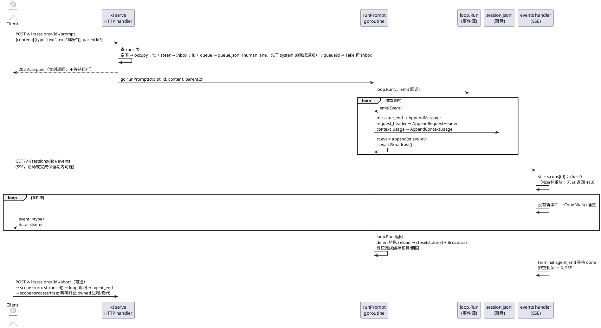
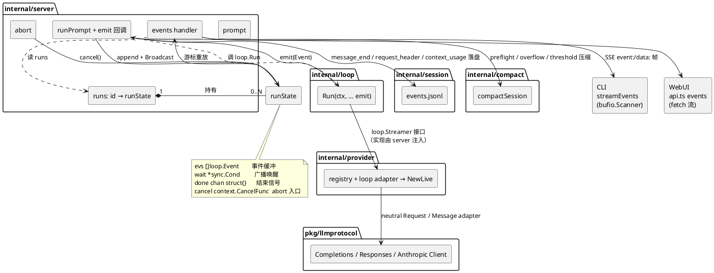

# 一次 prompt 怎么走

跨 `cli` → `server` → `loop` 的编排。包内不变量见各自 `doc.go`。

## 进程

- `ki`：后台启动或复用 HTTP server，尝试打开同源 WebUI。
- `ki serve [--addr]`：前台 HTTP，默认 `127.0.0.1:19800`，复用已有
  `~/.ki/server.json` 的 token（不存在时首次生成），并写回当前 addr + token。
- `ki serve -d`：后台启动或复用 server，CLI 退出后 server 继续运行。
- `ki run [flags] <text>`：client。`server.json` health 通则连；否则本进程听 `127.0.0.1:0`，退出带走。
- `ki session compact|fork --session <id>`：对已有 session 执行管理操作。
- `ki reload`：对已运行的 daemon 发 `POST /v1/reload`（不在本进程起 server）。
- `ki extension list`：列出全局发现的扩展。
- `ki provider login|logout <provider>`：provider 扩展登录 / 清除凭据。
- `ki config path` / `ki version`：查看配置位置和版本。
- CLI 命令和 flags 由 Cobra 管理；TOML 由 Viper 解析，只管理 server、session、compaction 和 logging 等运行参数。模型与供应商由 provider registry 的 `models.json` / `credentials.json` 管理。`ki serve --addr` 通过 Cobra flag 绑定到 Viper 的 `server.addr`，优先级高于配置文件和环境变量。

进程诊断日志由 `internal/logging` 初始化为 JSONL，同时写 stderr 和 `{KI_HOME}/ki.jsonl`；日志按大小轮转，默认保留 3 个备份，可由 `[log]` 的 `max_size_mb` / `max_backups` 调整。日志带 `pid` / `role`，禁止记录 API key、token、prompt 和文件内容。HTTP、prompt 后台任务和进程入口会记录 panic 值与 stack。每个 session 另有不进入消息树、API、SSE 或模型上下文的 `telemetry.jsonl`：每行是 OTLP/JSON `ExportLogsServiceRequest`，记录 model request 的 cache 前缀摘要与 usage、分类后的 tool outcome 和 run summary；只保存 hash、计数、状态和 trace/span ID，不保存 prompt、工具参数/结果、credential 或 opaque provider 内容。文件到 32 MiB 后保留一个 `.1` 备份，写入失败仅告警而不影响 run。

续聊必须 `--session <id>`。`--model` 随 prompt 发给 server，写回**该 session** 的 `config.json`，不改 toml。`KI_FAKE=1` 用假模型。

系统提示词由 `internal/prompt` 从预加载的资源快照纯渲染，其中含 ki 自身配置布局（`KI_HOME`、ki.toml、skills/、models.json 等路径，对应 pi 系统提示词里指向自身 docs 的段落；ki 是单二进制、无内置文档，所以直接列出路径）、内置追加指令（`prompt.DefaultAppendSystemPrompt`，搜索工具偏好）、global / project 两个叠加的 `APPEND_SYSTEM.md`、启用扩展的 `prompt.append`、运行 OS/架构、cwd 和本地日期时区。追加栈由 `prompt.AppendSection` 复用同一套 `appendBlocks` 渲染，设置页（`GET/PUT/DELETE /v1/prompt/append`）的预览与实际 prompt 因此不会漂移。后面这些运行环境字段在 session 首次加载资源时计算一次，普通消息不会重复探测；reload 后随新快照更新。模型被问及"去哪改 server / 扩展 / skills 设置"时读这段，配合 `ki config path`。完整分层与缓存边界见 [system_prompt.md](system_prompt.md)。

`internal/resources.Loader` 由 Server 持有，把运行环境、skills、AGENTS/CLAUDE 和 prompt 模板合并成 session 级不可变快照。设置页没有 session，只用不缓存的 `Scan(cwd)` 展示配置。每轮 prompt 在渲染前准备当前 session 的 extension view；扩展工具与内置工具一起进入 prompt、loop 和 `request_header`，单个扩展失败不阻断本轮。

Provider 协议形状来自嵌入式离线 catalog、`{KI_HOME}/models.json` 和启用的 provider 扩展目录的合并结果。自定义 provider/model 和协议兼容字段通过设置 UI 或 provider API 管理；不从网络刷新目录。provider 扩展以进程级 sidecar 接管完整 streamer，普通 provider 仍由 ki 内置 HTTP adapter 处理；`--model provider/model` 只写回 session 配置。

每轮 `runPrompt` 解析模型后，把 `input` 和 `applyPatchToolType` 映射为 provider-neutral `builtin.Profile`，再一次性构造本轮内置工具。GPT Responses 模型使用 native custom/freeform `apply_patch`，其它模型使用 `Write` + `Edit`，两组编辑器互斥；`input` 含 `image` 的模型使用富媒体 `Read`（带 `pages`）。同一份工具集进入 prompt、loop 和 `request_header`，模型切换后的下一轮立即重建。provider 扩展收到完整 `loop.Request`，在 sidecar 内完成请求构造、传输和响应解析，Host adapter 只把紧凑事件还原成 loop 增量。

`spawn_agent` 创建 `forkMode=tree` 的具名 child，继承 provider/model/cwd，并以独立 runState 异步执行 loop。`fork_turns` 默认 all，支持 none/N 个完整已完成 user turn；当前轮及 QueueOnly 消息不作为 fork 边界。身份信封包含 `/root/...` task path，system/tools 与 parent 前缀一致；没有固定深度限制。agent.Controller 按 root 限制活跃 child turn（默认 4），完成后释放容量并保留身份。send_message 先持久化 context queue 再唤醒 live Inbox，idle 时不启动模型；followup_task 接受显式工作，busy/容量满时持久排队并在名额释放时续跑。wait_agent 观察 mailbox/user steer，list/wait 不认领结果。每代次完成通知写入结构 parent，上下文交付在 transcript 持久化时按 taskId/generation 去重；idle parent 无自动新轮次。agent.json v3 恢复身份与 pending，shell handle 不恢复。exec_command/write_stdin 由 session 的 process.Manager 管理，工具等待取消不终止进程；turn/process/tree 的中止 scope 分别控制运行轮次、指定进程和结构后代。进度经 sideband JSONL、现有 SSE 和 session GET 的 processes/agents 投影传递。详见 [tools.md](tools.md)。

主进程缓存分开管理正文、结构索引和已完成回放：正文加权 LRU 64MiB（单会话 8MiB），轻量元数据/偏移索引 16MiB，完成回放 16MiB / 2 分钟；各最多 256 项。相同 request_header 的 system/tools 在当前对象生命周期内共享，索引/分页/compact 按偏移读取所选正文。活动模型 Session 仍需要完整上下文，缓存预算不冒充进程 RSS 上限。资源 reload 只读 header 定位 cwd，不为失效资源再打开完整历史。详细约束见 [session.md](session.md) 与 [events.md](events.md)。

## HTTP

除 `GET /v1/health`、`GET /v1/auth/status` 和 `POST /v1/auth/login` 外，API 要么带 `Authorization: Bearer`，要么带 WebUI 登录后设置的 HttpOnly browser session cookie。浏览器写请求还要带 `X-Ki-CSRF`，CLI 继续使用 Bearer。非 `/v1` 路径是同域 WebUI，SPA HTML 不再注入 server token；登录时由用户显式输入 token，服务端换发短期 cookie。不要把 token 放进 URL。登录会话仅保存在 server 内存中，server 重启后失效。

| 方法 | 路径 | 作用 |
|---|---|---|
| GET | `/v1/auth/status` | 返回当前 browser session 是否已登录，不返回 token |
| POST | `/v1/auth/login` | 校验 body 中的 token，换发 HttpOnly browser session 和 CSRF cookie |
| POST | `/v1/auth/logout` | 清除当前 browser session 和 CSRF cookie |
| GET | `/v1/models` | registry 的可选模型扁平视图（含 `thinkingLevels` / `defaultThinking`） |
| GET/POST/PATCH/DELETE | `/v1/providers…` | provider、credential、OAuth login/logout 和 model 管理；扩展 provider 目录只读 |
| PUT | `/v1/default-model` | 显式记住上次选用的模型；WebUI 切模型时 server 也会写 |
| GET | `/v1/meta` | 上次选用的模型（不可用则第一个可用项）、该模型 default thinking、用户 home（无进程 cwd） |
| GET | `/v1/commands` | 按可选 `workspaceId` 扫描的内置、prompt template 和 skill 命令；用于尚未创建 session 的 WebUI composer |
| GET | `/v1/sessions` | 列出全部 session（含 title / running / workspaceId / pinned / parentSessionId / forkMode）。每行只读 `config.json`、jsonl header 和 title fallback 的首条 user message，不解析整份 transcript；行按 `events.jsonl` / `config.json` 的 size+mtime 缓存。响应带按渲染结果计算的 `ETag`，客户端用 `If-None-Match` 命中时返回 `304`，未变时侧栏不刷新状态 |
| POST | `/v1/sessions` | 新建：`workspaceId` → `cwd` → 临时 `{KI_HOME}/workspace/tmp+…`；可选 `model` / `thinkingEffort`，省略则用上次选用的模型和该模型 default thinking。WebUI 传入当前 composer 的模型配置 |
| GET | `/v1/sessions/search` | 正文字面搜索普通/flat session，最多 20 条；tree child 通过全量 session list 的 Tree 浏览器访问 |
| GET | `/v1/sessions/{id}` | header、leaf、模型、slim `entries`（active leaf 最新一页，默认 100 条）、`hasMore` / `oldestId`、running、只读 `availableSkills` / `availableExtensions`（含已加载的 skills / tools / commands / promptAppend / providers） / `commands` / `queued` / `extQueued` / `extensionUi` / `runtime.ready`。整棵树的 `index`（无正文）只在 `fields=index` 时返回；比一次尾部读取还短的 session 随默认响应返回。查询：`fields=runtime` 省略 transcript；`entry` / `entries` 取全文；`before` + `limit` 取更早的 leaf 尾。不返回 `messages`。打开 session 时后台 Prepare 全局 extension 的 session view |
| PATCH | `/v1/sessions/{id}` | 写 `model` / `thinkingEffort` / `title` / `pinned` / `leafId` / `queued`（保留 id 列表）；run 或独立压缩占用 session 时，会改变上下文绑定的 `model` / `thinkingEffort` / `leafId` 返回 409，避免压缩准备后的 leaf 被并发推进 |
| DELETE | `/v1/sessions/{id}` | 删该会话目录 |
| POST | `/v1/sessions/{id}/prompt` | `content[]` + 可选 `parentId` / `delivery` / `queueId`；空闲 `202 started`；忙时 `steer` 插入本轮或 `queue` 排队，省略则用 `toggles.json` `message.busy`；`queueId`+`delivery=steer` 从 `queue.json` 取出插入本轮；`parentId` 且 busy 仍 **409** |
| GET/PATCH | `/v1/message` | 全局忙碌发送默认（`steer` / `queue`） |
| GET | `/v1/sessions/{id}/events` | SSE，按游标重放本次 run 的事件；完成回放受 16MiB / 2 分钟 / 256 run 限制，过期或无回放时现存 session 返回 410，客户端从 session GET 恢复 |
| POST | `/v1/sessions/{id}/extension-ui` | 面板 action / submit / confirm / select 回传 sidecar |
| POST | `/v1/sessions/{id}/abort` | cancel |
| POST | `/v1/sessions/{id}/compact` | 手动 compaction（占 `s.runs`） |
| POST | `/v1/reload` | 清空闲 session 的资源快照并重载 extension catalog；body 可带 `sessionId` 只重载该 session |
| GET/PATCH | `/v1/tools` `/v1/skills` `/v1/extensions` | 全局启用开关（`toggles.json`）；tools 只管理内置工具 |
| GET/PATCH | `/v1/extensions/{name}/config` | 扩展配置（脱敏读写） |
| POST | `/v1/sessions/{id}/fork` | 以 `entryId` 新建 session 目录，只复制 root → target 路径；body 可传 `forkMode=flat|tree`，返回 `parentSessionId` / `forkMode`，删除时仅沿 tree 边级联。带 `entryId` 时运行中也可 fork（复制的是已落盘的完整前缀）；省略 `entryId`（fork 活动 leaf）且会话运行中仍 **409** |
| POST | `/v1/sessions/{id}/attachments` | multipart `file`；内容寻址保存到该 session，返回结构化 content 引用 |
| GET | `/v1/workspaces` | 工作区登记（含 `sessionIds` / `temp`） |
| POST | `/v1/workspaces` | 登记 path（可 mkdir） |
| PATCH | `/v1/workspaces/{id}` | 改 title |
| DELETE | `/v1/workspaces/{id}` | 删组内会话日志和登记，不删工作区磁盘目录 |
| POST | `/v1/workspaces/{id}/move` | 工作区排序 |
| POST | `/v1/workspaces/{id}/sessions/move` | 组内会话排序 |
| GET | `/v1/fs` | 列目录；`files=1` 时也列普通文件供附件选择；`preview=1` 同源预览图片、文本/代码和 PDF |
| POST | `/v1/fs` | 在已有目录下建子文件夹 |

`message_end` 上 await 写 jsonl。未启用 provider inline compaction 时，阈值检查发生在一个完整工具批次及其 tool results 落盘之后、下一次模型请求之前；`agent_end` 后不压缩。SSE reader 在 run 锁之外投影 typed message 并编码 patch，每次 write/flush 最多等待 30s；慢连接不占用事件漏斗。buffer 只在入队时计量 payload，debug 采样记录排队、编码与写入耗时。WebUI 按顺序解码、逐帧合并显示，终态立即 flush；可见身份与持久化 entryId 分开，使定稿不重挂载正文。SSE 在 run `done` 后先排空剩余事件，再结束（等待循环"先 `close(done)` 后 `Broadcast()`"的顺序协议有 TLA+ 模型验证，见 `spec/events-wait`）。

压缩有三个触发时机：

1. **preflight**：prompt 受理后、`loop.Run` 前，上下文已超阈值（resume/超大 prompt）就压缩一次，失败不阻断。
2. **overflow**：请求失败且错误匹配溢出正则表（`internal/loop/overflow.go`，对齐 pi `OVERFLOW_PATTERNS`，排除 rate-limit）→ `Hooks.OnContextOverflow(ctx, failedRequest)`（server 收到真实 system/messages/Responses prefix，压缩后返回完整 `ModelContext`）→ 同 Run 内同时替换 portable history 和 opaque prefix，再重试一次（`_overflowRecoveryAttempted` 语义）。溢出错误不做指数退避重试（重发同量级请求必败）。`stopReason == "length"` 的工具调用全部拒执（参数可能截断，让模型重发）。
3. **threshold**：仍需继续请求模型的工具轮在 tool call/result 完整落盘后估算超阈值 → 原地压缩并用新 context 进入下一轮；临时失败会在后续工具轮重试，同一 run 连续失败 3 次后停止主动尝试并保留 overflow recovery，extension cancel/空计划不重试。估算优先用最后一条 assistant 的 usage（pi `calculateContextTokens`：`totalTokens`，回退 `input+output+cacheRead+cacheWrite`）再加 trailing 消息；remote checkpoint 因模型/credential/protocol 失配而展开成 portable history 时，旧 checkpoint-scoped usage 必须失效并改用完整序列化历史估算。run 没有下一模型轮或已经到 `agent_end` 时不做 threshold 压缩。

`[compaction] mode` 为 `auto`（默认）、`local` 或 `remote`。模型目录用独立能力声明 standalone 与 inline，例如 OpenAI 为 `compaction:{standalone:"openai",inline:"openai"}`，Codex OAuth 为 `compaction:{standalone:"codex-v2"}`；不能由 `api:"responses"` 或模型名推断。`auto` 优先 standalone（OpenAI `POST /responses/compact` 或 Codex 普通 `/responses` + `compaction_trigger`），失败回退本地摘要；若 provider-facing messages 已被扩展改变，则失败而不回退到未变换的历史。`remote` 是 strict：能力缺失、custom local result/instructions、RPC 或持久化失败都会明确失败。opaque checkpoint 按 provider/API/base URL/model/实际请求 credential/compaction protocol 隔离。

显式压缩统一走 `Intent → Prepare → session_before_compact → Execute strategy → Validate → Commit`。`compact.PrepareWithIntent` 是纯规划；`compact.GenerateWithInputLimit` 调摘要模型，超过有效输入预算时按 UTF-8 字节上界分块，以最多 4 个并发 map 请求生成有长度约束的 partial checkpoint，再层次归并；`compact.Commit` 校验结果并用 `sourceLeafId` 原子拒绝过期 plan。hook 在 Prepare 后收到 portable preparation，可 cancel 或返回 `{result:{summary,usage?,details?}}`；Host 始终控制 cut、retained tail 和 tokensBefore。remote 的 request preparation、provider execution 与 expected-leaf commit 同样分阶段。`/compact [instructions]`、CLI `session compact [instructions]` 与 HTTP `{instructions}` 把要求加入本地摘要 prompt。

`[compaction] server_side=true`（默认）只对 `compaction.inline:"openai"` 的 Responses 模型发送 `context_management`；standalone-only 模型不会启用，也不能用私有 `responsesItems` 注入 inline checkpoint。阈值为有效模型窗口减 `reserve_tokens`。这类模型关闭 host preflight/threshold，overflow 和手动 `/compact` 仍看 standalone 能力。completed terminal raw suffix 与 assistant 原子提交；failed/incomplete/cancelled output 不提升，opaque 内容不进入普通 message、SSE、WebUI、CLI 或 lifecycle payload。

每次成功压缩都会对该 session 触发 reload：压缩发生在 prompt 或手动 `/compact` 的 occupy 中，统一走 `requestReload`，排队到匹配的 `release`。上下文已重建，下一次 `prompt.Build` 必须使用重读磁盘后的快照。`POST /v1/reload` 和 `/reload` 是全局/session reload 入口；忙时排队到对应 run 的 `release`。设置页写入或删除 `APPEND_SYSTEM.md` 后同样走一次全局 reload，否则改了文件的下一次 prompt 仍会用缓存里的旧快照。run 之外的手动 `/compact` 完成后立即重算并追加 `context_usage`（char/4，加上最后一次 `request_header` 的 system/tools 估算）并经 push 下发；run 内 threshold 会在下一次 `request_header` 立即产生新 meter。空闲 session 切换模型也按新 binding 立即重算，不能继续展示旧 remote checkpoint 的 usage。

host 阈值判定 `compact.ShouldRun(tokens, contextWindow, cfg)`：`tokens > contextWindow - reserveTokens`，窗口缺省 128000。`cfg.MaxContextTokens`（ki.toml `[compaction] max_context_tokens`）取 min 兜底——小于模型窗口时以它为准，小值让压缩提前触发（低成本测试不烧 token），0 = 只用模型窗口；同一个有效窗口也用于 server-side `compact_threshold`。

压缩 no-op 保护（对齐 pi `prepareCompaction` 返回 undefined）：切点预算（`keep_recent_tokens`，char/4 口径）装下整个对话时没有值得摘要的内容，`Prepare` 返回 `ErrNothingToCompact`——不调模型、不落盘；自动路径（A/D）静默跳过，手动 `/compact` 返回 409 "nothing to compact (session too small)"。

## 循环事件

```
agent_start
  turn_start
    message_start → message_end                       # user（仅首 turn）
    request_header                                    # system + tools + 模型/价格快照
    context_usage                                     # 请求前上下文占用
    message_start → message_update* → message_end     # assistant；期间可有 patch_apply_updated
    context_usage                                     # usage 返回后的上下文占用
    tool_execution_start → … → tool_execution_end
    message_start / message_end                       # toolResult
  turn_end
compaction_start / compaction_end                   # 溢出恢复时（reason=overflow）
agent_end
```

字段跟 pi；`patch_apply_updated` 是 apply_patch 输入仍在生成时的语法预览，不表示已经执行。写盘和 SSE 是 server 挂在 `emit` 上的订阅者，不进 loop 包。

`queue_changed` / `run_aborted` 是不推进消息 leaf 的 sideband 事件，沿同一 jsonl/SSE 通道发布；`steer_accepted` 只进当前 run 的 SSE（Inbox 收下、尚未 drain）。run 在 drain 前被 abort 时，待处理 steer 会在 `release` 前作为未回复的 user turn 落到 jsonl，用户消息不会随本轮取消丢失。

## 时序

**图 1：一次 prompt 的时序**（POST 受理 → `loop.Run` 产事件 → 落盘 + 缓冲 → SSE 重放 → 结束）


```plantuml
@startuml
actor Client as C
participant "ki serve\nHTTP handler" as S
participant "runPrompt\ngoroutine" as R
participant "loop.Run\n(事件源)" as L
participant "session jsonl\n(落盘)" as F
participant "events handler\n(SSE)" as E

C -> S : POST /v1/sessions/{id}/prompt\n{content:[{type:"text",text:"你好"}], parentId?}
S -> S : 查 runs 表\n空闲 → occupy；忙 + steer → Inbox；忙 + queue → queue.json（human lane，先于 system 的完成通知）；queueId → Take 再 Inbox
S --> C : 202 Accepted（立刻返回，不等待运行）
S -> R : go runPrompt(ctx, st, id, content, parentId)

R -> L : loop.Run(..., emit 回调)
loop 每次事件
  L -> R : emit(Event)
  R -> F : message_end → AppendMessage\nrequest_header → AppendRequestHeader\ncontext_usage → AppendContextUsage
  R -> R : st.evs = append(st.evs, ev)\nst.wait.Broadcast()
end

C -> E : GET /v1/sessions/{id}/events\n(SSE，活动或完成保留期内可连)
E -> E : st := s.runs[id]；idx = 0\n（按游标重放；无 st 返回 410）
loop 事件流
  E -> E : 没有新事件 → Cond.Wait() 睡觉
  E --> C : event: <type>\ndata: <json>
end

R -> R : loop.Run 返回\ndefer: 排队 reload → close(st.done) + Broadcast\n登记完成缓存预算/期限
E -> E : terminal agent_end 等待 done\n排空剩余 → 关 SSE

C -> S : POST /v1/sessions/{id}/abort（可选）\n→ scope=turn: st.cancel() → loop 返回 → agent_end\n→ scope=process/tree: 明确终止 owned 进程/后代
@enduml
```

`POST /prompt` 只受理（202），后台 goroutine 跑 `loop.Run`；`GET /events` 以 SSE 重放本次 run 的事件。事件先落盘（jsonl）再进缓冲，SSE 见到 `agent_end` 就关流。（见图 1）

工具子系统按契约、适配和运行时分开：`tool` 提供接口、schema、注册与命名，`tool/builtin` 组装 file/shell/agent 三组适配器；agent 身份与调度由 `internal/agent` 管理，终端进程由 `internal/process` 管理。server 注入各运行时并把 loop 事件投影为 agent 进度；shell 适配器显式传递进程调用身份。运行时不反向依赖 loop 或工具实现；sidecar 直接复用 process 的进程组控制。详见 [tools.md](tools.md#模块边界)。

## 包关系

**图 2：包关系**（server / runState / loop / session / compact / provider，以及 CLI / WebUI 两个消费者）


```plantuml
@startuml
skinparam componentStyle rectangle

' ==== 消费者：只走 SSE ====
[CLI\nstreamEvents\n(bufio.Scanner)] as CLI
[WebUI\napi.ts events\n(fetch 流)] as WEB

' ==== 组装者：server 包 ====
package "internal/server" {
  [prompt] as PROMPT
  [runPrompt + emit 回调] as RUNP
  [events handler] as EV
  [abort] as ABORT
  [runs: id → runState] as RUNS
}

' ==== runState（server 包内类型）：一次运行的直播录像 ====
[runState] as RS
note bottom of RS
  evs []loop.Event        事件缓冲
  wait *sync.Cond         广播唤醒
  done chan struct{}      结束信号
  cancel context.CancelFunc  abort 入口
end note

' ==== 事件源：loop 包（依赖中立工具契约、输出策略与 types）====
package "internal/loop" {
  [Run(ctx, … emit)] as RUN
}

' ==== 订阅端 ====
package "internal/session" {
  [events.jsonl] as JSONL
}
package "internal/compact" {
  [compactSession] as COMPACT
}
package "internal/provider" {
  [registry + loop adapter → NewLive] as LIVE
}
package "pkg/llmprotocol" {
  [Completions / Responses / Anthropic Client] as PROTOCOL
}

' ---- 组合 / 编译期依赖 ----
RUNS "1" *-- "0..N" RS : 持有
RUNP ..> RUN : 调 loop.Run
EV ..> RUNS : 读 runs

' ---- 运行期数据流 ----
RUN --> RUNP : emit(Event)
RUNP --> JSONL : message_end / request_header / context_usage 落盘
RUNP --> RS : append + Broadcast
RS --> EV : 游标重放
EV --> CLI : SSE event:/data: 帧
EV --> WEB
ABORT --> RS : cancel()
RUN --> LIVE : loop.Streamer 接口\n（实现由 server 注入）
LIVE --> PROTOCOL : neutral Request / Message adapter
RUNP --> COMPACT : preflight / overflow / threshold 压缩
@enduml
```

事件流方向与 import 方向相反：loop 产生事件，依赖中立的 `tool` 契约、`tool/output` 输出策略、`types` 和诊断能力，落盘、压缩、SSE 都是 server 挂在 `emit` 回调上的订阅者；模型实现经 `loop.Streamer` 接口注入。每轮 run 只有一个事件漏斗（`internal/server/emit.go` 的 `runEmitter`），它按固定顺序把事件喂给各订阅者：jsonl 落盘 → runState 缓冲（SSE 重放）→ WebUI push（仅终态帧）→ 扩展 lifecycle 通知，之后是 context meter 与 `agent_end` 的阈值压缩。这个顺序是契约，所以漏斗始终是 loop 所在 goroutine 上的一条同步调用链，任何一级都不得另起 goroutine（`agent_settled` 越过 `message_end` 的教训见 `notifyExtensions`）。同一份事件还要携带 run 身份：`runId` 与 `external` 由 `buffer` 写回**调用方那个事件**（因此它取指针），而不是只写在缓冲副本上，因为其后的 WebUI 终态帧与扩展 lifecycle 通知读的是同一个事件，订阅者认不出归属就只能丢弃——渠道扩展收到空 `runId` 时不会回复（教训见 `docs/postmortem/2026-09-24-extension-events-lost-run-identity.md`）。runState 是 server 包内类型，由 `runs` map 持有。空闲新 prompt occupy 并替换已结束的 runState；忙时 steer 写入 Inbox，queue 写入 `queue.json`，`queueId` 把已入队条目原子提升进 Inbox（原 occupy 已结束则放回头并 `queued` 或新 occupy），`parentId` 仍 409。（见图 2）
