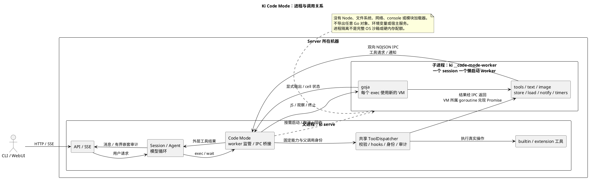

# Code Mode

Ki 使用 **goja + 同一二进制的 session-scoped worker** 实现 JavaScript 工具编排。JS 在 server 所在机器的子进程执行，不在浏览器执行，也不依赖 Node/Bun。

## 配置

固定使用 `mixed`，保留直接工具并添加 `exec/wait`；Settings 和 TOML 均不再提供模式选择。旧 `[code_mode]` TOML 表作为未知配置被拒绝，需删除；`toggles.json` 的旧覆盖通过 v3 迁移移除。

嵌套工具来自本次 occupy 的内置开关、extension Prepare、MCP 允许目录与 activeTools 过滤后的快照。设置页始终列出 `exec/wait`，可分别关闭；正在运行的代码和模型请求保持占用时的工具集合。

MCP 声明仅在有可用 search_tool 时 Deferred：最初省略 exec 描述中的完整声明，搜索后按需补充；JS tools/ALL_TOOLS 自始拥有全部允许能力，不需要动态更新 VM。search_tool 不作为嵌套 JS 方法；关闭搜索则直接披露全部允许声明。官方 SDK、配置及回退规则见 [mcp.md](mcp.md)。

既有 `GET /v1/tools` 返回 `{items, mcp}`；`PATCH /v1/tools` 只接受可选的 `disabled` 和 `mcpDisabled`，省略字段保持已有值，未知字段被拒绝。写入使用状态文件的原子/版本检查，未知新版本不能被覆盖。

## 进程关系



发布 schemas 不占 worker 名额。第一次实际调用才创建逻辑 session，第一次 `exec` 才启动进程；后续 occupy 复用已提交的内存 store。worker 在 session 删除、runtime 关闭或 server shutdown 时回收。进程故障不会自动重启或重放有副作用的 JS。

## 执行契约

Responses 的 `exec` 接收 raw JS；其它协议使用 `{code: "…"}`。两者均可使用首行 pragma：

```javascript
// @exec: {"yield_time_ms": 10000, "max_output_tokens": 10000}
const result = await tools.read({file_path: "/absolute/project/go.mod"});
text(result.content.filter(item => item.type === "text").map(item => item.text).join("\n"));
```

`exec` 以 async function body 执行，因此支持 await，不是完整 ES module。只接受 pragma 中的两个字段，必须为非负 JS-safe integer；显式零有效，空源码和没有后续源码的 pragma 拒绝。

- `tools.xxx(object)` 用于 function 工具，`tools.xxx(string)` 用于 freeform 工具，返回 Promise。
- 结果为 `{content, details, isError, terminate?}`。工具自身错误通过 `isError` 表示；RPC、审计或输出策略失败使 cell 失败，不允许 catch 后继续有副作用的调用。
- `ALL_TOOLS` 为 `{name, description}` 元数据；exec 描述包含嵌套工具的输入 schema/字符串要求。不支持 Codex 的 deferred tool search 或 TS 声明渲染。
- `text(value)` 显式输出，`image(dataURLOrImageBlock)` 转发内嵌图片；`generatedImage({image_url, output_hint?})` 同样不接受 HTTP URL 或文件路径。未显式输出的表达式值不返回模型。
- `exit()` 成功结束当前代码；pending timers 不单独维持存活。正常完成取消并 join 未 await 的工具调用，不能留下无审计归属的后台操作。
- `setTimeout/clearTimeout` 与工具 Promise 完成均由该 VM 的单一 goroutine 驱动；其它 goroutine 不并发访问 VM。
- `store/load` 保存 JSON 值。cell 启动时读取快照，cell 内写入立即可读，完成（包括 JS 错误）才向共享 store 提交；yield 不提交，取消/终止丢弃写入。并发 cell 看到各自快照，后完成的写入覆盖同名键。

`exec` 返回 `Script completed`、`Script failed`、`Script terminated` 或 `Script running with cell ID …`。running 时使用：

```json
{"cell_id":"cell-1","yield_time_ms":10000,"max_tokens":10000,"terminate":false}
```

`wait` 只返回新增输出；`terminate=true` 请求终止。`yield_control()` 提前返回当前输出但不结束脚本。默认观察时间 10 秒，最大 60 秒；观察期限与脚本生命周期不同。每次观察消费当前输出，超预算文本按 UTF-8 边界截断并报告截断，不把已完成脚本伪装成仍在运行。

## 工具策略和历史

嵌套调用与普通调用共用 dispatcher：解析名称 → 校验 → BeforeTool → 执行身份/progress → AfterTool → 遥测/审计。JS 获得 post-hook 的完整中间结果，受独立 RPC 预算约束，不能拿模型预览冒充完整结果；持久化/SSE 使用有界的独立副本，包含有界 args、details 和 progress。

只有外层 provider-issued exec/wait 生成 transcript toolResult。嵌套 start/update/end 通过现有事件目录持久化，带父调用、cell 和父进程分配的调用身份；SSE 与历史重建同一张工具卡片。事件漏斗串行化 callback 与模型事件，不跨工具执行持有漏斗锁。

occupy 结束取消并 join 所有 cell 与父进程 callback，先于 hooks、telemetry、session 和 release 关闭。已提交 store 留在 worker，但旧 occupy 的工具、身份和 callback 不跨轮复用。shell 的 session-owned 进程保持已有生命周期，取消 JS 等待不等于杀掉合法启动的 shell。

## 限制和相对 Codex 的差异

- 默认最多 32 个逻辑 worker session、每 session 64 个未关闭 cell / 8 个并发执行 cell。名额在关闭 session 时释放。
- 源码 256KiB，IPC frame 16MiB，单次中间结果和每 cell 总输出分别 8MiB；store 4MiB / 1024 keys。
- 每 cell 最多 512 次工具调用 / 32 个 pending calls / 128 个 timers，调用栈深度 1024，执行期限 5 分钟。普通完成不延长该期限。
- 输出 tokens 使用 Ki 的四 UTF-8 字节估计，并受 runtime 字节上限及最终 outer spool 约束，不使用 Codex tokenizer。
- goja 没有每 VM 硬堆配额。上述字节/调用预算不冒充整个 worker RSS 限制；终止时 native builtin 无法及时中断，由父进程 cleanup watchdog 终止 worker，仍 join 父进程持有的 callback。
- `notify` 即时发送有归属的进度，文本在下次 exec/wait 观察返回，**不注入 Codex 的额外 custom_tool_call_output**，保持三个 provider 的配对消息契约。
- 活跃 cell 不跨 occupy 存活；store 不写磁盘，不随 fork/server 重启恢复。Codex 的远程 gRPC host、audio 和内部 execute-to-pending API 不在本版中。

## 测试

逻辑、跨协议和取消语义使用 Go/Bun 单元测试，IPC/服务端测试复用同一个 test binary 作 worker，不为每例重复构建，也不依赖固定 sleep。实测强制运行的 runtime 包约 0.13 秒，服务端 Code Mode 集成约 0.43 秒；WebUI 相关单元由 66 例 / 0.11 秒增至 74 例 / 0.15 秒。增加成本用于真实子进程、callback 取消/join 屏障和审计重建，不以省略断言换速度。

完整验证为 fresh WebUI typecheck/build 后的 `go test -tags embed -count=1 ./...`（含已安装的 Bun/Chromium 测试，约 53.5 秒），以及 runtime/loop/server/session race 检查、三个支持目标的无 CGO embed 构建和真实 `ki` worker 入口 smoke。此处耗时只是当前机器的观测，不是运行性能承诺。

Settings 模式切换新增 7 个 Go 服务端用例（约 0.27 秒，race 约 2.7 秒）和 1 个独立浏览器用例（约 3 秒，含启动命令约 4.5 秒）。浏览器覆盖原生 select/触屏尺寸、保存失败与 reload，纯数据校验、并发部分更新和运行中快照留在便宜的 Go 测试中；既有工具开关测试保留。
