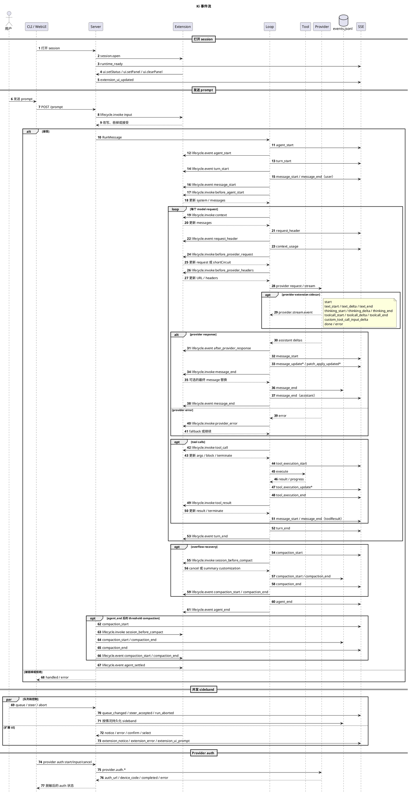

# 事件目录

本文汇总 ki 当前使用的事件名。HTTP SSE 的事件名同时出现在 `event:`
字段和 JSON 的 `type` 字段中。`lifecycle.event`、`provider.stream.event`
等 RPC 方法名只是传输方式，不是事件名。

## 事件通道

| 通道 | 方向 | 事件名来源 |
|---|---|---|
| Session SSE / `loop.Event` | server → CLI/WebUI | 下表的 `type`，也承载 session sideband |
| Extension lifecycle | host → extension sidecar | `lifecycle.invoke`（同步）或 `lifecycle.event`（异步） |
| Provider stream | provider sidecar → host | `provider.stream.event.type` |
| Provider auth | provider sidecar → host | `provider.auth.event.type` |
| WebUI 通知 | server → WebUI | `extension_ui_updated` |

## Session SSE 事件

以下是 Host 侧的 session 事件名。一次运行通常按时序图中的顺序发生；
sideband 事件可以并发到达。

| 分组 | 事件名 | 含义 |
|---|---|---|
| Run 和 turn | `agent_start`、`agent_end`、`turn_start`、`turn_end` | Run/turn 边界；`agent_end` 结束普通运行 SSE 回放。 |
| 请求 | `request_header`、`context_usage` | 面向模型的 system/tools 快照和上下文压力。 |
| 消息 | `message_start`、`message_update`、`message_end` | 用户、assistant、tool result 消息；assistant 增量通过 update 流式发送。 |
| 工具执行 | `tool_execution_start`、`tool_execution_update`、`tool_execution_end` | 工具开始、进度和结束。 |
| Patch 预览 | `patch_apply_updated` | `apply_patch` 参数仍在生成时的非执行预览。 |
| 压缩 | `compaction_start`、`compaction_end` | preflight、overflow recovery 或 threshold 压缩。 |
| 队列和控制 | `queue_changed`、`steer_accepted`、`run_aborted` | 队列变化、实时 Inbox 接收和中止；`steer_accepted` 不是 JSONL leaf。 |
| 扩展 UI/状态 | `extension_error`、`extension_notice`、`extension_ui_prompt` | 扩展失败、toast，或 WebUI 确认/选择弹层。 |
| Runtime | `runtime_ready` | session 打开时的扩展视图准备结束；成功或失败都会解锁 session。 |
| 仅扩展生命周期 | `agent_settled` | `agent_end` 后 Host 收尾完成；发送给 lifecycle subscriber，不进入普通运行 SSE。 |
| WebUI 通知 | `extension_ui_updated` | 扩展 status/panel/prompt 投影变化；客户端重新读取 session。它不是 `loop.EventType` 常量。 |

`message_end`、`request_header`、`context_usage`、压缩事件、工具进度、
Patch 预览和部分 sideband 会按各自的 server 路径持久化。并非每个 SSE
事件都会推进 conversation leaf。

## Extension lifecycle 事件

只有下列事件名可以被扩展订阅。`sync` 可以影响当前操作；`async` 是持久化
和 SSE 之后发送的通知。

| 模式 | 事件名 |
|---|---|
| Sync 和 async | `before_agent_start`、`context`、`before_provider_request`、`before_provider_headers`、`provider_error`、`tool_call`、`tool_result`、`input`、`message_end`、`session_before_compact` |
| 仅 async | `after_provider_response`、`agent_start`、`agent_end`、`agent_settled`、`turn_start`、`turn_end`、`message_start`、`message_update`、`request_header`、`tool_execution_start`、`tool_execution_end`、`compaction_start`、`compaction_end`、`queue_changed`、`steer_accepted`、`run_aborted` |

`provider_error` 的 sync 订阅只有扩展在 `initialize` 中声明 `fallback` 时才
能介入错误处理。

assistant 的 `message_end` 可能带 `stopReason=error`、`errorMessage` 和
`isError=true`；扩展应丢弃此前收到的 partial 文本并展示错误信息，不应把
partial 当作成功回复。

同一 run 的 async lifecycle 通知按 loop 产生顺序写入 sidecar：各次
`message_start/update/end` 不会被该 run 的 `agent_settled` 越过。async
表示 Host 不等待扩展完成外部 I/O，不表示事件可以乱序。

`tool_execution_update`、`context_usage`、
`patch_apply_updated`、`extension_error`、`extension_notice`、
`extension_ui_prompt`、`runtime_ready` 和 `extension_ui_updated` 不是
lifecycle 订阅点。

## Provider sidecar 事件

### `provider.stream.event.type`

`start`；`text_start`、`text_delta`、`text_end`；`thinking_start`、
`thinking_delta`、`thinking_end`；`toolcall_start`、`toolcall_delta`、
`toolcall_end`；`custom_tool_call_input_delta`；`done`；`error`。

`done` 可以携带最终 message。Host 会把 stream event 转换成 loop 的
`message_update` 事件。

Anthropic、Responses、Completions 的原始 provider SSE 事件只在
`pkg/llmprotocol` 内部解析，不属于 ki 对外的事件契约；协议细节见
[`provider.md`](provider.md)。

### `provider.auth.event.type`

`auth_url`、`device_code`、`completed`、`error`。

credential 只在 sidecar 和 Host auth broker 之间传递，不会出现在 WebUI
或 session SSE 事件中。

## 时序图

`alt` 和 `par` 表示可选或并行分支；带 `*` 的事件可以重复发生。

