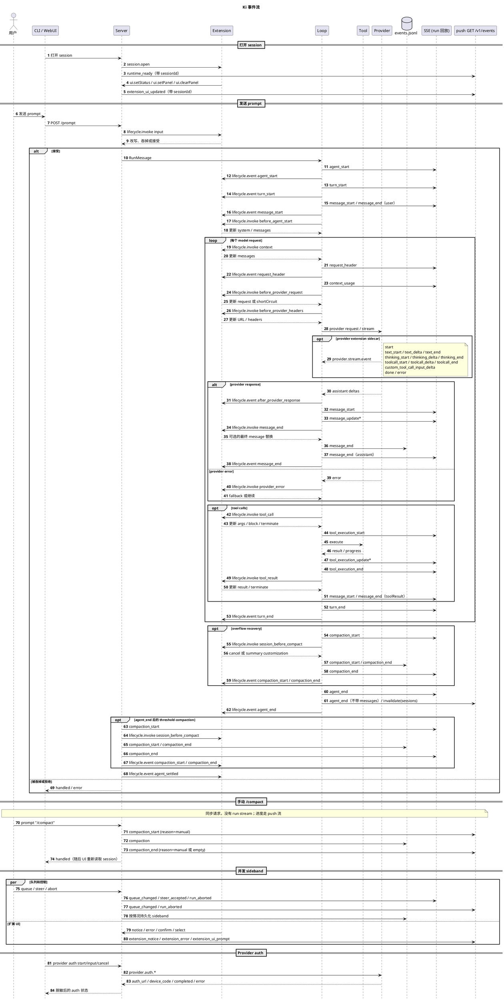

# 事件目录

本文汇总 ki 当前使用的事件名。HTTP SSE 的事件名同时出现在 `event:`
字段和 JSON 的 `type` 字段中。`lifecycle.event`、`provider.stream.event`
等 RPC 方法名只是传输方式，不是事件名。

## 事件通道

| 通道 | 方向 | 事件名来源 |
|---|---|---|
| Session SSE / `loop.Event` | server → CLI/WebUI | 下表的 `type`，也承载 session sideband |
| Extension lifecycle | host → extension sidecar | `lifecycle.invoke`（同步）或 `lifecycle.event`（异步） |
| Provider stream | provider sidecar → host | `provider.stream.event.type` |
| Provider auth | provider sidecar → host | `provider.auth.event.type` |
| WebUI push / `GET /v1/events` | server → WebUI | 每个 tab 一条：`invalidate`（`scope` = `sessions` / `workspaces` / `providers` / `extensions`，只表示"去重取"，数据仍走原 REST）与 `ready`；以及带 `sessionId` 的 session sideband：`extension_ui_updated`、`runtime_ready`、`run_aborted`、`queue_changed`、`compaction_start`/`compaction_end`、run 结束的 `agent_end`、以及 run 之外压缩（手动 `/compact`、threshold 自动压缩）后立即重算的 `context_usage`。这些不进 occupy 回放（`ready` 后客户端自行全量重取，重连靠它追平）；WebUI 用它们刷新侧栏、workspaces、扩展目录，并给后台完成的 session 发系统通知 |

## Session SSE 事件

以下是 Host 侧的 session 事件名。一次运行通常按时序图中的顺序发生；
sideband 事件可以并发到达。

| 分组 | 事件名 | 含义 |
|---|---|---|
| Run 和 turn | `agent_start`、`agent_end`、`turn_start`、`turn_end` | Run/turn 边界；`agent_end` 结束普通运行 SSE 回放。 |
| 请求 | `request_header`、`context_usage` | 面向模型的 system/tools 快照和上下文压力。 |
| 消息 | `message_start`、`message_update`、`message_end` | 用户、assistant、tool result 消息；assistant 增量通过 update 流式发送。 |
| 工具执行 | `tool_execution_start`、`tool_execution_update`、`tool_execution_end` | 工具开始、进度和结束。 |
| 压缩 | `compaction_start`、`compaction_end` | preflight、overflow recovery、threshold，以及手动 `/compact` 压缩。 |
| 队列和控制 | `queue_changed`、`steer_accepted`、`run_aborted` | 队列变化、实时 Inbox 接收和中止；`steer_accepted` 不是 JSONL leaf（run 在 drain 前被 abort 时，待处理 steer 会作为未回复的 user turn 落盘）。parent 的 run 还活着时，子代理完成通知也走这条 Inbox 路径（于是它以 `steer_accepted` 先到 push、随后由 drain 产生 `message_*`），run 已结束才落到 `queue_changed` + durable queue。 |
| 扩展 UI/状态 | `extension_error`、`extension_notice`、`extension_ui_prompt` | 扩展失败、toast，或 WebUI 确认/选择弹层。 |
| Runtime | `runtime_ready` | session 打开时的扩展视图准备结束；成功或失败都会解锁 session。 |
| 仅扩展生命周期 | `agent_settled` | `agent_end` 后 Host 收尾完成；发送给 lifecycle subscriber，不进入普通运行 SSE。 |
| WebUI push | `extension_ui_updated` | 扩展 status/panel/prompt 投影变化；客户端重新读取 session。它不是 `loop.EventType` 常量，只在 `GET /v1/events` 上带 `sessionId`下发。 |

`GET /v1/sessions/{id}/events` 是某个 run 的有序回放（`agent_end` 结束）。
一个整轮模型调用期间可能长时间没有可发的帧，所以该流和 `GET /v1/events` 一样按
`ssePingInterval`（15s）发 `: ping` 注释帧保活移动网络/代理；SSE 客户端忽略注释，
CLI 的行读取器只认 `data:` 前缀。
回放日志**按「后到的读者是否用得上」裁剪**，否则它会随 turn 的输出量增长而不是随
轮次数增长。裁剪只作用于回放：已经连上的 reader 该收的每一帧照收。

- `message_start` / `message_update` / `tool_execution_update` 是「过时即可丢」的事件：
  chunk 每条都带整份累积 partial，`message_start` 被自己的 chunk 取代，工具进度被下一
  条取代。**当前 in-flight 的那份 partial 永远保留**（刚 attach 的客户端靠它渲染），其余
  的在**所有已连接 reader 都读过之后**被清空成 `blank`（reader 直接跳过、不发帧、不进扩
  展）。内存因此只跟最新 partial 同量级，而不是跟整轮流式文本的平方同量级。
- 裁剪还带**上限**：最多保留最新的 `128` 条过时 payload（且总量不超过 4 MiB）。原因是一
  个不再读取的 reader（后台标签页、被挂起的手机页、停掉的端口转发）会把裁剪点永久钉在
  它停下的位置，实测一个 live run 因此攒下 14,766 条事件 / 286 MB 重复 partial、daemon
  RSS ~1 GB，而**每一次重新打开该会话都要先把这 286 MB 重放完**才能渲染。超出上限的
  reader 不再被让路：最新 partial 已经带着整份累积文本，更早的内容都在同一份 transcript
  里，落后 128 条以上的读者本来就看不到「直播」；CLI 因此改成打印累积文本里尚未输出的
  后缀（`internal/cli` 的 `streamPrinter`），裁剪与重连都不会让它漏字。
- 一条 message 的 `message_end` **落盘后**（带 entry id），它的 `message_start` 和所有
  chunk 就都能从 `GET /v1/sessions/{id}` 取回，整个 group 随即退出 in-flight 状态、可被
  裁掉：一个已完成的 run 的回放因此只剩 `message_end`，没有 `message_start`/`message_update`。
  落盘失败的 `message_end`（无 entry id）不在此列，它的 group 会留着。
- `request_header` 每轮都重复同一份 system prompt 和 tools schema（实测一个 209 轮的
  run 里占 7 MB / 9 MB）。第一份带完整 body，重复的存成 `promptUnchanged` 且不带
  body，与持久化 entry 给 `GET /v1/sessions/{id}` 的形状一致，客户端复用已有 prompt。
  发给扩展的生命周期事件仍是完整 payload。

每个回放帧的 `id:` 为 `<runId>:<seq>`（`seq` 也放在 JSON 里）。客户端可以带
`Last-Event-ID`（EventSource 自动重发）或 `?since=<runId>:<seq>` 续传，只收该事件之后
的内容；runId 不匹配的游标会被忽略，避免旧值跳过新 run。WebUI 按 session 记住最后应用
的 `seq` 并在重新监听时带上它；因为服务端会裁掉已持久化的消息、且客户端按状态（entry
id / 是否已有 streaming 气泡）去重，续传不需要客户端持有完整历史。CLI 不发游标：它只跟
自己刚启动的 run，直接读累积 partial 的增量打印。

compact WebUI 连接可带 `?through=<已读取快照的 leafId>`。服务端沿该持久化分支过滤已被摘要计入的 message 和已完成工具事件，避免重放把隐藏正文重新下载并重复加入折叠计数。快照之后的消息继续发送；并发工具按结果是否已落盘判断，不能仅按 seq 截掉仍在运行工具的 start/args。此连接的 `turn_end` / `agent_end` 只传生命周期边界，不重复附带 message / messages / toolResults。无效 leaf 忽略，普通连接不变；该快照边界与 Last-Event-ID 续传同时生效。

`message_update` 的 HTTP 表示由每条连接独立编码：第一条 update 是 `message` 快照；后续只在更小时发送 `messagePatch: {baseSeq, changes}`，省略重复的 `assistantMessageEvent.partial`。`messageStream` 标识这条连接上的消息流（第一条 update 的 seq），当前帧 `seq` 是新 revision；`baseSeq` 指上一条 **message frame**，中间可以有其他事件或被裁剪的全局 seq，不能按 `seq+1` 判定连续。

每个 change 为 `{path: string[], op, value?}`：`set` 替换 JSON 值，`append` 追加字符串（Unicode 无字节偏移歧义），`remove` 删除对象字段，`resize` 调整数组长度后再写入新增项。覆盖 text/thinking、工具参数、内容块增删、字段替换/重置与错误元数据。每次 attach / reconnect 使用新编码器，第一条有效 update 必为可独立还原的快照；消息 start/end 清空基线。base 或 messageStream 不匹配时客户端拒绝该 patch，WebUI 从最后成功应用的游标重连。

CLI 与 WebUI 在打印/逐帧渲染合并之前还原 patch；不能先丢弃中间补丁。canonical `loop.Event`、服务端回放缓存、extension 生命周期仍是完整消息，编码不修改共享事件；`message_end` 与 jsonl 保持权威全文。SSE 不启用 gzip，事件持久化、关闭、广播顺序不变。线性追加流只传新增字段内容；attach 快照和 provider 主动重写全文单独计量。

编码器直接从 typed Message/Content 投影字段，共享不可变字符串，仅对可变 arguments/details 做 JSON 快照；追加 patch 可以明确小于快照时不序列化全文比较体积。保留现有 baseSeq、messageStream、快照恢复和终态全文契约。回放在入队时计一次 payload 字节数，覆盖工具参数、raw 输入、签名及 details；128 条/约 4MiB 仍仅约束已被替代的 partial，不是 run 总内存上限。进程内 BufferedAt/BufferedBytes 不进入 wire/jsonl。

run 与 push SSE 都发送 `X-Accel-Buffering: no`，每次 write/flush 有 30s deadline，取消会立即打断支持 deadline 的底层 writer；心跳失败取消等待循环，退出前 join 取消回调并清除 deadline，允许 HTTP 正常写完终止 chunk。gzip wrapper 向下传播 flush 错误，不对 SSE 压缩。正常长 run 没有全局写时长限制；反向代理仍须允许流式转发。debug 日志抽样记录 run/seq、queue/encode/write 微秒及帧字节，不记录正文。

`GET /v1/events` 是每个 tab 的 push 流，只带「失效」和「终态/边带」信息，不带
run 内的增量：`invalidate` 帧让客户端重取（sidebar 用 ETag 304 收尾），
sideband 帧带 `sessionId` 让客户端只处理相关 session。`agent_end` 在 push 流上
**不带 `messages`**——整份 run 消息只回放给持有该 run SSE 的客户端，push 只广播
「这个 session 结束了」。因此 push 可以丢帧而不影响正确性：状态永远由 REST
重取得出，`ready`/重连后的一次全量刷新即可追平。

`message_end`、`request_header`、`context_usage`、压缩事件、工具进度
和部分 sideband 会按各自的 server 路径持久化。并非每个 SSE
事件都会推进 conversation leaf。

`tool_execution_start` 带 `timestamp`（Unix 毫秒）作为调用开始时间；
`tool_execution_end` 带完成时间 `timestamp` 和 `durationMs`。耗时覆盖
工具执行及 `AfterTool`；校验、拦截和未知工具也会产生有计时的成对事件
和 toolResult。toolResult message 会携带同一组 `timestamp` / `durationMs`
并落入 jsonl；start/end 本身仍是实时事件，不单独生成 conversation entry。
`durationMs` 不做 `omitempty`：亚毫秒的调用（例如读小文件的 `Read`）真实
测得 0，字段必须保留，否则 WebUI 会把「0ms」误当成「无计时」而不显示。

## Extension lifecycle 事件

只有下列事件名可以被扩展订阅。`sync` 可以影响当前操作；`async` 是持久化
和 SSE 之后发送的通知。

| 模式 | 事件名 |
|---|---|
| Sync 和 async | `before_agent_start`、`context`、`before_provider_request`、`before_provider_headers`、`provider_error`、`tool_call`、`tool_result`、`input`、`message_end`、`session_before_compact` |
| 仅 async | `after_provider_response`、`agent_start`、`agent_end`、`agent_settled`、`turn_start`、`turn_end`、`message_start`、`message_update`、`request_header`、`tool_execution_start`、`tool_execution_end`、`compaction_start`、`compaction_end`、`queue_changed`、`steer_accepted`、`run_aborted` |

`provider_error` 的 sync 订阅只有扩展在 `initialize` 中声明 `fallback` 时才
能介入错误处理。

assistant 的 `message_end` 可能带 `stopReason=error`、`errorMessage` 和
`isError=true`；扩展应丢弃此前收到的 partial 文本并展示错误信息，不应把
partial 当作成功回复。

同一 run 的 async lifecycle 通知按 loop 产生顺序写入 sidecar：各次
`message_start/update/end` 不会被该 run 的 `agent_settled` 越过。async
表示 Host 不等待扩展完成外部 I/O，不表示事件可以乱序。

`tool_execution_update`、`context_usage`、
`extension_error`、`extension_notice`、
`extension_ui_prompt`、`runtime_ready` 和 `extension_ui_updated` 不是
lifecycle 订阅点。

## Provider sidecar 事件

### `provider.stream.event.type`

`start`；`text_start`、`text_delta`、`text_end`；`thinking_start`、
`thinking_delta`、`thinking_end`；`toolcall_start`、`toolcall_delta`、
`toolcall_end`；`custom_tool_call_input_delta`；`done`；`error`。

`done` 可以携带最终 message。Host 会把 stream event 转换成 loop 的
`message_update` 事件。

Anthropic、Responses、Completions 的原始 provider SSE 事件只在
`pkg/llmprotocol` 内部解析，不属于 ki 对外的事件契约；协议细节见
[`provider.md`](provider.md)。

### `provider.auth.event.type`

`auth_url`、`device_code`、`completed`、`error`。

credential 只在 sidecar 和 Host auth broker 之间传递，不会出现在 WebUI
或 session SSE 事件中。

## 时序图

`alt` 和 `par` 表示可选或并行分支；带 `*` 的事件可以重复发生。

```plantuml
@startuml
title Ki 事件流
hide footbox
autonumber

actor 用户 as User
participant "CLI / WebUI" as UI
participant Server
participant Extension
participant Loop
participant Tool
participant Provider
database "events.jsonl" as JSONL
participant "SSE (run 回放)" as SSE
participant "push GET /v1/events" as Push

== 打开 session ==
UI -> Server: 打开 session
Server -> Extension: session.open
Server -> Push: runtime_ready（带 sessionId）
Extension -> Server: ui.setStatus / ui.setPanel / ui.clearPanel
Server -> Push: extension_ui_updated（带 sessionId）

== 发送 prompt ==
User -> UI: 发送 prompt
UI -> Server: POST /prompt
Server -> Extension: lifecycle.invoke input
Extension --> Server: 改写、吞掉或接受

alt 接受
  Server -> Loop: RunMessage
  Loop -> SSE: agent_start
  Loop -> Extension: lifecycle.event agent_start
  Loop -> SSE: turn_start
  Loop -> Extension: lifecycle.event turn_start
  Loop -> SSE: message_start / message_end（user）
  Loop -> Extension: lifecycle.event message_start
  Loop -> Extension: lifecycle.invoke before_agent_start
  Extension --> Loop: 更新 system / messages

  loop 每个 model request
    Loop -> Extension: lifecycle.invoke context
    Extension --> Loop: 更新 messages
    Loop -> SSE: request_header
    Loop -> Extension: lifecycle.event request_header
    Loop -> SSE: context_usage
    Loop -> Extension: lifecycle.invoke before_provider_request
    Extension --> Loop: 更新 request 或 shortCircuit
    Loop -> Extension: lifecycle.invoke before_provider_headers
    Extension --> Loop: 更新 URL / headers
    Loop -> Provider: provider request / stream

    opt provider extension sidecar
      Provider --> Loop: provider.stream.event
      note right
        start
        text_start / text_delta / text_end
        thinking_start / thinking_delta / thinking_end
        toolcall_start / toolcall_delta / toolcall_end
        custom_tool_call_input_delta
        done / error
      end note
    end

    alt provider response
      Provider --> Loop: assistant deltas
      Loop -> Extension: lifecycle.event after_provider_response
      Loop -> SSE: message_start
      Loop -> SSE: message_update*
      Loop -> Extension: lifecycle.invoke message_end
      Extension --> Loop: 可选的最终 message 替换
      Loop -> JSONL: message_end
      Loop -> SSE: message_end（assistant）
      Loop -> Extension: lifecycle.event message_end
    else provider error
      Provider --> Loop: error
      Loop -> Extension: lifecycle.invoke provider_error
      Extension --> Loop: fallback 或继续
    end

    opt tool calls
      Loop -> Extension: lifecycle.invoke tool_call
      Extension --> Loop: 更新 args / block / terminate
      Loop -> SSE: tool_execution_start
      Loop -> Tool: execute
      Tool --> Loop: result / progress
      Loop -> SSE: tool_execution_update*
      Loop -> SSE: tool_execution_end
      Loop -> Extension: lifecycle.invoke tool_result
      Extension --> Loop: 更新 result / terminate
      Loop -> SSE: message_start / message_end（toolResult）
    end

    Loop -> SSE: turn_end
    Loop -> Extension: lifecycle.event turn_end
  end

  opt overflow recovery
    Loop -> SSE: compaction_start
    Loop -> Extension: lifecycle.invoke session_before_compact
    Extension --> Loop: cancel 或 summary customization
    Loop -> JSONL: compaction_start / compaction_end
    Loop -> SSE: compaction_end
    Loop -> Extension: lifecycle.event compaction_start / compaction_end
  end

  Loop -> SSE: agent_end
  Loop -> Push: agent_end（不带 messages）/ invalidate(sessions)
  Loop -> Extension: lifecycle.event agent_end
  opt agent_end 后的 threshold compaction
    Server -> SSE: compaction_start
    Server -> Extension: lifecycle.invoke session_before_compact
    Server -> JSONL: compaction_start / compaction_end
    Server -> SSE: compaction_end
    Server -> Extension: lifecycle.event compaction_start / compaction_end
  end
  Server -> Extension: lifecycle.event agent_settled
else 被吞掉或拒绝
  Server --> UI: handled / error
end

== 手动 /compact ==
note over User, Push: 同步请求，没有 run stream；进度走 push 流
User -> Server: prompt "/compact"
Server -> Push: compaction_start (reason=manual)
Server -> JSONL: compaction
Server -> Push: compaction_end (reason=manual 或 empty)
Server --> UI: handled（随后 UI 重新读取 session）

== 并发 sideband ==
par 队列和控制
  User -> Server: queue / steer / abort
  Server -> SSE: queue_changed / steer_accepted / run_aborted
  Server -> Push: queue_changed / run_aborted
  Server -> JSONL: 按情况持久化 sideband
else 扩展 UI
  Extension -> Server: notice / error / confirm / select
  Server -> Push: extension_notice / extension_error / extension_ui_prompt
end

== Provider auth ==
UI -> Server: provider auth start/input/cancel
Server -> Provider: provider.auth.*
Provider --> Server: auth_url / device_code / completed / error
Server --> UI: 脱敏后的 auth 状态

@enduml
```
