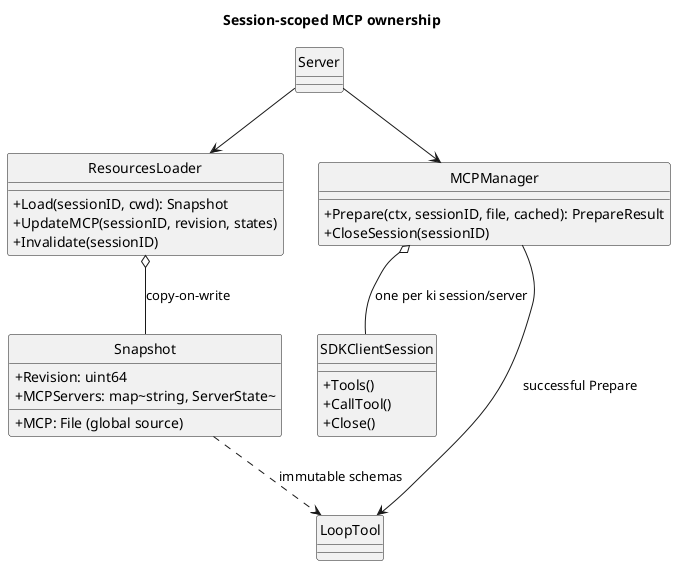

# MCP

MCP 跨 `server`、`resources`、`mcp`、`session` 和 WebUI：配置目录是全局的，工具目录和连接状态固定在各 session 的资源快照中，活跃的官方 SDK 连接由 MCP Manager 隔离持有。包内不变量见 `internal/mcp/doc.go`；工具的通用执行契约见 [tools.md](tools.md)。

## 配置与开关

- `internal/mcp.Load` 只读 `{KI_HOME}/.mcp.json`。项目目录中的 `.mcp.json` 不生效。
- 一个 server 必须只配置一种 transport：`url` 使用 Streamable HTTP，可带 `headers`；`command` 使用 stdio，可带 `args` / `env`。两者同时存在或同时缺失都无效。
- `{KI_HOME}/toggles.json` 是进程级启用状态。禁用的 server 不参与该轮准备，也不会为该轮启动进程或建立连接。
- 设置页没有真实 session，使用 `resources.Loader.Scan(cwd)` 展示当前磁盘配置，不创建缓存或连接。

## 请求前准备

打开会话（create / GET by id / fork）即后台 `Prepare`，与全局扩展 sidecar 并行；List 不 spawn。`runPrompt` 在渲染 system prompt 和生成 `request_header` 前再次 `Prepare`（已连接则 reuse）：

1. `resources.Loader.Load(sessionID, cwd)` 返回全局 `.mcp.json` 的 session 快照和已有工具发现状态。
2. `mcp.Manager.Prepare` 按 Toggle 过滤 server，并行建立或复用每个 session/server 的连接；每个 server 独立握手并完成分页 `tools/list`。
3. 单个 server 失败只产生 failed 状态和 sideband 事件，不隐藏其他 MCP server，也不阻断内置工具或本轮 prompt。
4. `resources.Loader.UpdateMCP` 以 snapshot revision 做 copy-on-write 发布发现结果。Reload 前启动的迟到握手因 revision 不匹配而不能写回新快照。
5. 成功绑定的 MCP tools 追加到本轮内置工具集；同一份工具集进入 system prompt、loop 和 `request_header`。

工具定义是不可变的模型侧副本，不把 SDK 指针放入快照。工具列表会随 session 快照保持稳定，直到显式 Reload。

## 所有权与缓存

| 状态 | 所有者 | 生命周期 |
|---|---|---|
| 全局 `.mcp.json` 配置目录 | `mcp.Load` / `resources.Loader` | 全局读取；不含 Extension 注入 |
| server 状态、工具 schema | `resources.Snapshot` | 按 session 固定到 Reload；copy-on-write 更新 |
| SDK `ClientSession`、transport、连接中的握手 | `mcp.Manager` | 按 ki session/server 隔离；Reload 或删除 session 时关闭 |
| 本轮可执行的 `loop.Tool` 包装 | `runPrompt` / `loop.Run` | 只属于固定 request header 的当前轮 |

## 事件与 Reload

MCP 运行状态通过 `mcp_server_failed` 和 `mcp_tools_changed` 发布。两者是 sideband 事件：写入 session jsonl 并沿 SSE 发送，但不推进消息 leaf，也不进入 provider context。WebUI 使用同一 events 路径的 `?notifications=1` 模式，在 session 空闲时继续接收通知。

- `mcp_tools_changed` 只把当前 server 状态标成 `stale`，保留已经固定的工具 schema；不会在后台静默替换本轮或当前快照的工具目录。用户显式 Reload 后才重新发现。
- MCP 工具调用发生 transport error 时，Manager 丢弃该连接并发布 `mcp_server_failed`。调用不会自动重试，因为服务端可能已经执行了非幂等操作；下一轮 prompt 再重连。
- session Reload 使该 session 的资源快照失效并关闭它的 MCP 连接。若 session 正在运行（prompt 或 compact），Reload 记入 `pendingReload`，本轮 `occupy` 结束时由 `release` 执行。
- 全局 Reload 立即清理空闲 session；活跃 session 使用相同的排队规则。prompt 通过 `runPrompt` 的 `defer release` 落地排队的 Reload；compact 在 `compact.Run` 之后 `release`。`POST /v1/reload`、MCP/Skills Toggle 变化触发全局 Reload；成功 compaction 对该 session `requestReload`。
- 删除 session 或 workspace 中的 session 时，同时关闭对应的 MCP 连接。
- 打开会话预热与全局扩展 sidecar 共用 `runtime.ready` / `runtime_ready`；MCP 仍没有跨 session 连接池，扩展 sidecar 则由多个 session 复用。

## 工具调用

MCP 工具实现 `loop.Tool`，与内置工具走相同的 schema 校验和 prepare/execute 生命周期。`CallTool` 的文本、图片、音频和 structured content 转换成 ki 的 `ToolResult`；server 返回的 `isError` 保留为工具错误。图片等历史内容是否能送给当前模型，仍由 provider 输入模态在最终请求边界决定。

会话详情的 `availableMcp` 展示 session 级 server 状态和已缓存工具；设置接口 `GET/PATCH /v1/mcp` 只展示或修改全局 Toggle，不会在无 session 的设置页启动 MCP server。
