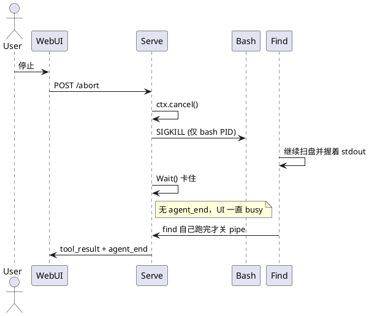

# Bash 中断杀不掉子进程

日期：2026-08-18  
范围：`internal/tools` Bash、`POST /v1/sessions/{id}/abort`、CLI Ctrl+C

## 现象

WebUI 点「停止」（或 CLI Ctrl+C）之后，正在跑的 Bash 看起来没停：停止按钮一直红着，工具行一直 running，磁盘上 `find` / `sleep` 还在干活。等几十秒到几分钟，才突然吐出 tool result，session 才空闲。

复现（2026-08-18 的 ki session `01a014e9a1327bf184f054ff0b2fb48d`）：模型一次发了两条 Bash，第二条是

```bash
find /data/hgy/ki -name ".mcp.json"; find / -name ".mcp.json" -maxdepth 5 | head -20
```

`find /` 本身就要扫很久（那次 193s，16 个命中不到 `head -20`，只能把 depth≤5 走完）。点停止之后它继续扫，jsonl 里两条 tool result 同一秒才落盘。

## 时间线

1. `abort` 只做 `st.cancel()`。loop 的 ctx 取消了，但没有单独的 abort 事件，UI 的 `busy` 要等 `agent_end`。
2. Bash 用 `exec.CommandContext(ctx, "bash", "-lc", command)`，stdout 接到 `bytes.Buffer`。ctx 取消时 Go 只对 **bash 的 PID** 发 `SIGKILL`。
3. `bash -lc` 拉起来的 `find`、`sleep`、管道后段还活着，并继承那根 stdout pipe。
4. `cmd.Wait()` 要等 copy goroutine 结束。`WaitDelay` 默认 0，等于无限等。孙子进程不退出，`Execute` 就不返回。
5. `executeTools` 并行等整批。`ls` 12ms 就完了，整轮仍被旁边的 `find` 拖住。
6. 默认 120s `timeout` 走同一条洞：只杀 bash，文案还经常不是 `timed out`——父 ctx 先被 abort 取消时是 `Canceled`，结果写成 `Command exited with code -1`。
7. CLI Ctrl+C 更糟：abort 请求复用已经 cancel 的 `NotifyContext`，HTTP 自己被取消，serve 可能根本收不到 `POST /abort`。



## 根因

两件事叠在一起，缺一就会「点了中断还在跑」。

### 1. 只杀 launcher，不杀进程组

`CommandContext` 的默认 `Cancel` 是 `Process.Kill()`。MCP 那边已经按进程组杀了（`Setpgid` + `Kill(-pid)`），Bash 没有。

### 2. `Wait()` 被 stdout 管道钉住

stdout 不是 `*os.File` 时，Go 建 pipe + copy。孙子进程握着写端，`Wait()` 就不返回。所以即使用户以为「已经 stop 了」，loop 仍堵在 `executeTools`，发不出 `agent_end`。

命令本身可以就是慢的（`find /`）；bug 是中断和超时都切不掉它。

## 现状

| 层 | 做法 |
|---|---|
| Bash | `Setpgid`（Windows：`CREATE_NEW_PROCESS_GROUP` + `taskkill /T`），`Cancel` 杀整个进程组 |
| Wait | `WaitDelay = 200ms`，漏网的写端也会被关掉，避免无限挂 |
| 结果 | 中断 → `Command aborted`；超时 → `Command timed out after N seconds` |
| CLI | abort 用独立的 2s `context.Background()`，不再复用已取消的 signal ctx |
| 后台 Bash | `run_in_background` 仍是 `WithoutCancel`，不跟这次 abort |

契约写在 `docs/tools.md` 和 `internal/tools/doc.go`。

## 教训

- 取消 context ≠ 停掉用户命令。`bash -lc` 后面一定还有孩子；杀进程必须按组（或 Windows 进程树），不能只杀 launcher。
- `os/exec` 接到 `bytes.Buffer` 时，`Wait` 等的是 I/O 而不是 PID。`WaitDelay == 0` 会把「已杀掉的 bash」变成「session 永远 busy」。
- Abort 路径要单独测「孙子还活着吗」和「Execute 是否马上返回」，只测 `cancel()` 被调用不够。
- CLI 里「ctx 取消 → 再发 abort」不能用同一个 ctx 当 HTTP 的 Context。

## 未做

- `setsid` / `nohup` / 守护进程会离开进程组，这次仍杀不到。
- 没有 Playwright 去点停止按钮做 e2e。
- 后台 job 在 `ki serve` 退出时仍可能残留。
