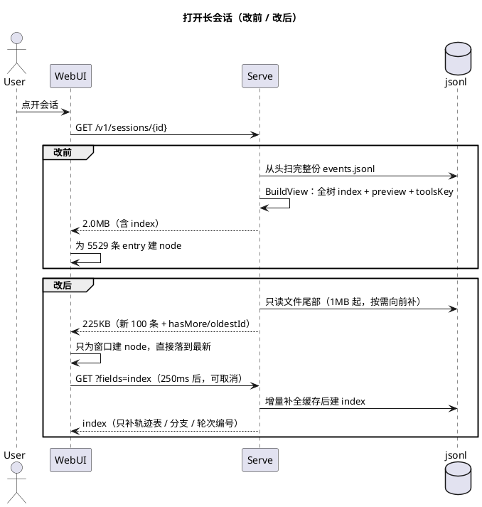

# 打开会话变慢：GET 把整份 transcript 读成了首屏

日期：2026-09-19  
范围：`GET /v1/sessions/{id}`、`internal/session` 读取路径、WebUI 历史加载

## 现象

用户反馈两点：「重连会话加载有时候很慢」，「最关心的其实是最新几条，能不能从最新的开始加载」。

实测（本机真实会话，41.8MB `events.jsonl`、5529 条 entry）：

| 步骤 | 耗时 | 响应 |
|---|---|---|
| `session.Open`（全量扫描 jsonl） | 951ms | — |
| `BuildView`（index + 尾部 slim） | 537ms（其中 preview 326ms、tools schema 序列化 ~19MB） | 2.0MB（index 1.63MB + entries 397KB） |

同一份 `session.Open` 还在每次 `POST /v1/sessions/{id}/prompt` 里跑一遍。服务端缓存以 `size+mtime` 为键，任何一次 append 都会让它失效，所以流式跑起来后每一轮结束的刷新都要重付这笔钱。客户端拿到响应后 `JSON.parse` → `mergeEntries` → 对整条 leaf 链逐条 `applyEntry`，为 5529 条 entry 建 chat node，再滚到底。

对话视图的语义本来就是「尾部优先」（`entries` = leaf 尾部 100 条，`?before=` 翻页），慢的不是排序，而是**首屏被整棵树的索引绑架了**。

## 时间线

1. 先确认渲染顺序：`BuildView` 返回的 `index` 是整棵 jsonl 树（无正文，每条带 160 字 preview），`entries` 才是 leaf 尾部。客户端用 `mergeEntries(index, entries)` 把 index 也合成了 node，所以「全部历史」都在渲染管线里。
2. 逐项拆成本：冷读 951ms（JSON 解码 41MB）+ 537ms（`indexOf` 对每条正文做 `strings.Fields` 取 preview、每个 `request_header` 把 tool schema marshal 两遍）。
3. 再看客户端：`loadHistory` 从 index 建 node，`reconcileUserNodes`/`turnStats`/`cacheMisses` 每次渲染都遍历全部 node。
4. 于是确定三段改造：**首屏只读尾部**、**读取改成增量**、**index 变懒加载**。
5. 实现中踩到一个经典坑：新的尾部读取器把文件第一行（session header）当成了 entry，导致新建 session 的首条 user message 的 `parentId` 变成 session id 这个并不存在的 entry。修法是「`from == 0` 时第一行按 header 解析并跳过」。
6. 另一处是「inline index」的判定：一开始用「窗口是否覆盖整个文件」，结果同进程里先跑过一次 `s.open` 的会话（缓存已被补全）会突然带上 index，响应形状跟着缓存状态变。改成用文件大小判定（`size <= TailReadLimit`），响应形状只取决于 session 本身。

## 根因

四件事叠在一起，缺一件都不会这么慢。

### 1. 首屏响应包含首屏不需要的数据

`index` 必须解析整份 transcript 才能产出，却被放进了默认响应。用户要的最新几条只需要文件尾部。

### 2. 读取没有利用 append-only 这个契约

`docs/session.md` 明确写了「新行永远 append 在文件末尾」，但读取方（`session.Open`、服务端快照、每次 prompt）每次都从头解码。文件增长 1KB 也要重读 41MB。

### 3. 派生数据重复计算

`previewOf` 对整段正文做 `strings.Fields` 再取 160 字（300KB 的 tool result 会切出一个 5 万词的切片）；`toolsKey` 在 `selectLeafEntries` 和 `slimPath` 里各 marshal 一次同一份 tool schema。

### 4. 客户端把树索引合成了聊天节点

index 里的历史条目本来是「无正文的行」，客户端却用 `indexToEntry` 把它们补成 entry 再建 node，于是 node 数随历史线性增长，每次渲染都要遍历。

## 现状

| 层 | 做法 |
|---|---|
| 读取 | `internal/session/entries.go`：按目录缓存已解码 entry，用 `size+mtime` 重新校验；文件只增长时只解码新增字节，变小或被改写才重读 |
| 首屏 | `TailEntries`/`LeafTail` 只读文件尾部（首读 1MB，缺口按 256KB 补，按行边界对齐）；`BuildTail` 不建 index |
| index | `?fields=index` 才返回；比一次尾部读取还短的 session 随默认响应返回（它本来就被整份读出）；客户端 250ms 后后台拉一次，切会话即取消，打开轨迹页立刻拉 |
| prompt | `s.open()` 用 `AllEntries` + `OpenFrom`，不再重解 transcript；entries 拷贝时 `cap==len`，append 不会写进共享缓存 |
| 派生 | `previewOf` 先按 4KB 截断再分词；`toolsKey` 每次构建只算一次（`toolsDigests`） |
| 客户端 | `ViewState` 拆成 `entries`（正文窗口）/ `index`（懒）/ `turnBase`；只给窗口建 node，更早的条目只进 `records`；一轮结束用 `applyTail` 刷新窗口并保持 index 热 |
| 编号 | 轮次 = `turnStats(nodes, turnBase)`；index 未到达前是相对窗口的，到达后自动补正 |

结果（同一台机器、同一批会话）：

| | 改前 | 改后 |
|---|---|---|
| 40MB / 5529 条：首屏 | 951ms + 537ms，2.0MB | 25ms + 10ms，225KB |
| 同进程再次打开 | 每次 prompt 951ms | 22µs |
| index（惰性） | 每次打开都算 | 首次约 1.1s，之后微秒级 |

契约写在 `docs/session.md`、`docs/webui.md`、`docs/architecture.md`、`internal/session/doc.go`、`internal/server/doc.go`。

## 教训

- 默认响应只该包含首屏需要的东西。把「整棵树的索引」塞进 GET，代价是首屏与历史大小线性相关；改成 opt-in 后，长会话的开销与消息条数解耦。
- append-only 是读取性能的契约，不只是写入约定。既然「新行只在末尾」，读取就该按偏移增量推进，而不是每次重放。
- 反向按行读取必须自己对齐行边界：起点落在行中间要丢掉半个 JSON，读到文件尾部的半行要留给下一次读（并发 append 时本来就可能看到）。
- **第一行是 header，不是 entry**。这条在 `session.Open` 里是隐式的（`first` 分支），新写的读取器一旦忘记，就会静静地造出一条 `id == session id` 的幽灵 entry——症状是首条 user message 的 `parentId` 指向不存在的行。
- 缓存会影响「响应形状」时要小心：第一版按「窗口是否覆盖整个文件」决定要不要带 index，而同进程先跑过一次 `s.open` 就会把缓存补全，导致同样的会话时快时慢、形状不定。判定条件必须来自文件本身（大小），不能来自缓存状态。
- 窗口化渲染会暴露「依赖全量的展示」：轮次编号、分支导航、轨迹表都假设拿得到整棵树。改造要给它们明确的降级（先相对编号）与补正路径（index 到达后重编号），而不是让它们悄悄算错。
- 性能回归要用「不随历史增长」来断言。只写「< 3s」这种绝对预算，41MB 与 1MB 的夹具都能过；`TestSessionViewPerf` 因此改成断言尾部 GET 不含 index、体积有上限，`web/e2e/webui.perf.spec.ts` 也加了同样的断言。

## 未做

- `?fields=index` 仍然是 O(整个文件) 的一次惰性拉取。轨迹表、分支导航和右侧请求导航确实要整棵树，但「轮次基数」其实只需要 leaf 链上的 user 条目；真要再快，可以在 jsonl 里持久化轮次计数或提供一条更窄的 spine 接口。窗口化之后右侧请求导航就是靠这份 index 才完整（点旧请求时按页补历史），也就是说它继承了「一次全量读」的成本——只是挪到了打开浮层之后的惰性路径上。
- `?before=` 仍要求全量快照（游标总在尾部窗口之外），首次翻页会触发一次全量读；之后走缓存。
- 按目录的 entry 缓存常驻、不做淘汰，与旧的 `s.snaps` 同等；长期运行的 server 如果打开过大量长会话，内存占用需要另外评估。
- `webui.perf.spec.ts` 用生成夹具，没有对真实长会话做 e2e（只在开发机上手工量过）。
