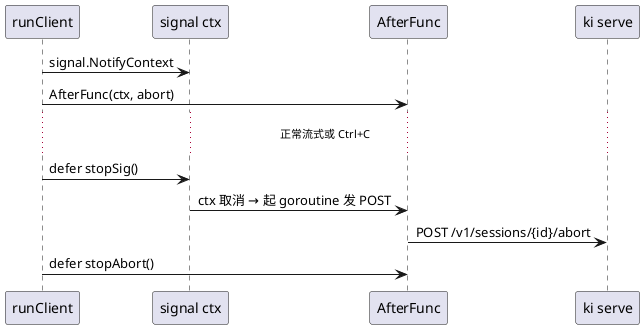

# Modern Go 改造：一次提交换掉 77 个文件的写法（b6534fd）

日期：2026-09-20（提交 `b6534fd`，2026-09-19 17:19，标题 `fix: use modern go`）
范围：全仓库 Go 代码（`cmd/`、`internal/`、`pkg/`、`extensions/`、`e2e/`），依据 `.ki/skills/use-modern-go` 的 Modern Go Guidelines CLI，目标版本取 `go.mod` 的 `go 1.25.0`

## 现象

`go.mod` 早就是 Go 1.25，代码却还停在 1.21 之前的写法：`sort.Slice` 配手写比较、`append([]T(nil), s...)` 当拷贝、`sync.Once` 配包装闭包、测试里 `context.WithTimeout(context.Background(), …)`、手写 min/max、`strings.Index` 切 frontmatter、自造的 `indexOf` / `cloneStringMap` 小工具。语法都合法，所以既没有编译错误也不会有人主动去改——直到按 Modern Go Guidelines 逐条对照，才发现它们全是「同一语义的旧拼法」。

提交规模：77 个文件，+388 / −538（净减 150 行，因为替换掉的大多是样板）。

复现这套检查：

```sh
sh .ki/skills/use-modern-go/scripts/run-tool.sh list --file-path internal/loop/loop.go   # 按 go.mod 版本列出适用条目
sh .ki/skills/use-modern-go/scripts/run-tool.sh explain slices_clone sync_once_func      # 需要细节时看单条
```

## 总览

| guideline | 改动 | 处数 | 典型位置 |
|---|---|---|---|
| `json_omitzero` | bool / 数值字段的 `,omitempty` → `,omitzero` | 75 | `loop.Event`、`extension.Event`、`session.Entry`、`types.Message`、`tools.TaskSnapshot`、`llmprotocol.Request` |
| `cmp_or` | 手写 `if x == "" { x = b }` 兜底 → `cmp.Or` | 32 | `provider.resolveSeed`、`logging.Setup`、`server.prompt`/`patch`、`compact`、telegram-bot、llmprotocol |
| `slices_clone` | `append([]T(nil), s...)` → `slices.Clone(s)` | 31 | `extension.Manager.Prepare`、`loop.RunMessage`、`server.cloneExtensionUI`、`processenv` |
| `slices_sort_func` / `slices_sort` / `slices_sorted` | `sort.*` → `slices.*`（全库 `sort.` 调用点 21→0） | 18 | `command.Catalog`、`extension.Discover`、`search.Grep`、`session.List`、`tools.Edit` |
| `testing_t_context` | 测试 ctx 的根从 `context.Background()` 改成 `t.Context()` | 26 | `e2e`、`extension`、`server`、`provider`、`tools` |
| `slices_index` / `slices_contains` | 手写查找循环 → `slices.Index` / `slices.ContainsFunc` | 8 | `workspace.Store`、`provider.modelRefEnabled`、`server.entryIn` |
| `sync_once_value` / `sync_once_func` | `sync.Once` + 包裹变量 → `sync.OnceValues` / `OnceFunc` | 7 | 三个 `fixture_test.go`、`search.ToolsDir`、`logging.rotatingFile`、`steerAgentStreamer` |
| `testing_b_loop` | benchmark 主循环 → `b.Loop()` | 5 | `session/list_bench_test.go`、`view_bench_test.go` |
| `range_over_int` | `for i := 0; i < n; i++` → `for i := range n` | 5 | `session.SeedTranscript`、`view_test`、e2e provider 夹具 |
| `strings_split_seq` | `strings.Split` 迭代 → `strings.SplitSeq` | 4 | `server/compress.go`、`server.hasField` |
| `strings_cut_prefix_suffix` / `strings_cut` | `HasPrefix` + `Index` → `CutPrefix` + `Cut` | 6 | 三处同源的 frontmatter 解析 |
| `min_max` | 手写比较 → 内建 `min` / `max` | 5 | `session.entriesCache`、`telegram.splitTelegram`、`server.runPrompt` |
| `maps_keys_values_iter` | 手写 collect/sort → `slices.Sorted(maps.Keys(m))` | 3 | `extension.loadI18n`、`ProviderManager.Specs`、`server.takeScopes` |
| `sync_waitgroup_go` | `wg.Add(1)` + `defer wg.Done()` → `wg.Go(…)` | 3 | `loop.executeTools`、`e2e.TestParallelSessionsOnOneServer` |
| `bytes_clone` / `maps_clone` | `append([]byte(nil), …)` → `bytes.Clone`；自造克隆 → `maps.Clone` | 4 | `search.lineBuffer`、`tools.jobs`、telegram-bot |
| `atomic_types` | `seq uint64` + `atomic.AddUint64(&s.seq, 1)` → `seq atomic.Uint64` | 2 | `tools.AgentStore`、`tools.JobStore` |
| `context_after_func` | `go func(){ <-ctx.Done(); … }()` → `context.AfterFunc` | 1 | `cli.runClient` 的 Ctrl+C abort |

---

## 1. `json_omitzero`（75 处）

**规则**：bool、数值、struct、time 字段想省略零值就用 `,omitzero`；string、slice、map 继续用 `,omitempty`。

`internal/loop/loop.go`：

```go
// before
Timestamp int64 `json:"timestamp,omitempty"`
IsError   bool  `json:"isError,omitempty"`
OK        bool  `json:"ok,omitempty"`

// after
Timestamp int64 `json:"timestamp,omitzero"`
IsError   bool  `json:"isError,omitzero"`
OK        bool  `json:"ok,omitzero"`
```

`internal/session/session.go`（一整组 context-usage 字段）：

```go
// before
TokensBefore   int  `json:"tokensBefore,omitempty"`
CatalogVersion int  `json:"catalogVersion,omitempty"`
UsedTokens     int  `json:"usedTokens,omitempty"`
Estimated      bool `json:"estimated,omitempty"`

// after
TokensBefore   int  `json:"tokensBefore,omitzero"`
CatalogVersion int  `json:"catalogVersion,omitzero"`
UsedTokens     int  `json:"usedTokens,omitzero"`
Estimated      bool `json:"estimated,omitzero"`
```

要点：

- **对 bool / int / int64 / uint64 两者完全等价**（都在零值时省略），所以这次 75 个字段的 SSE、jsonl、extension RPC wire **一个字节都没变**；它不是行为修复。
- 真正必须换的是 struct 字段：`omitempty` 按 `reflect.Kind` 判空，struct 永远不为空，零值 `time.Time` 会照样被序列化；`omitzero` 才会走 `IsZero()`。仓库里 `started_at`（`tools.TaskSnapshot`、`AgentMetadata`）早就是 `omitzero`，正是这个原因。
- **slice / map / string 不能换**：`omitzero` 只省略 nil，空而非 nil 的 slice 会被写成 `[]`。本提交没有碰任何 string/slice/map 标签。
- 「必须出现」的字段保持无标签或显式注明：`durationMs` 两边都不加，`docs/events.md` 里那条注释仍然成立。
- 迁移前先按类型分桶（`git show <commit> | grep 'json:"'`），别整表替换。

## 2. `cmp_or`（32 处）

**规则**：`cmp.Or(a, b, c)` 返回第一个非零值，用来表达 `a != "" ? a : b` 这类兜底链。

`internal/logging/logging.go`：

```go
// before
home := opts.Home
if home == "" {
	home = os.Getenv("KI_HOME")
}
...
role := opts.Role
if role == "" {
	role = "unknown"
}

// after
home := cmp.Or(opts.Home, os.Getenv("KI_HOME"))
...
role := cmp.Or(opts.Role, "unknown")
```

`internal/server/server.go`（同一模式在三处：`prompt` / `patch` / `promoteQueued`）：

```go
// before
spec := body.Model
if spec == "" {
	spec = sess.Config.Model
}

// after
spec := cmp.Or(body.Model, sess.Config.Model)
```

`internal/compact/compact.go`：

```go
// before
t := transcript.String()
if t == "" {
	t = "(empty)"
}

// after
t := cmp.Or(transcript.String(), "(empty)")
```

`pkg/llmprotocol/completions.go`（`responses.go`、`anthropic.go` 同形）：

```go
// before
mime := c.MIMEType
if mime == "" {
	mime = "image/png"
}

// after
mime := cmp.Or(c.MIMEType, "image/png")
```

适用条件与坑：

- 只在**类型天然有零值语义**时用（string 空串、数值 0、指针 nil）。若「零值」本身是合法值（例如「用户显式设为 0」），`cmp.Or` 会把它当成缺省吞掉，此时要继续用显式判断或指针类型。
- 实参**全部会求值**（没有短路）：`cmp.Or(f(), g())` 一定同时调用 `f` 和 `g`，所以别把昂贵或有副作用的调用放进来（这里是 `filepath.Join`、`os.Getenv` 这类便宜调用）。
- 多处连续改写时注意 `strings.TrimSpace` 的包裹顺序：`cmp.Or(strings.TrimSpace(a), ...)` 与旧的 `t := trim(x); if t == ""` 等价。

## 3. `slices_clone`（31 处）

**规则**：`slices.Clone(s)` 替掉 `append([]T(nil), s...)`。

`internal/loop/loop.go`：

```go
// before
emit(Event{Type: RequestHeader, Tools: append([]ToolSpec(nil), specs...), ...})

// after
emit(Event{Type: RequestHeader, Tools: slices.Clone(specs), ...})
```

`internal/extension/manager.go`（两处：写入状态、以及打包返回给调用方的快照）：

```go
// before
m.status[d.Name] = RuntimeStatus{Name: d.Name, State: "starting", Capabilities: append([]string(nil), d.Capabilities...)}
...
for _, state := range m.status {
	state.Capabilities = append([]string(nil), state.Capabilities...)
	out = append(out, state)
}

// after
m.status[d.Name] = RuntimeStatus{Name: d.Name, State: "starting", Capabilities: slices.Clone(d.Capabilities)}
...
for _, state := range m.status {
	state.Capabilities = slices.Clone(state.Capabilities)
	out = append(out, state)
}
```

`internal/processenv/processenv.go`：

```go
// before
return append([]string(nil), os.Environ()...)

// after
return slices.Clone(os.Environ())
```

坑：

- nil 输入两者都返回 nil；但**空而非 nil** 的 slice，`slices.Clone` 返回非 nil 空（实现是 `append(S{}, s...)`），旧写法返回 nil。本次这些字段都带 `omitempty`（`encoding/json` 按 `len()` 判空）且调用方只看 `len()`，所以没有暴露；不要用 `== nil` 表达「没有数据」。
- `slices.Clone` 是浅拷贝，元素仍共享：`server.cloneExtensionUI` 里逐层克隆（`panel.Sections` → `Fields[i].Options`）就是因为嵌套 slice 要各自拷。
- 分布式锁/并发返回的快照必须拷——这次改的是写法，不是「要不要拷」。

## 4. 排序三件套 `slices_sort_func` / `slices_sort` / `slices_sorted`（18 处）

**规则**：`sort.Slice` → `slices.SortFunc`（比较函数返回 `int`，用 `cmp.Compare`）；`sort.Strings` → `slices.Sort`；「收集 map key 再排序」→ `slices.Sorted(maps.Keys(m))`。稳定性要一一对应。

`internal/command/catalog.go`——**这是唯一必须用 Stable 版本的一处**：

```go
// before
sort.SliceStable(out, func(i, j int) bool {
	if out[i].Source != out[j].Source {
		order := map[string]int{"builtin": 0, "prompt": 1, "extension": 2, "skill": 3}
		return order[out[i].Source] < order[out[j].Source]
	}
	return out[i].Name < out[j].Name
})

// after
slices.SortStableFunc(out, func(a, b Item) int {
	if a.Source != b.Source {
		order := map[string]int{"builtin": 0, "prompt": 1, "extension": 2, "skill": 3}
		return cmp.Compare(order[a.Source], order[b.Source])
	}
	return cmp.Compare(a.Name, b.Name)
})
```

`internal/session/list.go`——降序就是交换参数：

```go
// before
sort.Slice(out, func(i, j int) bool { return out[i].Timestamp > out[j].Timestamp })

// after
slices.SortFunc(out, func(a, b Info) int { return cmp.Compare(b.Timestamp, a.Timestamp) })
```

`internal/search/engine.go`：

```go
// before
sort.Strings(result.Files)
sort.Slice(result.Counts, func(i, j int) bool { return result.Counts[i].Path < result.Counts[j].Path })

// after
slices.Sort(result.Files)
slices.SortFunc(result.Counts, func(a, b Count) int { return cmp.Compare(a.Path, b.Path) })
```

`internal/tools/grep.go`——比较函数里带 `os.Stat`，顺手把 `ModTime().After` 换成 `ModTime().Compare`：

```go
// before
files := append([]string(nil), result.Files...)
sort.Slice(files, func(i, j int) bool {
	left, leftErr := os.Stat(files[i])
	right, rightErr := os.Stat(files[j])
	if leftErr == nil && rightErr == nil && !left.ModTime().Equal(right.ModTime()) {
		return left.ModTime().After(right.ModTime())
	}
	return files[i] < files[j]
})

// after
files := slices.Clone(result.Files)
slices.SortFunc(files, func(a, b string) int {
	left, leftErr := os.Stat(a)
	right, rightErr := os.Stat(b)
	if leftErr == nil && rightErr == nil && !left.ModTime().Equal(right.ModTime()) {
		return right.ModTime().Compare(left.ModTime()) // 新的在前
	}
	return cmp.Compare(a, b)
})
```

`internal/server/slash.go`——顺便消掉一个 `.(string)` 断言 panic，并新增 `mapName` 保证排序是全序：

```go
// before
sort.Slice(items, func(i, j int) bool {
	a, _ := items[i]["name"].(string)
	b, _ := items[j]["name"].(string)
	return a < b
})

// after
slices.SortFunc(items, func(a, b map[string]any) int { return cmp.Compare(mapName(a), mapName(b)) })

// mapName returns a catalog row's "name" field, treating a non-string as empty
// so sorting stays total.
func mapName(row map[string]any) string {
	name, _ := row["name"].(string)
	return name
}
```

要点：

- **`sort.SliceStable` 只能对 `slices.SortStableFunc`**：`Catalog` 依赖「同 source 内再按 name」的稳定语义，换 `slices.SortFunc` 会静默改变同权重项顺序。其余 `sort.Slice` → `slices.SortFunc` 才是等价（都不稳定）。
- 用 `cmp.Compare` 而不是自己写 `a < b` / `a > b`，反向排序只需交换实参。
- 比较函数里做 I/O（`os.Stat`）时，比较次数是 O(n log n)：旧的 `sort.Slice` 也一样，这次没有变差，但也别趁机加东西。

## 5. `maps_keys_values_iter`（3 处，配 `slices_sorted`）

**规则**：`maps.Keys(m)` / `maps.Values(m)` 直接当迭代器用；要排序就 `slices.Sorted(...)`。

`internal/extension/manifest.go`：

```go
// before
locales := make([]string, 0, len(spec.Resources))
for locale := range spec.Resources {
	locales = append(locales, locale)
}
sort.Strings(locales)

// after
locales := slices.Sorted(maps.Keys(spec.Resources))
```

`internal/server/push.go`：

```go
// before
out := make([]string, 0, len(p.scopes))
for scope := range p.scopes {
	out = append(out, scope)
}
p.scopes = map[string]bool{}
sort.Strings(out)

// after
out := slices.Sorted(maps.Keys(p.scopes))
p.scopes = map[string]bool{}
```

要点：需要「快照后清空 map」时，先取 keys 再清；`slices.Sorted` 已是新切片，不会指向原 map。

## 6. `slices_index` / `slices_contains` / `slices_reverse`（8 + 1 处）

**规则**：手写 `for` 查找 → `slices.Index`（返回 -1）、`slices.Contains`、`slices.ContainsFunc`；手写 swap 到中间 → `slices.Reverse`。

`internal/workspace/store.go`——直接删掉自造 helper：

```go
// before
func indexOf(ids []string, id string) int {
	for i, v := range ids {
		if v == id {
			return i
		}
	}
	return -1
}
...
from := indexOf(ids, sid)
if beforeID != "" && indexOf(ids, beforeID) < 0 { ... }

// after
from := slices.Index(ids, sid)
if beforeID != "" && slices.Index(ids, beforeID) < 0 { ... }
```

`internal/provider/registry.go`：

```go
// before
for _, m := range p.Models {
	if m.ID == ref.Model && m.Enabled {
		return true
	}
}
return false

// after
return slices.ContainsFunc(p.Models, func(m Model) bool { return m.ID == ref.Model && m.Enabled })
```

`internal/session/view.go`：

```go
// before
for i, j := 0, len(rev)-1; i < j; i, j = i+1, j-1 {
	rev[i], rev[j] = rev[j], rev[i]
}

// after
slices.Reverse(rev)
```

要点：**返回值语义别搞混**——`Index`/`IndexFunc` 返回 `-1` 表示未找到，很多旧代码用 `>= 0` 判断，迁移后要逐个核对；`Contains*` 只给 bool。

## 7. `sync_once_value` / `sync_once_func`（7 处）

**规则**：`sync.Once` + `xxxOnce/xxxErr` 字段对 → `sync.OnceValue(f)` / `sync.OnceValues(f)`（返回闭包，调用点不变）；只执行不返回值 → `sync.OnceFunc(f)`。

`e2e/fixture_test.go`（`internal/extension/`、`internal/server/` 三个 fixture 同形）：

```go
// before
var (
	fixtureDirOnce sync.Once
	fixtureDir     string
	fixtureDirErr  error
)

func fixturesDir() (string, error) {
	fixtureDirOnce.Do(func() {
		fixtureDir, fixtureDirErr = os.MkdirTemp("", "ki-e2e-fixtures-")
	})
	return fixtureDir, fixtureDirErr
}

// after
var fixturesDir = sync.OnceValues(func() (string, error) {
	return os.MkdirTemp("", "ki-e2e-fixtures-")
})
```

`internal/search/executable.go`——`resolveToolsDir` 直接当函数值：

```go
// before
var (
	toolsDirOnce sync.Once
	toolsDirPath string
	toolsDirErr  error
)
func ToolsDir() (string, error) {
	toolsDirOnce.Do(func() { toolsDirPath, toolsDirErr = resolveToolsDir() })
	return toolsDirPath, toolsDirErr
}

// after
var toolsDir = sync.OnceValues(resolveToolsDir)
func ToolsDir() (string, error) { return toolsDir() }
```

`internal/logging/logging.go`——状态在 struct 里，就得在构造函数里装配：

```go
// before
type rotatingFile struct {
	mu   sync.Mutex
	once sync.Once
	...
}

func (f *rotatingFile) Close() error {
	f.once.Do(func() { ... f.closeErr = f.file.Close() ... })
	return f.closeErr
}

// after
type rotatingFile struct {
	mu        sync.Mutex
	closeOnce func()
	...
}

func newRotatingFile(...) (*rotatingFile, error) {
	f := &rotatingFile{...}
	f.closeOnce = sync.OnceFunc(f.closeFile)   // 必须在这里初始化
	return f, nil
}

func (f *rotatingFile) Close() error { f.closeOnce(); return f.closeErr }
```

同类：`internal/server/server_test.go` 的 `steerAgentStreamer` 改为 `newSteerAgentStreamer()`，并替换 3 处结构体字面量。

要点（这是本次唯一的「隐性成本」）：

- **类型不再零值可用**。状态从字段搬到构造期闭包后，裸字面量构造会 nil panic，而且不是编译错误。凡是「谁都能 `T{}` 出来用」的结构，改造要么给构造函数，要么保留字段形式（仓库里 `internal/extension/rpc.go` 的 `closedOnce`/`closeOnce`、`internal/tools/jobs.go` 的 `stopOnce` 就没换）。
- panic 传播不同：`sync.Once.Do` 在 f panic 后认为它「已返回」，后续调用直接跳过；`OnceFunc`/`OnceValues` 返回的函数**每次调用都会再 panic 一次**。本仓库 Close 路径不会 panic，所以无影响。
- `TestMain` 里为了删目录必须调用 `fixturesDir()`，于是「本进程没建过夹具」的包也会临时建一个再删掉——记忆化的惰性被 TestMain 强制求值了。

## 8. `sync_waitgroup_go`（3 处）

**规则**：`wg.Add(1)` + `go func(){ defer wg.Done(); … }()` → `wg.Go(…)`（Go 1.25）。

`internal/loop/loop.go`：

```go
// before
if cfg.Parallel {
	var wg sync.WaitGroup
	for i := range calls {
		wg.Add(1)
		go func(i int) {
			defer wg.Done()
			run(i)
		}(i)
	}
	wg.Wait()
}

// after
if cfg.Parallel {
	var wg sync.WaitGroup
	for i := range calls {
		wg.Go(func() {
			run(i)   // Go 1.22 起 i 是每轮独立变量，不用再显式传参
		})
	}
	wg.Wait()
}
```

`e2e/proc_test.go`：

```go
// before
wg.Add(2)
go func() { defer wg.Done(); out1, c1 = runBin(...) }()
go func() { defer wg.Done(); out2, c2 = runBin(...) }()
wg.Wait()

// after
wg.Go(func() { out1, c1 = runBin(...) })
wg.Go(func() { out2, c2 = runBin(...) })
wg.Wait()
```

要点：`wg.Go` **自己**做 `Add`/`Done`，别再手写；它依赖 Go 1.22 的 per-iteration 变量（`loopvar_capture`：不要加冗余拷贝，反过来也说明旧的 `func(i int){}(i)` 是多余的）。

## 9. `context_after_func`（1 处）

**规则**：想「ctx 取消时做一件事」，用 `context.AfterFunc(ctx, f)`，别再起一个常驻 `<-ctx.Done()` goroutine。

`internal/cli/cli.go`：

```go
// before
ctx, stopSig := signal.NotifyContext(context.Background(), os.Interrupt)
defer stopSig()
go func() {
	<-ctx.Done()
	// Why Background: ctx is already canceled (that's why this goroutine
	// woke). Reusing it would cancel the abort HTTP request before serve
	// sees it, so Ctrl+C would never reach POST /abort.
	// WithoutCancel keeps the abort request alive after the signal context
	// is canceled while retaining any values attached to the client context.
	abortCtx, abortCancel := context.WithTimeout(context.WithoutCancel(ctx), 2*time.Second)
	defer abortCancel()
	_ = doJSONContext(abortCtx, base, token, "POST", "/v1/sessions/"+id+"/abort", nil, nil)
}()

// after
ctx, stopSig := signal.NotifyContext(context.Background(), os.Interrupt)
stopAbort := context.AfterFunc(ctx, func() {
	abortCtx, abortCancel := context.WithTimeout(context.WithoutCancel(ctx), 2*time.Second)
	defer abortCancel()
	_ = doJSONContext(abortCtx, base, token, "POST", "/v1/sessions/"+id+"/abort", nil, nil)
})
defer func() {
	stopSig()    // 先取消：这才是触发 abort 的条件
	stopAbort()  // 后停：避免「还没触发就被撤销」
}()
```



要点：

- **收尾顺序就是正确性**：`stopSig()` 必须在前，否则 `stopAbort()` 会把还没触发的 abort 直接撤销。
- `AfterFunc` 返回的 stop **不等待**已启动的调用，进程随即退出时 abort 请求可能被截断——与旧 goroutine 版本行为一致，不是新引入的问题。
- `stopAbort()` 返回 bool（是否成功阻止回调；已经开始或已完成则为 false），这里在 `defer` 里直接忽略返回值——想确认可以接住再用。
- 仍用 `context.WithoutCancel(ctx)` 保留 ctx 上的值：`AfterFunc` 回调里 ctx 已是取消态。

## 10. `atomic_types`（2 处）

**规则**：`seq uint64` + `atomic.AddUint64(&s.seq, 1)` → `seq atomic.Uint64` + `s.seq.Add(1)`。

`internal/tools/agent_tasks.go`：

```go
// before
type AgentStore struct {
	mu  sync.RWMutex
	...
	seq uint64
}
id := fmt.Sprintf("a-%d-%d", time.Now().UnixNano(), atomic.AddUint64(&s.seq, 1))

// after
type AgentStore struct {
	mu  sync.RWMutex
	...
	seq atomic.Uint64
}
id := fmt.Sprintf("a-%d-%d", time.Now().UnixNano(), s.seq.Add(1))
```

`internal/tools/jobs.go` 的 `JobStore.seq` 同形。

要点：`atomic.Uint64` 带 `noCopy`，容器 struct **不可复制**（`go vet` 的 copylocks 会报；本仓库的 store 都按指针传递）。旧的 `atomic.AddUint64(&s.seq, …)` 其实也有同样约束，只是从「约定」变成了「类型」。原子性本身不能省：`AgentStore.Start` 在拿 `mu` 之前就取号，`JobStore.newJob` 同理。import 仍是 `sync/atomic`，区别只在用类型方法（`s.seq.Add(1)`）而不是包级函数 + 手工取地址。

## 11. `testing_t_context`（26 处）

**规则**：只属于测试自身生命周期的 ctx，根用 `t.Context()`（测试结束自动取消），便于泄露检测。

`internal/extension/rpc_test.go`：

```go
// before
ctx, cancel := context.WithTimeout(context.Background(), 5*time.Second)
defer cancel()

// after
ctx, cancel := context.WithTimeout(t.Context(), 5*time.Second)
defer cancel()
```

`internal/provider/fake_test.go`：

```go
// before
ctx, cancel := context.WithCancel(context.Background())

// after
ctx, cancel := context.WithCancel(t.Context())
```

`e2e/webui_test.go`（`exec.CommandContext` 的 ctx 也一样）：

```go
// before
ctx, cancel := context.WithTimeout(context.Background(), 5*time.Minute)
cmd := exec.CommandContext(ctx, bun, "run", "test:e2e")

// after
ctx, cancel := context.WithTimeout(t.Context(), 5*time.Minute)
cmd := exec.CommandContext(ctx, bun, "run", "test:e2e")
```

要点：

- 只换「派生超时/取消、纯属测试自身」的 26 处；仓库里仍有 221 处 `context.Background()` 是**有意保留**的：`srv.Shutdown(context.Background())` 不能被测试 ctx 取消、要喂给长于测试的后台 goroutine、无 `t` 的 helper。
- `defer cancel()` 一律保留：`t.Context()` 只保证测试结束取消，不代替超时。

## 12. `testing_b_loop`（5 处）

**规则**：benchmark 主循环写 `for b.Loop()`，它自己做计时器管理，还能防止编译器优化掉循环体。

`internal/session/list_bench_test.go`：

```go
// before
b.ReportAllocs()
b.ResetTimer()
for i := 0; i < b.N; i++ {
	infos, err := List(root)
	...
}

// after
b.ReportAllocs()
for b.Loop() {
	infos, err := List(root)
	...
}
```

要点：删掉 `b.ResetTimer()`（`b.Loop` 负责起停计时）；`b.N` 不再出现在循环体里。`view_bench_test.go` 三处同形。

## 13. `range_over_int`（5 处）

**规则**：只从 0 数到 n-1 时写 `for i := range n` / `for range n`。

`internal/session/seed.go`：

```go
// before
for i := 0; i < spec.Turns; i++ {
	user, err := seedMessage(...)

// after
for i := range spec.Turns {
	user, err := seedMessage(...)
```

`e2e/testdata/extensions/provider/main.go`（循环变量根本不用）：

```go
// before
for i := 0; i < 100; i++ {
	if isStopped(requestID) { return }
	...

// after
for range 100 {
	if isStopped(requestID) { return }
	...
```

要点：只有「步长 1、从 0 开始」才等价；`for i := 1; i <= n; i++`、倒序、带步长的一律不动。循环变量不被使用时写成裸 `for range n`（`range_over_int` 与 `loopvar_capture` 一起看）。

## 14. `strings_split_seq`（4 处）

**规则**：只迭代不建切片时，用 `strings.SplitSeq` / `bytes.SplitSeq`（迭代器，零分配）。

`internal/server/compress.go`：

```go
// before
for _, v := range h.Values("Vary") {
	for _, part := range strings.Split(v, ",") {
		if strings.EqualFold(strings.TrimSpace(part), value) {
			return
		}
	}
}

// after
for _, v := range h.Values("Vary") {
	for part := range strings.SplitSeq(v, ",") {
		if strings.EqualFold(strings.TrimSpace(part), value) {
			return
		}
	}
}
```

`internal/server/server.go`：

```go
// before
for _, f := range strings.Split(fields, ",") {
	if strings.TrimSpace(f) == name {
		return true
	}
}

// after
for f := range strings.SplitSeq(fields, ",") {
	if strings.TrimSpace(f) == name {
		return true
	}
}
```

要点：`SplitSeq` 只给一个值（`for part := range`，不是 `for _, part := range`）；迭代器**不可重复遍历**，需要保留结果就用原来的 `Split`。嵌套在 `range` 里没问题是本次的用法。

## 15. `strings_cut_prefix_suffix` / `strings_cut`（6 处）

**规则**：`HasPrefix` + 手算偏移 → `CutPrefix`（返回「去前缀后的串」和 bool）；`Index` + 切片 → `Cut`（返回前段、后段、bool）。

`internal/command/catalog.go`：

```go
// before
func stripFrontmatter(text string) string {
	if !strings.HasPrefix(text, "---") {
		return text
	}
	i := strings.Index(text[3:], "---")
	if i < 0 {
		return text
	}
	return strings.TrimLeft(text[3+i+3:], "\n")
}

// after
func stripFrontmatter(text string) string {
	rest, ok := strings.CutPrefix(text, "---")
	if !ok {
		return text
	}
	_, body, found := strings.Cut(rest, "---")
	if !found {
		return text
	}
	return strings.TrimLeft(body, "\n")
}
```

`internal/resources/prompts.go`（保留 frontmatter 本体）：

```go
// before
if strings.HasPrefix(text, "---") {
	if i := strings.Index(text[3:], "---"); i >= 0 {
		frontmatter := text[3 : 3+i]
		template.Body = strings.TrimLeft(text[3+i+3:], "\n")

// after
if rest, ok := strings.CutPrefix(text, "---"); ok {
	if frontmatter, after, found := strings.Cut(rest, "---"); found {
		template.Body = strings.TrimLeft(after, "\n")
```

`internal/skills/skills.go` 同一模式（改造后还少了一次切片运算）。

要点：

- **`CutPrefix` 返回的已经是去前缀后的串**，后面 `Cut`/`Index` 的偏移不要再补前缀长度（旧代码里那些 `3+i+3` 是最容易改错的地方）。
- 三处是同一份逻辑的三个副本（`command`、`resources`、`skills`），改的时候一起改，避免行为漂移。
- `Cut` 的返回值顺序是 `(before, after, found)`；只想要后半段也要先接住前段。

## 16. `min_max`（5 处）

**规则**：需要 `a < b ? a : b` 时用内建 `min`/`max`（作用于 ordered types：整数、浮点、字符串及其命名类型，如 `time.Duration`）。

`internal/session/entries.go`（两处 clamp 到 0）：

```go
// before
start := stamp.size - tailReadBytes
if start < 0 {
	start = 0
}

// after
start := max(stamp.size-tailReadBytes, 0)
```

`internal/telegram-bot/telegram.go`：

```go
// before
n := telegramMessageLimit
if len(runes) < n {
	n = len(runes)
}

// after
n := min(telegramMessageLimit, len(runes))
```

`internal/server/server.go`（上下文窗口封顶，两处 `publishContextUsage` / `runPrompt`）：

```go
// before
if maxContext := s.cfg.Compaction.MaxContextTokens; maxContext > 0 && maxContext < window {
	window = maxContext
}

// after
if maxContext := s.cfg.Compaction.MaxContextTokens; maxContext > 0 {
	window = min(window, maxContext)
}
```

要点：`min`/`max` 是内建函数、作用于 **ordered types**（整数、浮点、字符串及其命名类型，比如 `time.Duration`），不是 `math.Min`：浮点遵循同样的 NaN 与 ±0 规则（有 NaN 结果就是 NaN），但它**不是** `slices.Max`（后者只吃切片）。所有实参都会被求值（没有短路），所以只对纯表达式用；「第一个非零值」是 `cmp.Or`，别拿 `min` 硬凑。

## 17. `bytes_clone` / `maps_clone`（4 处）

**规则**：`append([]byte(nil), b...)` → `bytes.Clone(b)`；手写 map 克隆 → `maps.Clone(m)`。

`internal/search/engine.go`：

```go
// before
part := append([]byte(nil), b.pending[:i]...)

// after
part := bytes.Clone(b.pending[:i])
```

`internal/tools/jobs.go`（两处 pendingEmit 快照）：

```go
// before
pending := append([]byte(nil), j.pendingEmit...)

// after
pending := bytes.Clone(j.pendingEmit)
```

`extensions/telegram-bot/main.go`——删掉整个自造 helper：

```go
// before
func cloneStringMap(in map[string]string) map[string]string {
	if in == nil {
		return nil
	}
	out := make(map[string]string, len(in))
	for key, value := range in {
		out[key] = value
	}
	return out
}
... external: cloneStringMap(ev.External),

// after
... external: maps.Clone(ev.External),
```

要点：`maps.Clone` 对 nil 返回 nil（与旧 helper 一致），浅拷贝语义也一致；`maps.Copy` 是「往已有 map 里追加」，别混用。

---

## 通用教训

- **语义等价要逐条论证，不要整表替换**：本次唯一有真实差别的两处是「稳定性」（`SliceStable`）和「空 slice 的 nil 性」（`slices.Clone`），都靠人工核对；`omitempty`→`omitzero` 反而不是行为修复。
- **`sync.Once*` 的迁移成本在构造期**：字段形式零值可用，闭包形式必须先装配。凡是「零值即可用」的类型（`rotatingFile`、`steerAgentStreamer`），要么补构造函数，要么别换。
- **删 helper 是收益**：`indexOf`、`cloneStringMap` 这类自造件全部消失，和标准库同义的代码越少越好。
- **顺手修掉的隐患要写进本文件**：`slash.go` 的 `.(string)` 断言 panic 就是改排序时顺手发现的。

## 验证

- `go build ./...`、`go vet ./...` 通过（`atomic.Uint64` 的 `noCopy` 在 copylocks 下干净，`AgentStore` / `JobStore` 没有被复制）。
- `go test -count=1 ./internal/... ./pkg/...` 全新执行全绿（含 `session`、`server`、`tools`、`extension`、`search`、`logging`）。
- `KI_FAKE=1 go test -count=1 ./e2e` 全绿（25.4s；其中 `TestWebUIPlaywright` 单独跑也通过，23.4s，未跳过）。
- wire 兼容性靠类型分桶论证（见 §1），因此没有改任何契约文档：`docs/events.md`（loop/SSE 事件字段）、`docs/session.md`（jsonl entry 字段）、`docs/tools.md`（工具结果 details）里描述的字段可见性都没变。

## 未做

- 测试里仍有 221 处 `context.Background()`（见 §11）。
- 仍留 4 处 `sync.Once` 值字段：`internal/extension/rpc.go`（`closedOnce`、`closeOnce`）、`internal/tools/jobs.go`（`stopOnce`）、`e2e/helpers_test.go`（`kiBinOnce`）。
- 少量 `append([]string{}, x...)` 形态的拷贝（`server.exthost`、`server.server`、`workspace.Store` 的 prepend）仍是 `slices.Clone` 的候选；注意同一文件里多数 `append([]T{…}, …)` 是「前插」语义，不是克隆。
- **没有 CI 门禁**：Modern Go Guidelines CLI 只在 skill 里按需手跑，`sort.`、`sync.Once`、`append([]T(nil), …)` 很容易长回来；要守住就得把 `list --file-path` 的差分检查接进 lint 或 CI。
