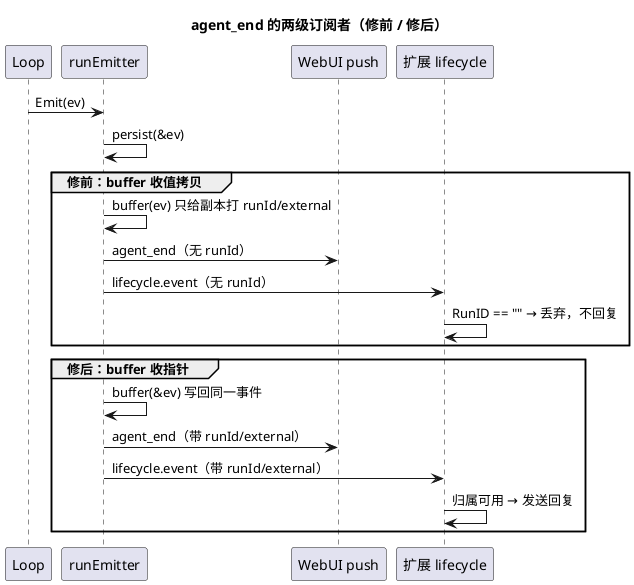

# Telegram bot 不回复：生命周期通知丢了 run 身份

日期：2026-09-24  
范围：`internal/server/emit.go`（`runEmitter`）、扩展 lifecycle 通知、WebUI push 终态帧

## 现象

用户在 Telegram 里发消息，模型在服务端正常跑完（session jsonl 里有 user/assistant 消息、有 usage 和成本），但聊天窗口没有任何回复，连「正在输入」的草稿占位都没有。服务端 stderr 没有任何扩展报错。

排查顺序与证据：

| 步骤 | 结果 |
|---|---|
| 会话 jsonl（`--data-hgy--/…01a0d398…`） | user + assistant 都落盘，说明 loop 与 provider 正常 |
| telegram sidecar 进程 | 存活，`state.json` 的 offset 在推进，说明 getUpdates 与转发正常 |
| `GET /v1/events` 现场抓帧（真机） | 一轮 prompt 后的 `agent_end` 帧**没有 `runId`**（字段被 omit） |
| `internal/extension/chain.go` 的 `RedactEvent` | `RunID`/`External` 直接取自 loop 事件，为空就为空 |
| telegram-bot `handleLifecycle` | 第一道判断就是 `ev.RunID == ""` → 直接 return，什么都不发 |

## 时间线

1. 先分三块定位：模型有没有跑（有）、sidecar 有没有收到消息（有，offset 与 mapping 都在变）、回复有没有发出去（没有）。
2. 侧信道验证：抓 WebUI push 流，发现 `agent_end` 帧不带 `runId`。这个帧和扩展通知是**同一个事件**的两级订阅者，帧里没有身份，扩展那边同样不会有。
3. 追到 `emit.go`：漏斗的 `Emit` 依次调 `persist → buffer → publishCompletion → notifyExtensions → recordContextUsage`，但 `buffer(ev loop.Event)` 收的是**值拷贝**。它在副本上写 `ev.RunID`/`ev.External`，调用方的 `ev` 仍是空的，于是后面两级订阅者拿到的是匿名事件。
4. 对照重构前的代码（`b357aa3` 之前 `runPrompt` 里的闭包）：那里是同一个 `ev` 变量先 `ev.RunID = st.runID`、`ev.External = cloneExternal(st.external)`，再 buffer、再 push、再 `s.ext.OnEvent(...)`。`runEmitter` 抽取时把「写回同一份事件」变成了「只写缓冲副本」，契约就断了。
5. 为什么测试没拦住：`emit_test.go` 只断言 `em.st.evs`（缓冲副本）带 run id——而那正是唯一还正确的地方；没有任何用例断言**下游订阅者**看到的事件带身份。
6. 修法：`buffer` 改收 `*loop.Event`（与 `persist` 同样的理由：写回要到达后续订阅者），在 `Emit` 里显式注明「标记的是调用方的事件」；`recordContextUsage` 的合成事件也走指针形式。补一条走真实 push 流的回归用例：`Emit(agent_end)` 后终态帧必须带 `runId` 与 `external`。去掉修复后该用例确实失败，恢复后通过。

## 结论

- 「同一事件、多级订阅者」的漏斗里，任何在某一级补写字段的操作都必须写回**调用方的事件**；值接口天然只在副本上生效，是这类漏斗里最容易静默出错的地方。
- 回归用例要盯订阅者看到的东西，而不是中间存储：缓冲副本正确掩盖了整条下游链路全错。
- 扩展侧 `RunID`/`External` 是「这条事件是不是我的」的唯一依据，缺失时丢弃是正确行为；因此漏斗必须保证 `agent_end`（以及终态帧）一定带身份。
