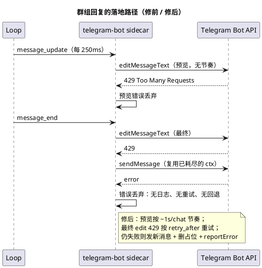

# Telegram 群组不回复：最终占位编辑失败被静默吞掉

日期：2026-09-28  
范围：`extensions/telegram-bot`（`flushOutput` 的最终写入、预览写入节奏、`botAPI` 调用）

## 现象

群组 topic 里用户提问，服务端把答案正常跑完（jsonl 里 assistant 消息、usage、cost 齐全），Telegram 里却看不到最终答案：按这条链路，占位消息会停在 `…` 或最后一个成功写进去的半截文本上。扩展进程存活、`state.json` 的 offset 在推进，server stderr 里一条扩展报错都没有。

和 [2026-09-24](2026-09-24-extension-events-lost-run-identity.md) 那个 postmortem 的现象几乎一样，但这次不是丢 run 身份：事件投递正常，丢的是最后一次写入。

## 排查顺序与证据

| 步骤 | 结果 |
|---|---|
| 会话 jsonl（`…01a04c7b…`） | 最后一轮由 `messageId=149` 触发，`stopReason=stop`、1715 字的答案已落盘 |
| 该轮 user 条目 | 同时带 `external`（telegram 元数据）和 `idempotencyKey=bot:…:795202674`：只有直投/extension 队列 drain 会带 key，两条路都传 external → 事件归属没问题 |
| 运行二进制 | `go version -m ./ki` 显示 `v0.0.6+dirty`（9/24 的 identity 修复已在其祖先里） |
| 扩展进程 | pid 16819 自 9/27 22:10 存活，offset 在 23:47、23:54 推进，收消息正常 |
| 扩展 stderr | 就是 server 那个 pane 的 `/dev/pts/0`；该 pane 自 22:10 起没有任何输出 → 一次 `reportError` 都没走 |
| 群里的 message id 算术 | user 消息 144(23:45:59) 与 148(23:47:17) 连号，中间只有 3 个 id；上一轮恰好 2 次工具调用（`deep_web_search`+`fetch_content`）→ 3 条 = 2 条状态 + 1 条占位，答案是把占位 edit 出来的。用户随后的追问（「认真读题啊…」）说明他看到了那条答案 |
| 最后一轮 | 3 次工具调用 → 3 条状态 + 1 条占位；答案同样必须靠 edit 占位落地 |

## 根因

群组的最终回复不是一条新消息，而是**编辑那条 `…` 占位消息**。旧代码：

```go
if i == 0 && placeholderID != 0 {
    if err := worker.api.editMessage(ctx, chatID, placeholderID, part); err != nil {
        _, _ = worker.api.sendMessage(ctx, chatID, threadID, part)  // 两个错误都被丢弃
    }
    continue
}
```

三个叠加问题：

1. **预览没有节奏**：`appendOutput` 用 250ms 的 debounce 直接驱动写 Telegram，长答案的流式期间对同一条消息做 40+ 次 `editMessageText`，把一个 chat 的写入预算打满。
2. **429 不重试**：Telegram 的限流（`Too Many Requests` + `retry_after`）只在 `getUpdates` 轮询里处理过，写入路径完全没有。
3. **失败完全静默**：最终 edit 失败后，回退的 `sendMessage` 复用**同一个可能已经耗尽的 ctx**，其错误又被丢给 `_`，于是答案、日志、重试全都没有。只有「没有占位」的分支才 `reportError`。

所以只要最后一次 edit 被限流（或那一刻到 `api.telegram.org` 抖动），回复就永久消失，且扩展侧看起来一切正常。



## 修法

- **最终写入绝不静默**：`flushFinal` 给每个分片单独的时间预算（慢的前一片不再吃掉后面的 deadline）；`writeFinalPlaceholder` 先用 `editMessageRetry` 重试限流，仍失败则 `reportError` 后再发一条普通消息（新 ctx，因为失败的 edit 可能已经花掉原 deadline），成功后删除占位——先发再删，避免回退也失败时把半截答案删掉。
- **预览有节奏**：`outputState.lastWriteAt` + `reserveWrite`/`outputDelay` 把每个 chat 的写入压到约 1s 一次，工具状态和预览共用同一份预算；落在窗口里的预览是**推迟**而不是丢弃（最终写入不受节奏限制）。
- **调用层重试**：`botAPI.callRetry` 只重试 429（`retry_after` 有上限），`sendMessageRetry`/`editMessageRetry` 供最终路径使用；预览仍不重试，避免在已被限流时继续加压。
- 回归用例：`TestFinalEditRetriesThrottlingAndIgnoresPacing`（429 重试一次并忽略节奏）、`TestFailedFinalEditFallsBackToFreshMessage`（4xx 不重试 → 发新消息 → 删占位）、`TestPreviewWritesArePaced`。

## 结论

- channel 类扩展里，**「最终写入」是唯一不能复用预览那套容错策略的调用**：预览可以丢、可以晚，最终回复丢了就等于整个 run 白跑，所以它必须有独立的时间预算、限流重试和失败日志。
- 「复用同一个 ctx 做回退」是隐形的二次失败：第一次调用超时后，回退会立刻以 `context deadline exceeded` 失败，而错误又被丢弃时，现象就是「什么都没发生」。回退要开新 ctx。
- 排障时**群里的 message id 连号**是判断「扩展有没有发出东西」的硬证据：user 消息之间的 id 差就是那段时间机器人新建的消息数，配合工具调用次数能直接确认状态消息与占位消息都发出过。
