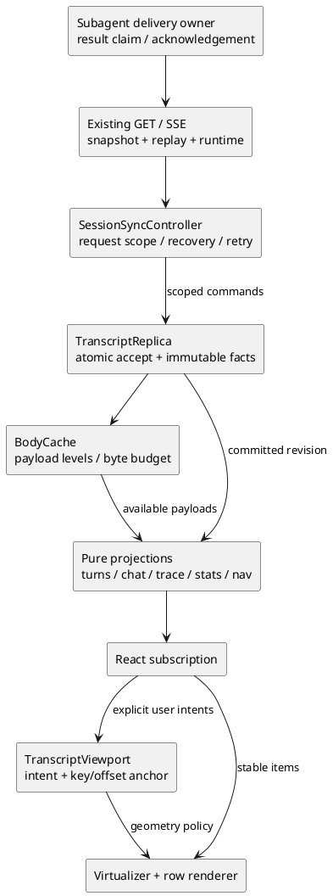

# 手机消息流反复失效：恢复、折叠、subagent 与视口的架构复盘

日期：2026-09-30

审计基线：`45083fb5833822cbf8c31ab606abb00a992c4989`

状态：**原始审计 + 已实施的核心重构；实施、验证及未关闭边界见第 9 节。**

第 1–8 节保留对审计基线的记录和当时的计划，不代表修改后的代码仍有全部同样缺陷。

## 1. 结论

这不是再调整几个 CSS 或补一个 reconnect 条件就能可靠解决的问题。审计基线中可复现：

- subagent 通知参与正文加载后，同一个人工请求的轮次、步数和工具统计改变；
- 同一 compact 快照重复应用，折叠数量改变，缺失正文却被认定为已全部加载；
- 旧分页投影与恢复交错，可产生 `nodes=[]` 且 `hasMore=false` 的状态；
- 两条有不同持久化 ID 的相同文本输入，被展示层合并成一条；
- `TaskOutput` 已取得结果，父任务的 live Inbox 仍收到同一个结果通知；
- 已带 `origin=agent:*` 的实时通知，accepted 阶段却被前端暂时当成人工输入；
- 同一人工轮中有没有 runtime 通知，会改变展开折叠行后的跟随策略；
- 计时文字在整数/小数切换时移动相邻内容，已有 `tabular-nums` 不足以防抖。

“父任务灰灯”还暴露了**自身 run 与整个任务树活动状态没有区分**的产品/协议缺口；不能直接认定为 SSE 丢事件。

但不能把全部旧截图都归因于这些新复现：**截图中的持续重叠、重复前缀和大片空白，本轮没有在当前 Chromium 重放中重现同一画面。** 现有部分修复确实有效，真机问题仍未关闭。

建议对 transcript 状态、同步控制、投影、任务交付和视口控制做一次**分阶段替换架构**，而不是继续叠加条件分支，也不是丢弃整个 WebUI 重写。每阶段必须删除被替代的旧状态所有者，不能永久保留新旧两套协调逻辑。

## 2. 证据范围与限制

### 2.1 原始截图

原件位于本机 `tmp/bug/`，没有改动：

| 文件 | 可以直接观察的现象 | 不能仅凭截图证明的事情 |
|---|---|---|
| `Screenshot_20260929_010518_Chrome.jpg` | 同一屏出现两个“第 1 轮”统计，工具数量分别为 170 与 2，仍有运行中的 Bash 行 | 哪个响应/SSE 顺序造成了统计分裂；两个 spinner 是否都陈旧 |
| `Screenshot_20260929_131510_Chrome.jpg` | 已折叠 329 条，后面出现 subagent 完成通知气泡；底部与轮统计不同 | 通知是否应被当前 keep 折叠；截图未提供当时全部执行状态 |
| `Screenshot_20260929_133535_Chrome.jpg` | 通知顶部出现重复 `<task-notification>` 前缀，气泡/操作栏间距异常 | 后端是否写了重复正文 |
| `Screenshot_20260929_133548_Chrome.jpg` | 顶部一条消息之后正文区域有大片空白 | 整站白屏、React 崩溃、正文缺页、虚拟高度错误中的哪一种 |
| `Screenshot_20260929_133756_Chrome.jpg` | 通知气泡与前一条操作栏直接重叠，正文开头也有重复显示 | 是否为持续 DOM 几何错误、短暂量测错位或 Android 合成/绘制问题 |

第一张标题对应会话 `01a0e8e97c0d7d129dbf4dcfea351cdf`；后四张中的任务可在
`01a0eb6491747b45a81de13e805d1240` 找到，也存在于其后续 flat fork
`01a0ecfab4227459b73362a7fc9b9c87`。因此使用原会话做历史取证，不靠截图反推消息正文。

### 2.2 审计阶段执行方式

- 真实历史只通过只读 session 命令/接口取证，没有重发历史 prompt，没有重启用户服务。
- 浏览器实验使用独立测试 server、独立 `KI_HOME` 与测试会话；fake 仅用于自动化夹具。
- Chromium 使用 touch/mobile context，主要为 `390×744`，另测 `320`、`412` 宽度。原手机型号、DPR、字体和浏览器版本未知，不能声称等同原机。
- 实际截取了 2026-09-29 **13:34:44–13:38:11 CST** 的 98 条连续 entry，约 977KB；未改正文、origin、ID 或内部 parent 边。浏览器实验将它作为独立、有限的展示窗口，不冒充整条历史分页测试。
- 状态层实验包括真实 reducer 和 hook 回调；人为调度 hook updater 的实验明确标为**状态/时序层复现**，不是浏览器随机撞到。
- 没有 Android/iOS 物理设备验收。WebKit 启动被宿主依赖缺失阻断，不能记成产品失败或测试通过。

本轮脚本、日志及截图在 `tmp/bug/repro/`；它们是 **git 忽略的本地调查材料，不是已纳入 CI 的回归测试**。其中真实历史含用户内容，不应直接提交；重构第一阶段要提炼脱敏夹具。

## 3. 审计问题清单（修复前）

优先级是本轮建议；“复现”与“推断”分开：

| 编号 | 问题 | 证据级别 | 优先级 |
|---|---|---|---|
| B1 | runtime 通知拆分人工轮，加载正文改变工具统计 | Bun + Chromium 可复现 | P1 |
| B2 | compact helper 的身份完整被误当正文完整，重复快照不幂等 | Bun；fixture 经 Go 投影核对 | P1 |
| B3 | 旧投影污染恢复后的分支，导致空消息列表且历史封顶 | reducer + hook FIFO 调度复现；未在浏览器命中该时序 | P0 |
| B4 | 按文本去重吞掉不同 ID 的真实输入 | Bun 可复现 | P1 |
| B5 | TaskOutput 与 live Inbox 双渠道交付同一结果 | Go 确定性实验 + 历史记录 | P1 |
| B6 | 父任务灯只表达自身 run，不表达仍在工作的后代 | Go 确认语义，非已证实的前台 stale 灯 | P2 |
| B7 | runtime 通知改变折叠展开的 following/reading 行为 | Chromium 可复现 | P2 |
| B8 | 计时字段宽度变化造成横向抖动 | Chromium 几何量测 | P2 |
| B9 | 历史截图的持续重叠/大片空白/重复前缀 | 截图确认；当前同画面未复现 | 待定位，不关闭 |
| B10 | 实时通知 accepted 阶段丢失 origin，被临时当成人工请求 | Bun + Chromium 可复现 | P1 |

### B1. 显示、统计和服务端对“轮”的定义不一致

最小数据：

1. 一个真人 input `u`；
2. assistant 发起一次 Read，随后有 toolResult；
3. `origin=agent:child` 的 runtime user-role 通知；
4. 最终 assistant 回复。

服务端 compact 把它视为一整个人工轮。当前 UI 展开前后实测：

```text
展开前：第 1 轮 / 2 步 / 工具 0/1
展开后：第 2 轮 / 1 步 / 工具统计不再显示
底部会话统计：两次均为 1 轮 / 2 步
```

这是“同一份事实，仅补正文，统计发生变化”，不需要长时间离线即可复现；离线恢复、补全、展开只是更容易触发该路径。

代码证据：

- `web/src/lib/messageView.ts:68-75`：`groupTurns` 仅把人工请求作为分轮点。
- `web/src/lib/model.ts:1005-1015`：`applyMessage` 遇到任何 user role 都递增 `turn`。
- `web/src/lib/model.ts:2036` 的 `turnStats` 同样按 user 节点分轮。
- `web/src/lib/model.ts:2132` 的 `projectTurnStats` 再用数字轮次对齐服务端摘要。
- `web/src/features/chat/Chat.tsx:787-802`：把这些不同语义的统计重新挂到同一个展示轮最后 item，后一个覆盖前一个。

另一个浏览器夹具只有 1 个人工请求和 18 条 agent 通知，detailed 页面却显示“第 19 轮”。这不是样式错误。

**重构要求：**统一 `TurnId` 和 human/runtime 分类；Chat、Trace、导航、会话/轮统计、compact 都使用同一身份投影，不再靠各自递增的数字拼接。runtime-only 子会话也必须有明确锚点，不能为了统一而丢掉没有人工 input 的内容。

### B2. “有 entry ID”不等于“该轮正文已完整”

合法的运行中 compact 响应可能包含：

- `u → call` 两个 entry；
- 原始 `call` 含 assistant 正文以及 `t1/t2` 两个调用；
- 投影后 helper 只保留可见 `t2`，并标记 `truncated=true`；
- 摘要仍记录隐藏的 assistant 节点和 `t1`，`hiddenCount=2`。

同一份快照执行 `loadHistory(snapshot)`，再执行 `applyTail(state, snapshot)`：

```text
第一次：fold count = 2，未标记完整 turn
第二次：fold count = 1，loadedTurnIds = ["u"]
```

没有新执行、没有用户展开、没有新增正文，结果却变了。用户点击“展开”还可能因为这个错误的 loaded 标记而不再下载真正缺失的内容。

`web/src/lib/model.ts:620-634` 的完整性判定只从 `tailId` 沿 entry ID/parent 链走到 turn input，没有验证投影正文是否省略了节点。`internal/session/compact_view.go` 则确实会生成这种 helper；这不是服务器损坏响应。

**重构要求：**至少区分 identity/index、slim body、projection helper、full body、turn coverage；body fullness 和分支区间连续性也不是一个标志。快照应用应幂等，不以 `entryCount` 或“ID 链走通”代替内容完整证明。

### B3. 边界拒绝了旧页，旧摘要却仍被接纳

最小可复现调度：

1. 旧分支 `u → old-a1 → old-a2` 后还有 `v/w/x/y` 四轮，compact `keep=0` 首屏从 `v` 开始，`hasMore=true`。
2. 发出 `?before=v&view=compact&keep=0`，旧页含 `u`，摘要 tail 为 `old-a2`。
3. 另一客户端选中同一人工 input 下的新分支 `u → selected-a1`，恢复响应确认该分支。
4. 恢复 updater 已排队但未提交，`view.current` 还指向旧状态；旧页 callback 通过网络返回阶段的 guard，再排队 page updater。
5. React 按 FIFO 执行恢复 updater、page updater。后者发现分页边界不同，却仍合并 `compactTurns`。

结果：

```text
leafId          = selected-a1
compact tailId  = old-a2
nodes           = []
hasMore         = false
```

这是一个**数据投影为空**的复现；不能据此宣称它就是 13:35:48 截图的虚拟列表空白根因。

证据：

- `web/src/features/chat/useTranscriptRequests.ts:130-135`：`sameBoundary` 为 false 时仍传入旧 `compactTurns`。
- 同文件 `:257-260`：普通 keep 重投影也仅校验 scope，没有统一的 branch/frontier 接纳条件。
- `web/src/lib/model.ts:607-618`：较大的旧 `entryCount` 可以覆盖同一 turn ID 的较短新分支摘要。

不能仅修 `hasMore`：leaf、snapshot、coverage 和 cursor 必须在一个原子接纳决策中保持一致。旧响应至多补充不可变正文缓存，不能获得改写当前分支/摘要的权限。

### B4. 正文去重错误地使用了文本相等

`first`、`second` 是两个不同持久化 ID，内容都为 `continue`；加载后底层有两个节点，经过 `reconcileUserNodes` 只显示 `second`。

`web/src/lib/model.ts:1656-1664` 把任意连续同文本 user 当成 optimistic/live 两份拷贝。忙时的两次 steer、重复但合法的输入、不同来源同文通知，都不满足“真正第二轮之间一定有 assistant”的注释假设。

**重构要求：**只按明确的 optimistic request ID → canonical entry ID 确认关系合并；不同 canonical ID 不因正文相同被删除。

### B5. subagent 完成结果没有统一交付所有者

历史记录中：

- 同一个 `-6` task 的两条通知发生于 13:08:01、13:17:55；中间有明确的 `SendMessage` 恢复任务，两次结果内容不同，**不能把它们判为重复完成事件**。
- 13:17:55.087 的 `TaskOutput` 返回结果，13:17:55.089 的通知又带入同一结果，存在双渠道重复交付。
- 截图涉及的 `-4/-5/-6` 通知正文内部各只有一个 `<task-notification>` 开标签和一个 task header。截图里叠出来的前缀不是持久化正文原本就重复。

当前 Go 实验也确认：

```text
Wait 返回 "probe child result"
MarkNotified 后 consumed = true
父任务 live Inbox 仍有 1 条相同结果通知
```

runner 在 AgentStore 关闭 `done` 之前调用完成通知；等待者从 `Wait` 返回后才标记消费，晚于通知入 live Inbox 的时点。持久队列有后续消费检查，live Inbox 路径没有等价的结构化身份/再检查。

代码路径：`internal/server/agent.go:186-216,294-308`、
`internal/tools/agent_tasks.go:265-295`、`internal/tools/task_tools.go:85-108`；
持久队列的再次检查在 `internal/server/slash.go:776-785`，live Inbox 在
`internal/loop/loop.go:321-347` 保存普通 message。

**重构要求：**按 task + child-run/generation 管理结果交付，显式区分 completed、通知待交付、工具领取、通知领取、已提交。工具结果与通知的“认领”必须互斥或能撤销尚未提交的副本；不能通过文本比较解决，也不能因一次失败/超时 Wait 就吞掉通知。子任务被恢复后仍是同一 task ID，因此只按 task ID 永久去重也不正确。

这与“通知中断父任务”是不同问题，本轮没有证据支持后者。

### B6. 灰灯：执行状态正确，不代表用户得到正确状态

当前 Go 实验：

| 场景 | 父自身 running | 子 running |
|---|---|---|
| 前台 Agent 等待子任务 | true | true |
| 显式 `run_in_background=true`，当前 batch 全部终止父 run | false | true |

显式 background 的 Agent result 具有 `Terminate=true`；前台运行超过两分钟自动晋升后台是另一条路径，`Terminate=false`。不能混用这两个场景解释截图。

`running()` 看的是本会话 `run.done`，侧栏直接消费 `sessions[].running`。因此后台子任务继续工作、父自身空闲时显示灰灯，符合当前布尔字段定义，却无法表达“整个任务尚未完成”。本轮没有复现“前台 Agent 阻塞等待、父自身仍运行，但权威 API 为 false”的错误。

对应 `internal/tools/agent_tool.go:166-174`、`internal/loop/loop.go:1085-1093`、
`internal/server/server.go:1723-1737`、`web/src/App.tsx:175`。占用/释放时的 sessions
invalidation 与客户端重取路径确实存在，不能仅凭灰灯推断没有发事件。

**重构要求：**

- 分开 `ownRunState` 与 `activeDescendantCount/activity`，通过已有 sessions/session GET 和 SSE 投影，不新增专用轮询接口；
- 侧栏可显示“等待子任务 · N”或独立后代活动标记，含中英文、可访问名称，不能仅靠颜色；
- 不能把聚合活动直接写回 `busy=true`：发送/停止行为、父 run 终止与通知策略仍应遵守自身 run 的实际状态；
- 前台等待、显式后台、超时晋升、子任务恢复、子任务失败/取消、父已结束但子仍运行均需单独验收。

### B7. runtime 通知改变展开后的阅读意图

Chromium 同一个 compact 最新人工轮，`keep=1`、都从 following 开始：

```text
没有 runtime 通知：点击 fold → following
有 runtime 通知：  点击 fold → reading
```

`Chat.tsx:622-626` 用最后一个任意 `kind=user` 找 tail turn；`groupTurns` 却使用最后一个人工请求。通知给出了不同的“最新轮”ID。

另外 `Chat.tsx:627-644` 允许“距底部 ≤8px”把 reading 重新武装成 following。现有文档同时写“折叠进入 reading”“几何不能恢复 following”“最新折叠重新武装 following”，三个说法不能同时作为验收标准。

**建议统一策略：**展开/收起默认保留之前明确的 intent；只有此前已在 following 且操作的是最新人工轮时保持尾部，reading 不因几何贴底自动变 following。更早轮的展开进入 reading。采用前先确认产品规则，并删掉其它互斥文案。

### B8. 计时防抖不是只加等宽数字

`formatDuration`（`model.ts:2266-2270`）输出 `10s → 10.2s → 11s → 11.2s`，小数部分周期性出现/消失。

390px Chromium 实测，所有目标的 computed style 已是 `tabular-nums`：

| 字段 | `10s` | `10.2s` | 位移/变化 |
|---|---:|---:|---:|
| composer 耗时字段宽度 | 54.42px | 63.59px | +9.17px |
| 后面的“1 轮 · 1 步”左边缘 | 66.42px | 75.59px | +9.17px |
| 居中轮统计的轮号左边缘 | 19.64px | 15.06px | −4.58px |

`tool-duration` 在这次 5–60s 样本中宽度保持 32.70px；不能把所有计时控件都说成已复现同样的问题。字体即使提供等宽数字，也不会让有/无小数点的字符串等长。

**重构要求：**统一 duration 呈现组件，确定运行时精度，使用稳定的数值槽与真正可用的等宽字体/数字特性，隔离动态数值与周边 flex 布局。测试每次 tick、9→10、59.9→1m00、9m59→10m00，以及中英文；不能仅断言“文字在变化”。

### B9. 截图布局问题不能用“现有测试全绿”关闭

本轮当前 Chromium：

- 18 条长 runtime 通知的滚动、展开与 320/390/412px 宽度切换，没有观察到**稳定后**行矩形相互重叠；
- 98 条真实历史窗口、三个宽度、51 个滚动采样点，没有出现可见区无行、稳定后重叠或 pageerror；
- 320×568、390×844、844×390 的现有响应式矩阵通过。

这些实验**没有覆盖**真实 Chrome 后台进程冻结、Android 文字/合成层绘制、地址栏伸缩、物理惯性、特定字体与真实键盘。采样在 100ms 稳定后，也不能排除短暂重叠帧。因此只记为“当前夹具未复现”，不是“已修好”。

也没有证明工具详情的 `aria-expanded` 在无点击时自行变成 true。本轮确认的是折叠计数/完整性不稳定，不能偷换成所有“自动展开”症状已经查明。

### B10. 实时通知在 accepted 阶段丢了来源身份

给当前 reducer 输入一条本来就有 `origin=agent:a-probe` 的通知：

```text
steer_accepted：origin = null，人工请求导航条目 = 1
message_end：  origin = agent:a-probe，人工请求导航条目 = 0
```

后端 `internal/server/slash.go:557-564` 保留了 origin；前端
`web/src/lib/model.ts:1299-1300` 只取 `ev.message.content` 传给
`appendOptimisticUser`，后者在 `:1750-1760` 重建缺少来源的 user message。
到 `message_end` 才恢复身份。

Chromium 的同一 live 流也确认：accepted 阶段已有通知气泡，但 `user-origin` 为空、
`.origin-agent` 行数为 0；提交后来源标签和 agent 样式才出现。

`isHumanPrompt` 把无 origin 当真人，因而一条机器消息会暂时拥有真人 input 的导航、
分轮/折叠豁免和气泡样式。这个窗口不保证只有一帧：父 loop 仍在等工具或模型时，
accepted 与正式写入之间可以持续一段时间。它是 live/history 不一致的另一条根因，
与 B1“持久通知仍被统计为新轮”相互独立。

**重构要求：**所有 optimistic/accepted/committed 形态保留完整 origin 与身份确认信息。
“还未持久化”是交付阶段，不是消息变成人工输入的理由；不能依赖正文中的标签猜来源。

## 4. 为什么修了多次还复发

### 4.1 同一个事实有多个所有者

`ViewState`（`web/src/api/types.ts:529-576`）同时装着持久 entry、index、compact 摘要、正文缓存、执行覆盖、分页边界和多种 UI 投影。

`applyTail`/`rebuild` 要同时决定 HTTP 与 SSE 的先后、分支、正文连续性、工具终态和统计。补正文不是单纯增加 body，而会重新构造执行与展示状态。一个局部修复因而容易改变不相干的路径。

恢复还分布在 `App.tsx` 的 run EOF/retry、生命周期恢复、runtime refresh、全局 push、visibility/pageshow/online 等入口。它们通过多个 ref、cursor 和 `liveRevision` 约定协调，没有一个统一的响应接纳/提交状态机。

### 4.2 缺失信息被当成了已知事实

反复出现的推断是：

| 错误替代 | 真正应明确保存的事实 |
|---|---|
| 有连接 = 已同步 | 已应用的 run sequence 与权威 snapshot frontier |
| leaf 最新 = 历史连续 | 当前分支哪些区间被完整覆盖、哪里仍有缺口 |
| entry ID 链完整 = 正文完整 | body/helper 的载荷等级、遗漏节点、完整 turn 的覆盖证明 |
| 后面有可见节点 = 前面工具已结束 | run/step/toolCall 身份及明确终态 |
| 任意 user role = 人工 turn | human/runtime 的明确分类与 TurnId |
| 文本相同 = 同一输入 | requestId 与 canonical entryId 的确认关系 |
| 靠近底部 = 用户愿意跟随 | 用户显式 reading/following/seeking intent |
| 父自身 idle = 整个任务结束 | 自身执行与后代活动分别投影 |

### 4.3 HTTP 接纳依赖 React 调度细节

`useTranscriptRequests` 自己维护 `pendingBoundary`，与 reducer 的 `oldestId/hasMore` 双向确认。
在 `:227-242`，函数式 `setView` updater 内甚至会 resolve promise、移除 abort listener、修改 scope 的 pendingBoundary。

现有 `web/unit/transcript-requests.test.ts:35-51` 必须替换 React 私有 dispatcher 来控制这类竞态。这不是再拆出一个 hook 就能改善的问题：网络请求的接纳、游标推进及副作用应在 React 外的事务边界完成，React 只订阅已提交状态。

### 4.4 测试很丰富，但验收口径仍不统一

历史证据：

- [尾部优先历史](2026-09-19-session-view-tail-first.md)：曾把 index 当聊天正文，41.8MB 历史暴露全树读入/投影成本。
- [折叠与阅读位置](2026-09-27-fold-expansion-lost-the-reader-place.md)：桌面小样本错过移动端跨虚拟化阈值的结构 remount。
- [手机 SSE 停滞](2026-09-27-mobile-tab-sse-stall.md)：证明重连了 push，不等于证明恢复了最终正文。
- [滚动与丢页复盘](2026-09-27-transcript-scroll-jumps-and-lost-pages.md)：曾在错误响应提交后才记录锚点；曾只看最终位置，错过 WebKit 中间约 500px 的位移。
- `cec9b48` 用可见位置清理陈旧工具；约 71 分钟后的 `f256dcd` 又改为身份/执行边界。
- `45083fb` 修了“收到同一最新 leaf 就误以为历史连续”、旧模式转换边界、跨分支摘要等；B3 表明这种接纳规则仍没有覆盖所有写入入口。

当前新增 history recovery 夹具是 1440×900、三个简短 turn；cross-browser 项目没有包含 `history-recovery`、`stream-recovery`、`reclaim` 等全部相关文件。注入的 ReadableStream 和手工 lifecycle event 很适合确定性顺序测试，但不能证明真实服务器 replay、浏览器冻结和真机绘制也正确。

现有文档还有“只同步测最后一行、不整窗重测”的描述，而 `Chat.tsx:741-745` 实际遍历所有已挂载 `[data-index]`。文档中各轮补丁的描述累积下来，已经不能直接当作一致的架构契约。

## 5. 重构目标：替换所有权，而不是搬动文件

保留已经有效的部分：同源服务、现有 session GET/SSE、append-only session、有限 replay、React Virtual、增量 Markdown。没有证据支持为了这些问题改写 provider 或换掉整个渲染库。

以下名称是拟议模块，不表示已经存在：



### 5.1 TranscriptReplica：唯一的数据事实与接纳内核

- 以 session/branch epoch、run ID/seq、canonical entry ID 为身份；显示顺序与文本不是身份。
- 分开不可变 entry 图、body payload level、权威 snapshot frontier、已证明 coverage、执行状态。
- coverage 是当前分支的区间/缺口，不是全局布尔 `hasMore`；“到最早”由覆盖到该分支根的证明导出。
- 统一接纳命令：tail、page、index、hydrate、turn expansion、keep projection、SSE。每个响应带其请求 scope/frontier；一次提交决定哪些事实可写入、哪些仅可缓存、哪些应丢弃。
- snapshot、coverage、active leaf、统计基线原子更新。`entryCount` 大小不能裁决不同分支谁更新。
- 重复 snapshot/replay 幂等；body enrich 单调增加信息，淘汰只降低 payload，不改变身份、边界或执行状态。
- 执行按 run/step/toolCall 管理。取消/压缩等生命周期 entry 是独立投影节点，不混入普通回复计数；取消提示继续独立、持久、不可折叠。

### 5.2 SessionSyncController：唯一的恢复与请求所有者

- 一个会话打开作用域管理连接、恢复、退避、取消及请求 generation。
- visibility、pageshow、online、push ready/invalidate、run EOF 都输入同一个 controller，不各自维护 listen/recover 流程。
- 网络响应返回不等于被接纳；controller 调用 replica 原子提交后才推进 cursor、ack 和 resolve 等副作用。
- React 可使用外部 store subscription；禁止在 React state updater 内做网络任务确认或修改 controller 状态。
- 恢复失败保留当前可读内容和明确的 stale/retrying 状态，不显示“已到最早”冒充网络失败；绝不重发 prompt。

### 5.3 一个 turn/统计投影内核

- 人工 turn 的归属规则只有一份；Go compact 与 TypeScript projection 运行同一套跨语言 golden fixtures。
- `keep` 只裁剪展示，不改变 calls/failures/steps/usage/elapsed；展开、补全、切模式和恢复前后保持同一事实集合。
- 人工 input、runtime notice、assistant、tool、生命周期节点分别定义计数规则；避免 `visibleNodeIds.length` 被偷当回复总数。
- 显示集合应为“最近 N 个可计数 settled 回复 + 明确 live 节点 + 永不折叠元数据 + 人工 input”。**可见行超过 N 不自动等于 bug**，必须能解释各自例外。
- reply identity 与 entry identity 分开：同一个 assistant entry 可以含正文和多个调用，tool call/result 只算一个调用。
- UI 展开状态独立保存，不用 `loadedTurnIds` 兼任“用户想展开”和“已经完整下载”。

### 5.4 TranscriptViewport：唯一的几何与意图所有者

- 显式 `following | reading | seeking`，所有折叠、导航、分页、恢复与视口改变走命名 transition。
- ChatItem 不自行猜“是否到尾”；同一 `TurnId` 用于投影和最新轮判断。
- 虚拟库继续负责行量测及 offset 补偿；业务只提供稳定 item key、锚点和意图，不另起 rAF 循环互相改 scrollTop。
- 测量有效性包含宽度、body/render revision 与展开态；不能只依赖字符数代表几何未变化。
- composer、键盘/visualViewport、safe-area、历史控件、统计行与滚动区边界一起验收；布局问题不能全交给消息虚拟化。
- 计时组件只更新稳定数值槽，不让整条统计反复居中重排；确保中英版本、字体 fallback 下均稳定。

### 5.5 Subagent activity/delivery：独立的任务状态域

- 结果交付使用结构化 `taskId + childRunId/generation + deliveryId`，不解析 `<task-notification>` 文本决定业务状态。
- 将 live Inbox 与持久排队路径纳入同一认领/提交状态机；保留模型所需输入语义，但 UI 不再把 runtime 通知伪装成人工轮。
- 沿用现有 loop event、jsonl 与 GET/SSE 传递可恢复的事实；若需增强字段，在这些既有契约中增加，不另造任务状态轮询 REST。
- 自身 run 与 descendants 活动分离；activity 的恢复与树边界校验不依赖浏览器曾见过某个 start 事件。
- 通知卡片、错误、等待、重试、同步状态、计时说明都提供 zh/en；键盘/触屏/读屏共享同一个含义。

## 6. 分阶段落地与删除清单

| 阶段 | 必须交付 | 退出条件/删除内容 |
|---|---|---|
| R0：冻结语义与取证基线 | 脱敏真实历史 corpus；B1–B8、B10 的最小 fixture；统一 turn/keep/follow/activity 定义；响应接纳矩阵 | 每个已复现问题有独立 oracle；收敛互斥文档；不再把“最终恢复正常”当作无闪跳 |
| R1：新 replica 内核 | React 无关 reducer/store；identity/body/coverage/execution 分离；所有输入的原子接纳 | 乱序与重复操作属性测试通过；影子对比差异由独立 oracle 裁决，不能照抄旧结果；替换 `mergeCompactTurns` 的数量猜测、文本身份去重和 loaded 混合标志 |
| R2：同步 controller 接管 | 一处生命周期恢复、请求取消/重试与 cursor ack；HTTP/SSE 共用 scope | 删除 `App.tsx` 重复恢复写路径、hook 的 pendingBoundary 双写和 updater 内副作用；旧 session/branch 响应不能改变当前投影 |
| R3：统一投影与任务交付 | TurnId 对齐、统计一次归属、reply classification；backend 结果认领；own/descendant activity | 删除分散 user-role 计数、数字轮次拼接及 live/persistent Inbox 两套消费判断；B1/B2/B4/B5/B6/B10 全部锁住 |
| R4：视口与移动呈现接管 | 明确 fold transition、稳定 item/geometry revision、duration 组件与 runtime 卡片 | 删除 Chat 内对最新 user/几何贴底的自行推断；B7/B8 通过；截图场景按帧和真机验收，不只测终态 |
| R5：切换与清理 | 全套回归、弱网/跨浏览器、真机复核；精简当前契约文档 | 删除旧 model/refs/协调分支及临时影子路径；未复现的 B9 不能无证据标“已解决” |

后端任务交付和前端 replica 可以按接口契约独立开发；同一状态所有权切换不能由多个 agent 同时各加一层补丁。应先确定 scope/identity/turn 类型，再并行独立模块与测试，不让协作增加新的双重所有者。

R0 的接纳矩阵必须逐项列出 `tail/page/index/body/turn/keep/SSE`：请求捕获的
session、branch、generation；响应的 snapshot frontier 与 coverage 证据；允许改写的字段；
陈旧响应的拒绝或 cache-only 行为。还要区分现有服务端事实（canonical parent/leaf、
runId/seq、compact frontier）与拟议的客户端本地 epoch；不能把一个本地递增整数
冒充服务端分支证明。缺少协议证据时，在已有 GET/SSE 契约中补足并写明版本语义。

不推荐先估一个“大重写完成日期”。先完成 R0 的可执行验收合同，再按阶段的删除量和通过证据推进；没有删除旧所有者的“重构”不算该阶段完成。

## 7. 验收标准

### 数据/同步

1. 相同 snapshot 应用两次，items、fold count、工具/轮统计和 coverage 不变。
2. 同一 active branch 在允许的 HTTP/SSE/补全顺序下最终投影等价；测试独立 reference model，不用旧生产实现当预期值。
3. 知道 index/entry ID 不意味着知道正文或历史连续；active branch 存在未证明覆盖的历史缺口时不得显示“已到最早”。compact 有意省略隐藏正文不是这种缺口，权威投影可以在不下载这些正文时证明覆盖到根。
4. 旧分支 page/keep/turn expansion/index 只能补其获授权的数据，不能污染当前 snapshot；原子提交不能出现 leaf 与摘要跨分支。
5. 对同一权威事实集合，keep `0/1/20`、compact/detailed、展开/收起、slim/full、恢复/重放不改变统计；新完成事件产生的 usage、duration、failure 等增量只计一次，不要求运行到终止时数值冻结。
6. 一条并行工具完成不结束兄弟；恢复 idle 后无幽灵 spinner，running 后不丢真正 live 调用。
7. canonical ID 不同的同文输入保留；只有显式确认关系能替换 optimistic ID。
8. 不重发 prompt。重连失败可重试，不清空已有可读消息冒充新会话。
9. 取消事件保持独立红色消息行、持久化、不可折叠，live/history 重放不重复；不能在重构中回退成 composer 横条。

### subagent

1. 每个 completion generation 只有一次**原始交付提交**：以父 session 中带 completion ID 的 canonical toolResult 或通知 entry 落盘为边界。不是承诺结果只出现在一次 provider 请求中——后续请求重放上下文本来就会包含它。显式再次调用 TaskOutput 可以只读回看，但不得重新触发自动通知；这与竞态造成的双渠道原始交付区别记录。
2. 覆盖 TaskOutput 先领取、通知先领取、两者并发、父 idle/live、父取消、任务恢复。一次超时/取消等待不错误确认消费。浏览器断线靠身份重放；若要求 server 进程崩溃后恢复，则认领/落盘/确认必须有持久记录与幂等恢复，测试在提交前后分别杀进程，不能只靠内存布尔量声称 exactly-once。
3. 父自身 idle + 子仍运行，UI 明确显示后代活动；不伪造父自身 running，也不错误启用父 stop。
4. 人工请求数不会因 agent directive/notice 增加；真实中继用户 origin 仍按人工请求处理。

### 移动几何/可读性

1. 响应提交**之前**记录 key/offset，并逐帧观察；沿用现有 compact prepend ≤2px、following 尾差 ≤8px 等已建立预算，不为了重构放宽。
2. 无手势时不出现 viewport 内相邻内容重叠或大面积无解释空洞；reading 不被 tick、append、恢复、量测夺回。
3. 展开/收起、Markdown 后格式化、图片加载、正文 hydrate、旋转/键盘/地址栏变化均纳入 geometry revision。
4. 计时正常 tick 中相邻静态文字位移目标 ≤0.5px；跨单位位数增长按预定槽位处理，不周期性抖动，不导致意外换行。
5. zh/en、320/390/412 手机宽度、矮横屏、平板均通过；触控 ≥40px，关键导航 ≥44px，动态视口及安全区保持。
6. 保留现有流式/长历史性能预算；重构后专项测试单独运行，不与重型测试竞争。

### 测试层次

- **纯内核属性测试：**可重放随机种子，排列 tail/page/SSE/index/body/keep/branch/abort，验证不变量并输出最小反例。
- **跨语言一致性：**同一 session fixture 走 Go compact 和 TS projections，比较节点身份、turn 归属与统计，而不只比较条数。
- **真实传输自动化：**测试 server 真正持久化/replay，断网与恢复；mock 用于精确竞态，但不能全部替代此层。
- **浏览器按帧测试：**覆盖新 history/reclaim/recovery 场景的 Chromium、WebKit、Firefox，而不只运行旧 scroll 子集。
- **物理手机发布门槛：**工具/subagent/compaction 期间离开，返回时仍运行或已完成；读历史时重连；后台长驻/进程回收；键盘、旋转与惯性。记录 build、设备、browser、fixture/预期 entry ID 与视频/锚点。

建议补充低噪声诊断环形缓冲：build、branch epoch、snapshot frontier、applied seq、coverage/cursor、响应接受/拒绝理由、intent/anchor/item 数量、测量 revision。默认不记录正文；按用户操作导出，避免下次只剩一张无法对应状态版本的截图。

## 8. 审计阶段命令与结果

以下均针对上述基线；没有生产代码修复，因此没有以“全套回归通过”作发布承诺。
每条命令单独从仓库根目录执行；本地反例依赖本轮留下的调查文件。

```bash
# 现有状态/分页/统计回归
cd web && bun test unit/compact-recovery.test.ts unit/message-view.test.ts unit/session-window.test.ts unit/transcript-requests.test.ts unit/session-stats.test.ts

# 现有恢复、折叠与计时浏览器回归
cd web && bunx playwright test --project=fake e2e/history-recovery.spec.ts e2e/compact-history.spec.ts e2e/stream-recovery.spec.ts e2e/live-duration.spec.ts

# 手机响应式
cd web && bunx playwright test --project=fake e2e/responsive.spec.ts -g 'phone-'

# tab 生命周期与订阅恢复
cd web && bunx playwright test --project=fake e2e/sse-resume.spec.ts

# 本地调查夹具：成功表示量到预期现象，不表示产品已修好
cd web && bunx playwright test --config=../tmp/bug/repro/playwright.config.ts

# 期望正确行为的最小反例：当前基线应失败，不纳入默认 CI
go run tmp/bug/repro/recovery-compact-fixtures.go > tmp/bug/repro/recovery-compact-fixtures.json
bun test tmp/bug/repro/recovery-state.test.ts tmp/bug/repro/recovery-page-race.test.ts

# 独立 Go overlay，不修改 production 或正式测试文件
go test -overlay tmp/bug/repro/subagent-runtime-overlay.json ./internal/server -run TestSubagentProbe -count=1 -v
bun tmp/bug/repro/subagent-steer-origin.ts
```

| 检查 | 结果 | 证据 |
|---|---|---|
| 5 个现有 Bun 文件 | 78 通过 | recovery 调查日志 |
| Go compact 定向测试 | 通过 | `go test ./internal/session -run '^TestCompact'` |
| 4 个现有浏览器 spec | 11 通过 | `tmp/bug/current-regressions.log` |
| 三种 phone 响应式 profile | 12 通过 | `tmp/bug/responsive-phone.log` |
| tab lifecycle / SSE resume | 6 通过 | `tmp/bug/sse-resume.log` |
| 本地 Chromium 调查 | 分三次定向执行，6 个实验通过：计时、fold intent、合成布局、真实历史布局、统计展开、live origin | `tmp/bug/repro/browser-audit.log`、`browser-history-audit.log`、`browser-origin-audit.log`、`evidence/` |
| 期望正确行为的状态/hook 反例 | 5 个失败，分别揭示 B1/B2/B3/B4；B3 含 reducer 与 hook 两层 | `tmp/bug/repro/recovery-failures.log` |
| subagent Go 定向/overlay 实验 | 通过，确认当前 foreground/background 语义及双交付窗口 | `tmp/bug/repro/subagent-*` |
| 实时通知来源投影 | 确认 accepted 阶段丢 origin、message_end 才恢复 | `tmp/bug/repro/subagent-steer-origin.log` |
| WebKit iPhone compact | 5 个均在 launch 阶段阻断，应用断言未执行 | `tmp/bug/webkit-compact-touch.log`；缺 libevent/gstreamer/flite/avif 等宿主依赖 |

主要量测输出：

- `tmp/bug/repro/evidence/timer-width.json`
- `tmp/bug/repro/evidence/fold-runtime-intent.json`
- `tmp/bug/repro/evidence/runtime-stats-hydration.json`
- `tmp/bug/repro/evidence/runtime-origin.json`
- `tmp/bug/repro/evidence/notification-geometry.json`
- `tmp/bug/repro/evidence/historical-geometry.json`

审计阶段没有执行完整 `go test -tags embed -count=1 ./...`、性能全套、真实模型全套或真机测试；这部分记录的是调查，不是修复交付。实现后的验证另见下节。

## 9. 实施记录

### 9.1 不再增加补丁式状态所有者

此次实现不是简单地移动原 hook：

- 新增 `TranscriptStore`：同步提交、session epoch、快照 frontier 能力与按请求类别的接纳矩阵；React 改用 `useSyncExternalStore`。删除了 React 延迟 updater 内的网络确认、hook 的 `pendingBoundary` 副本。
- 新增 `SessionSyncController`：run EOF、push ready、visibility/online/pageshow 和重试共用 reader/recovery 生命周期。打开会话撤销旧 ACK；普通恢复保留已应用 ACK；游标只在 store 提交后推进。
- 新增 `TranscriptRequests`：普通页、compact 转换、keep、完整 turn、index、body 各自捕获能力并在同一个 store 决策。取消旧请求不等待远端真的响应；保留分页/正文去重、批量上限、读取意图 gate、显式重试与缓存预算。
- 新增 `transcriptIdentity` / `transcriptCoverage`：统一 TurnId、来源分类、请求 ID 确认，以及 index/helper/slim/full 的载荷区别。删掉 canonical 文本去重、按数字轮次接摘要、按 entry 数量选“较新”分支等推断。
- `useTranscriptScroll` 独占 following/reading/seeking；折叠、请求导航和视口高度变化都交给同一控制者。`TranscriptRow` 把局部展开/补全文纳入 layout 量测。
- backend 用 `CompletionIdentity(taskId,generation)` 串起 TaskOutput、live Inbox 与持久队列；原始交付认领不发生在 enqueue 阶段。既有 GET/SSE 暴露 `activeDescendantCount`，不新增轮询路由、不篡改父自身 running。

保留 `model.ts` 中纯投影函数与已经有效的增量 Markdown/虚拟库，没有为了文件行数把成熟逻辑全部替换。当前 coverage 以已确认窗口和 canonical sparse frontier 表达，不宣称已经实现任意离散区间数据库；关键是未知覆盖不再由 index/文本/行位置推断，所有网络写入口受统一权限约束。

### 9.2 问题落地情况

| 审计项 | 实施及正式回归 |
|---|---|
| B1 | canonical TurnId 贯通 Go compact、Chat、Trace、导航与统计；通知、runtime-only、prelude、第一条人工输入到来均有一致性用例 |
| B2 | helper 不证明节点结构完整；重复快照、slim/full/helper/index 的排列保持投影稳定；正文缓存不能被 late slim 降级 |
| B3 | stale page/keep/turn/转换不能带入旧摘要；不仅检查本地 ticket，还验证转换响应的 tail 属于已知活跃路径；失配先权威恢复，有限重试，根部失败也能手动重试 |
| B4 | `clientRequestId` 贯通 prompt/HTTP ack/accepted/message/queue promotion；不同 canonical ID 或不同请求 ID 的同文输入全部保留 |
| B5 | generation-specific 结果认领覆盖实际 child runner、TaskOutput、live drain、queue/handoff；重复显式读取返回 `read_only`，等待超时/取消不消费结果 |
| B6 | 父 idle + 后代活动显示独立委派灯和中英文文案，子树折叠时仍可见；Stop/steer 继续依据 own run |
| B7 | 最新轮判断使用共享人工分组；reading 不因贴底几何恢复 following；异步展开也不能重新武装用户已经取消的跟随 |
| B8 | `Duration` 固定数值槽，分钟/小时/天保留秒，精确毫秒有本地化可访问说明；不靠降低计时精度防抖 |
| B9 | 逐帧测试复现了程序跳转范围发布滞后、滚动中量测被跳过、iOS 先移动 transform 后补偏移等空帧路径，并分别加入回归。初始反例中真实约 312px 行仍按约 2400px 估计；iPhone UA 回归又拍到整页空白。不能据此证明旧手机截图的持续重叠/重复字形已全部定位 |
| B10 | accepted 与 canonical 保留 origin/identity；通知使用独立 runtime note，不短暂进入人工请求导航，不暴露人工编辑/分支按钮 |

几何缓存额外改成弱映射的数字 token：缓存中不强持有 ChatNode、图片或完整正文，避免行高缓存绕过约 8MiB 的 body 预算。长工具名可省略显示，但完整名称有 title/可访问名称；计时槽和触控按钮不被名称挤出。

### 9.3 新回归继续发现的缺陷

这次没有以“原反例通过”作为结束。独立 review、Go↔TS 对照和浏览器组合测试又找到了：

1. **idle GET 与 sideband 交错**：reducer 保留 busy，但 controller 按原响应退出。现在依据提交后的事实重新确认，不留下无人监听的 busy。
2. **新 prompt 被旧 idle GET 覆盖**：accepted 输入现在推进 revision；重复确认同一请求保持幂等，不复活 busy。恢复期间收到新的 running hint，也不能直接采用之前的 idle 响应。
3. **打开期间 pagehide/unmount**：取消尚未完成的初始 GET；迟到 select 不能解除暂停或激活已 dispose 的 controller。
4. **同一 ID 重开仍沿用 ACK**：transient 状态已丢弃时同步撤销 ACK，否则 server 会跳过唯一保留的 in-flight partial/start。
5. **相同 tail 的恢复取消详细展开后不重试**：尝试身份现在包含 frontier，区分请求失败与能力被撤销；多个 keep 失配共享一次恢复，避免互相取消。
6. **运行元数据的第二次 await 越过作用域**：queue/steer 后续 GET、初始 runtime polling、模型配置与队列编辑回复均检查打开 epoch，旧 A 响应不能改变 B 或重开的 A。
7. **手机同一 ID 重开后抽屉未关闭**：currentId 没变化，旧 effect 不执行，主区域一直 inert。打开操作现在显式关闭抽屉，新增交互回归。
8. **计时边界并不一致**：强制对照发现 assistant-only 历史把完成时间当请求起点、尾部 runtime notice 延长已完成耗时、第一条人工输入未即时接管 prelude 身份；均以共享夹具锁住。
9. **keep=0 展开后会话步骤翻倍**：轮统计是 41 步，composer 却显示 81。旧逻辑用 `summary.entryIds` 找增量边界，keep=0 只保留 input，补全文后把旧 40 步再次加到快照 40 步上。现在严格使用 `summary.tailId` 及其 canonical/sparse 子边计算后缀，增加所有补全/事件顺序的断言，并把 composer 总数纳入 Go↔TS 对照。
10. **WebKit 原生 wheel 被补偿写入中断**：keep=0 展开后，`-100000` 的真实 wheel 无法回到 fold。先试的“向上运动时不补偿”虽然让手势继续，却在未改动的 revisit 性能测试中出现 122px 漂移，超过 80px 预算，因而撤回；仅修工具估高也不能解决任意行高变化。最终采用同一 owner 下的桌面 WebKit 逻辑偏移暂存/行平移，在原生滚动静止后一次转移。故意把视口上方行增高 1000px 的回归验证了 400px 手势进度、0px 逐帧残差和归零的偏移差；不是只让固定工具行夹具通过。
11. **请求导航的 retry 被 hover 撤掉**：键盘打开错误面板后，鼠标进入面板又调用 onOpen，隐式重试把将要点击的按钮移除了。onOpen 现在只在真正从关闭到打开时触发。
12. **结果被另一个会话“读走”**：TaskOutput 的认领补充 caller scope；兄弟/其它会话可只读结果，但不能消费本应交给原 parent 的完成通知。扩展正文重写也不能抹掉 origin、clientRequestId 或 completion 身份。
13. **展开触发滚动条，计时槽仍横移 10px**：数值槽本身固定并不足够；WebKit 手机上新增经典滚动条会改变整列宽度。现在保持滚动条空间稳定，并处理该引擎对 styled scrollbar 的 gutter 差异；不是放宽 0.5px 断言。
14. **CPU 4× 的正文待显示时间超预算**：第一次完整性能运行是 p95 137ms / pending 543ms；不是新的 viewport 回调造成的，CPU profile 中该回调约 0.7ms，主要消耗在重复 Markdown 解析、文本布局与对整段增长文本生成 preview。限定 preview 工作量、复用语义 splitter、拆开冷文本布局和首次格式化后仍曾出现 pending 360ms。进一步修复活动片段封存时的 key/admission 继承，并将可选格式化放到 transition 优先级，完整文本始终 urgent；最终完整六项预算通过，CPU 4× 为 p95 72.9ms / pending 250.9ms / 最大帧 133.4ms。120/300/300ms 的原预算没有修改。
15. **fork 已创建但仍对旧会话 regenerate**：fork 后等待侧栏刷新才打开新会话，测试又仅等待服务器会话数和相同正文，导致下一次点击落到旧 DOM。现在确认 fork 后立即导航，侧栏刷新不阻塞；回归明确等待选中返回的 child ID，再验证新会话分支数。
16. **无需压缩/失败状态恢复后消失**：后端早已写入 start/end，但 compact 投影只保留成功 checkpoint，前端 history 仅还原 Trace、不还原 Chat。补齐持久化状态投影后，独立 review 又发现 SSE synthetic ID 重复、正文补全清掉状态、旧 start 随新 run busy 复活、回收 details 把失败变成功四条路径。现在 start/end 带独立 `lifecycleEntryId`，与 HTTP 使用同一身份图；配对不跨实际请求，状态事实不随正文回收，index-only 未知态明确标记并补全。共享 Go↔TS 夹具、重放/恢复顺序、跨页配对、回收及浏览器刷新均纳入回归；状态行不进折叠、不增加模型步数。
17. **弹窗延迟焦点抢走正在填写的字段**：provider-flow 的 trace 中，定位 Base URL 正确，实际 URL 却追加到 Provider ID。嵌套 dialog 同步聚焦后又在 rAF 无条件聚焦首字段，并行负载下该帧迟到、重定向了正在进行的输入。现在延迟补位只处理 dialog 外焦点，保留用户已选中的内部控件；回归主动安排早期字段移交，并检查每个字段值和协议展开态。
   同一 trace 暴露 Select 捕获所有 scroll 的次生问题：输入框失焦时自己的横向滚动并不移动菜单锚点，不能因此关闭已打开的下拉。现在仅祖先滚动/视口变化关闭菜单，并显式测试无关 input 滚动保持、祖先滚动关闭。
18. **消息定稿后 following 仍留下 36px 尾隙**：增长过程贴底正常，但 `message_end` 移除 live 节点、父仍 busy 时，等待占位使 `paddingEnd` 从 8 变 40，并产生额外行高；这不属于已有行 resize 的补偿量。更强的逐帧测试实际拍到 following 状态下错误的回到底部按钮。修复位于既有 scroll owner：仅尾部占位范围变化时，在 layout 提交后排一次可取消 microtask，待嵌套行量测完成、paint 之前通过库的 `scrollToEnd` 协调；只允许原本 following，不改变 reading/seeking。初次同步 layout 调用仍漏掉一帧，因而没有以“最终位置正确”结束验证。最终每个 rAF ≤8px，距底 10/30/60px 的 reading 在 terminal 变化中仍保持 ≤2px 位移。

19. **Markdown 局部格式化漏掉绘制前量测**：Firefox 在同一消息 revision 的源码→格式化切换时出现 22px / 166px 尾隙，下一帧才恢复。父行按消息身份执行的 layout effect 不会因子组件自己的 admission 状态改变而重跑。格式化组件现在接入已有 `TranscriptRow` 测量上下文，几何变化在当前提交完成，不增加新的跟尾控制者。
20. **iPhone 分支仍先移动内容、后补偏移**：扩大到 iPhone UA 后，逐帧截图确认整页正文空白，不是仅在 rAF 内读到了一个中间值。合成 wheel 只用于表达 reading，后续程序滚动却被当成真实惯性，iOS 延后了高度修正；更强的“触点保持 + 上方行晚增高 1000px”用例还发现库只暂存滚动修正、立即提交 transform，受控 400px 位移额外偏移 4948px。现在区分输入意图与可信原生 wheel 运动；iOS reading 期间的 touch/momentum 高度修正经公开 resize predicate 交给已有逻辑偏移所有者，保留每个 delta、同步逻辑范围与视觉平移，静止后再一次转移。没有操作库的私有 iOS 字段，也没有取消上方行量测。
21. **负向偏移转移先缩容器，引入隐式 clamp**：桌面 WebKit 晚增高测试最后内容移动仍是正确的 400px，但偏移账目出现 688px 残差。trace 证明先清空负 debt 会缩短 sizer，浏览器自动把 scrollTop 截断 688px，之后才执行显式补偿；这不是足以证明画面真的跳了 688px，却会让隐式几何修正被当成原生运动。转移现在按符号排序：负向先写较小目标再缩 sizer，正向先扩大 sizer 再写较大目标，同一任务中完成；read/latest/新手势也共用这个转移路径。

跨引擎执行也修正了测试前置条件：`page.goto` 完成不代表异步鉴权/App 已挂载，不能用
一次即时 `toggle.isVisible()` 把尚未出现的手机抽屉误判成桌面布局。夹具等待真实壳就绪，
不使用 force click、skip 或放宽断言来掩盖它。
Firefox 的独立普通 overflow 容器还证实：`-100000px` wheel 会被原生限制为一页
（该对照为 456px）。跨引擎的“回到 fold”用例因此在 Firefox 中继续发出有上限的真实
wheel，并要求每一步都有进度；不直接赋值 scrollTop，仍要求最终 fold 可见和统计正确。
流式跟随用例也暴露了不可靠的时间采样：约 625ms 的 fake 输出在负载下只采到 5 个
gap（全部为 0），并非已经证明跟随漂移。用例现在以同一 200 项列表的十个已显示增长
检查点控制生产节奏，等待期间仍逐帧检查，保留 >5 样本与 ≤8px 误差要求，并新增 >5
个不同的溢出高度断言；速度仍由独立流式/性能预算验收，不放宽时间或几何上限。加强后的
用例随后确实发现第 18 项终态尾隙，因此区分了“旧采样数量不稳定”和“新终态几何缺陷”，
没有把后者归咎于并行负载后直接放过。
另一个未闭合列表用例曾在 `message_end` 已到达后才检查临时源码尾部：trace 中 200 个
列表项已经正确格式化，测试却等待已经消失的 `- item 60`。现在明确保持 61 项、200 项
两个未闭合阶段，再主动放行结束事件；分别验证完整源码和零列表项，结束后验证 200 个
格式化项与精确 marker 数量，不靠延长超时让临时态碰巧被看见。
完整并行回归还发现 compact 分页夹具未确认第二次原生 wheel 已交付，就释放了被锁住的
HTTP 回复。`mouse.wheel` 返回不代表页面已收到事件；“已经处于 reading”也不能确认新
事件。trace 显示上一页已经成功提交，延迟到来的新手势随后合法地发起下一页，而测试
没有释放它的 gate，因而把新的 loading 误判成卡死。夹具现在在 owner 的 capture
处理之后确认该次可信 wheel 的 receipt，再释放响应；保留原手势大小、逐帧 ≤2px、
页数限制和全部断言。

### 9.4 测试资产与验收口径

正式测试而非 `tmp` 临时脚本：

- `web/unit/transcript-projection.test.ts`：身份、载荷、排列、统计和取消独立行。
- `web/unit/transcript-requests.test.ts`：不再替换 React 私有 dispatcher；直接控制独立 controller/store，覆盖响应与手势/恢复交错。
- `web/unit/session-sync.test.ts`：reader、游标、生命周期、运行事实新鲜度及重试。
- `web/unit/presentation.test.ts`：固定计时槽、弱身份几何缓存。
- `web/unit/preview.test.ts`、`markdown-stream.test.ts`、`stream-scheduling.test.ts`：限定前缀归一化与旧空白规则等价、增量 splitter 的语义和调度；Markdown 组件测试继续校验完整文本、格式化结果、取消与稳定 root。
- `internal/session/transcript_conformance_test.go`：普通 Go 测试强制核对共享输入与期望输出；Bun 消费相同用例，并验证用例集合完全一致。
- `internal/server/completion_delivery_test.go`、`activity_test.go` 及 tools/loop 回归：实际任务交付、队列提升、取消、generation、后代活动。
- `web/e2e/session-state.spec.ts`：跨会话/同 ID 重开、pending open、ACK replay、新 prompt/recovery、根部重试和 zh/en 活动状态。
- `web/e2e/transcript-presentation.spec.ts`：桌面、平板、390/320px，zh/en 计时及长工具名、按帧的重叠/空洞/空帧、hydrate/展开/旋转/键盘高度模拟、折叠意图。

原有 recovery/scroll/responsive 测试继续保留；旧 conversion 浏览器用例改为锁住**当前**
投影请求，断言它在途时 loading 不被旧响应清掉，而不要求已撤销的旧请求继续阻塞用户。
没有删除、skip 或放宽原有几何/性能预算来获得通过。

Firefox 不支持 Playwright `isMobile`，该项目使用同尺寸、touch/coarse-pointer 的桌面
布局引擎；Chromium/WebKit 的 touch profile 启用 mobile layout。iPhone UA 和库的 iOS
分支另由 `webkit-compact-touch` 覆盖。仿真注释写明这些差异，不把它们称为真实设备。

### 9.5 尚不能宣称的保证

- 原始 Android 手机的持续重叠、重复绘制字形、真实软键盘/地址栏/惯性仍需要物理设备
  复核。自动化中的一帧空洞已经有明确根因和回归，但不等同于所有旧截图根因。
- subagent 交付认领保证同进程内的竞争关系，元数据可恢复；父 transcript 和 task
  metadata 不是一个跨文件事务，因此**不承诺 server 进程恰在两次持久化之间崩溃的
  exactly-once**。磁盘持久化失败与队列饱和也不能靠前端重构消除。
- 后续 provider 请求正常重放上下文、用户显式再读 TaskOutput，不属于重复的原始通知
  交付。不能为了去重把这些合法读取删掉。
- 本轮不把“核心重构落地”写成“所有硬件/网络条件都已验证”；最终执行命令、结果和
  仍受环境限制的项目必须随本节更新。

### 9.6 最终执行结果（2026-09-30）

生产源码冻结后先独占运行性能预算，再运行完整回归。最后一次变化仅是上文所述
compact 分页夹具的 wheel receipt 确认，不改变生产代码；跨浏览器全矩阵与性能结果
因此保留，并补跑该夹具的四种浏览器配置、每种两次，再执行完整 Go 回归。

| 检查 | 最终结果 | 日志（本地调查产物） |
|---|---|---|
| `cd web && bun run typecheck`、新鲜 Vite 构建 | 通过；验证使用新鲜 dist | `iphone-geometry-build.log` |
| `go test -tags embed -count=1 ./...` | 全部通过，包含 201 项 Bun 单元测试和完整 171 项 Chromium 浏览器测试 | `implementation-full-regression-accepted.log` |
| 浏览器覆盖核对 | 128 执行单元，expected=171；unexpected/skipped/flaky 均为 0 | `implementation-coverage-final.json` |
| `bunx playwright test --project=firefox-scroll` | 91/91 | `implementation-firefox-final.log` |
| `bunx playwright test --project=webkit-scroll` | 91/91 | `implementation-webkit-final.log` |
| `bunx playwright test --project=webkit-compact-touch` | 49/49，iPhone UA 仿真 | `implementation-iphone-final.log` |
| 上述 compact 分页用例，四种浏览器配置 × 两次 | 8/8，保留逐帧 ≤2px 与页数断言 | `compact-wheel-ack-final.log` |
| `bun run test:perf`，独占执行 | 6/6，原预算未改 | `implementation-perf-final.log` |
| `KI_PERF_WEAK=1 bunx playwright test --project=perf --grep 'long history and huge'`，独占执行 | 1/1，原 GET/UI 预算未改 | `implementation-weak-link-final.log` |
| 后端任务、身份、队列、作用域交付及 compaction 生命周期定向 `go test -race` | 全部通过，无 race 报告 | 实施阶段 tools/loop/server/session 定向执行记录 |
| diff 空白、文档本地链接检查 | 通过 | `git diff --check` 与本地链接核对 |

表中日志均位于 `tmp/bug/`，未把用户的历史导出或大型浏览器产物加入正式测试树。
跨浏览器/性能命令从 `web/` 执行，并复用同一份已冻结、包含新鲜前端的不可变测试二进制
`KI_BIN=/tmp/ki-pw-iphone-debt-20260930`。本机 WebKit 的缺失依赖放在隔离的本地目录，
经 `KI_WEBKIT_EXECUTABLE` 启动实际 WebKit；没有因为宿主依赖而 skip 浏览器断言。

最终预算量测：

- 普通/长历史/CPU 4× 流式 p95 分别为 **38.2 / 35.9 / 114.8ms**；最大 pending
  **66.8 / 66.7 / 199.4ms**；最大帧 **99.9 / 33.4 / 150.1ms**。
  三者都完整显示 440/440 markers，完成前后保留同一 root，无文本错误。
- 分页内容锚点 **60→60px**；首遍与 revisit 的 400px 步长实测 **399–400px**，
  long task 为 0。没有以取消上方高度补偿换取滚动速度。
- 弱网 profile 下历史打开 UI **1306ms**，巨大消息打开 **1800ms**；tail 的
  decoded/encoded/transfer 为 **58483/4100/4400 bytes**。这是受控网络/CPU 仿真，
  不冒充实际 Tailscale 链路或物理手机。

运行中的真实服务未被重启，也没有向真实 provider 发送验证 prompt；可执行文件另行
重建，部署重启与真机验收仍应明确进行，不把测试服务的通过当成线上已切换。
