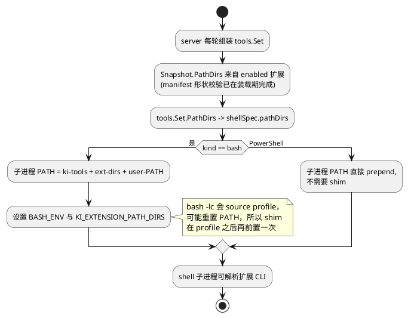

# 计划：扩展 PATH 能力 + zvec-grep 扩展

两项工作放在一起做，因为第二项的第一版就会用到第一项：sidecar 用包内库跑搜索，CLI 通过新能力暴露到 shell。

已完成的行为统一记录在 `docs/extension.md` / `docs/tools.md` / `docs/system_prompt.md`，这里只维护待办与决策记录，落地后把契约搬回那些文档，本文件相应条目打勾或删除。

> **状态：两部分都已落地，条目全部打勾。** 契约现在在这些地方：扩展 PATH 能力 → `docs/extension.md`「扩展 PATH 目录」+ `docs/tools.md`；zvec-grep 包本身 → `extensions/zvec-grep/README.md` + `prompt/APPEND.md`；随包扩展的加载守卫 → `internal/extension/bundled_test.go`。
> 仍需人工验证的一项：真实 provider 下"问概念时模型会改用 `zvec_grep_search`"（需要跑 `scripts/run.sh` 并在已建索引的 workspace 里提问），fake 模型矩阵无法覆盖模型路由行为。

## 目标

1. **扩展 PATH 能力**：extension.json 能声明包内目录，ki 在启动 shell 工具子进程时把这些目录并入 `PATH`，使扩展自带的 CLI（`zg`、linter、项目工具）对模型可见，且不需要用户全局安装。
2. **zvec-grep 扩展**：把 [zvec-ai/zvec-grep](https://github.com/zvec-ai/zvec-grep) 的本地混合检索（ripgrep + BM25 + 向量）做成 bundled extension，让模型在"语义/模糊/跨文件综合"问题上用索引检索，精确查询仍走内置 `Grep`/`Glob`。

## 非目标

- 不为扩展提供 MCP 客户端能力。ki 的扩展协议只有 NDJSON JSON-RPC sidecar；MCP 只能作为扩展**进程内部**的出站传输，不引入宿主支持。
- 不做项目级（`<cwd>/extensions`）扩展或项目级 PATH 作用域；扩展今天只有全局 scope。
- 不自动全局安装第三方 CLI，不写用户的 `~/.codex`、`~/.claude`、`opencode.jsonc` 等外部 agent 配置（即不使用 `zg --install`）。zg 的 `AGENTS.md`/`CLAUDE.md` 托管块由本扩展的 `prompt.append` 等价替代。
- 不 vendor zg 源码，不引入 Rust 实现（`rust/` 的 `publish = false`，要用就得自行构建并分发二进制）。
- 不把 zg 的 managed ripgrep 路由（`zg --rg` / `zvec_grep_rg`）注册成模型可见工具；ki 已有 `Grep`/`Glob`，且内置追加层强制 rg/fd。

---

## 第一部分：扩展 PATH 能力

### 决策

- **manifest 字段**：`runtime.path: []string`，相对包根，只允许相对路径；绝对路径、`..` 越出包根、空串 → manifest 错误（`d.Error`）并禁用该包，复用 `internal/extension` 现有的 `withinRoot` 校验路径。
- **能力门闸**：新增 `capabilities: ["path"]`。未声明时忽略 `runtime.path`，与 `skill` / `command` / `prompt.append` 的门闸语义一致。
- **不要求 `runtime.kind: rpc`**：纯 CLI 包（`kind: none`）也应能声明 `path`。
- **路径存在性只能在使用时判定**：`node_modules/.bin` 之类由 `runtime.install` 创建，而 install 晚于 manifest 校验。装载期只校验形状，每轮组装工具时 `os.Stat` 并跳过缺失目录（log 一次）。副产品：install 建出的目录下一轮自动生效，不需要 reload。
- **PATH 顺序**：`ki 内嵌 rg/fd 目录` → 扩展目录（按扩展名排序）→ 用户原 PATH。ki 的目录永远最前，保证 shell 里的 `rg`/`fd` 仍是 ki 自带版本；扩展目录在用户 PATH 之前，保证 shell 里敲到的 `zg` 与 sidecar 使用的版本一致。
- **作用面**：只影响 ki shell 工具（Bash / PowerShell / Monitor）派生的子进程；不影响用户终端、扩展 sidecar 自己的环境（sidecar 用 `KI_EXTENSION_ROOT` 定位包内 bin）和 `Grep`/`Glob` 的内嵌引擎。
- **可观测**：`GET /v1/extensions` 的扩展条目加 `pathDirs`（解析后的绝对路径），WebUI 扩展卡片展示；PATH 覆盖别人命令这件事必须可见。

### 关键实现点

Bash 的难点不在拼 PATH，而在 `bash -lc` 会先 source `/etc/profile`，Debian 的 `/etc/profile` 会整体重置 `PATH`。现状是 `internal/search/executable.go` 的 `toolsShim` 通过 `BASH_ENV` 在 profile 之后再前置 ki 自己的目录。扩展目录必须同样处理，但 shim 写在共享的 tools 缓存目录里、按内容比较决定是否重写（`materializeShim`）：内容一旦随 session 变化，每个 turn 都会去改写这个共享文件。所以 shim 保持静态，改成读环境变量：

```sh
# 现有逻辑：_ki_tools_dir 取自 BASH_SOURCE，先前置
# 新增：按顺序前置扩展目录
if [ -n "${KI_EXTENSION_PATH_DIRS:-}" ]; then
  _ki_old_ifs=$IFS; IFS=:
  for _ki_dir in $KI_EXTENSION_PATH_DIRS; do
    [ -d "$_ki_dir" ] || continue
    case ":$PATH:" in *":$_ki_dir:"*) ;; *) PATH="$_ki_dir:$PATH"; export PATH ;; esac
  done
  IFS=$_ki_old_ifs
fi
```



### 变更清单

- [x] `internal/extension/capability.go`：新增 `CapPath Kind = "path"`。
- [x] `internal/extension/manifest.go`：`RuntimeSpec.Path []string`；装载期校验（相对、`withinRoot`、非空），失败写 `d.Error`；`Descriptor.PathDirs()` 返回绝对路径（enabled + 声明能力 + 无 Error，不做存在性检查）。
- [x] `internal/extension/merge.go`：新增 `PathDirs(enabled []Descriptor) []string`，与 `PromptLayers` / `SkillRoots` / `CommandDir` 同层，按包名排序。
- [x] `internal/resources/loader.go`：`Snapshot.PathDirs []string`，在 `scan()` 里由 `extension.PathDirs(found.Enabled)` 填充（随快照缓存，reload 后更新）。
- [x] `internal/tools/set.go`：`Set.PathDirs []string`；`Build(profile)` 把它透传给 `bashTool` / `powerShellTool` / `monitorTool`（`shellSpec.pathDirs`）。
- [x] `internal/tools/shells.go`：`withBundledSearchTools(env, primary string, extra []string, kind shellKind)`；`prependPath` 支持多目录；Bash 分支额外设置 `KI_EXTENSION_PATH_DIRS`，分隔符固定为 `:`（shim 是 POSIX 脚本，与宿主 `os.PathListSeparator` 无关）。
- [x] `internal/search/executable.go`：`toolsShim` 增加扩展目录循环（shim 内容变更后 `materializeShim` 会重写缓存里的文件）。
- [x] `internal/server/server.go`：组装 `tools.Set{...}` 时填 `PathDirs: snapshot.PathDirs`（`snapshot` 已在同处 `s.resources.Load` 取到）。
- [x] `internal/server/slash.go`：`extensionCatalog` 暴露 `pathDirs`（`[{path,exists}]`，已声明但缺失的目录也返回，见 `Descriptor.PathDirStatuses`）。
- [x] 文档：`docs/extension.md`（manifest 表 + `runtime.path` 语义 + 失败模式）、`docs/tools.md` 的"内置 rg 和 fd"小节（PATH 顺序）、`internal/extension/doc.go`、`internal/tools/doc.go`、`internal/search/doc.go`。

### 测试

- [x] `internal/extension`：`pathDirs` 只返回 enabled + 声明能力 + 无 Error 的包，按名排序；绝对路径 / `..` 逃逸 → 包被禁用；缺失目录在使用时被跳过。
- [x] `internal/tools`：PATH 顺序（ki → ext → user）；`KI_EXTENSION_PATH_DIRS` 值；**无扩展时子进程 env 与今天逐字节一致**（防回归）；PowerShell 分支同样 prepend。
- [x] Go e2e fixture：扩展带 `bin/ziprobe`（`echo extension-path-marker`），Bash 工具能执行（新增 `e2e-bash:<cmd>` 脚本 token 驱动）；禁用该扩展后命令找不到；`runtime.install` 之后才出现的目录在下一轮生效（由 `internal/extension` 单测覆盖）。

### 风险

- PATH 是全局命名空间：扩展目录在用户 PATH 之前，理论上可以 shadow 用户命令。缓解：目录必须位于 `{KI_HOME}/extensions/<name>/` 之下、清单可见（`pathDirs`）、文档写明；不接受绝对路径。
- 若扩展非常多，PATH 会变长；只加真实存在的目录可缓解。

---

## 第二部分：zvec-grep 扩展

### 上游事实（0.2.1）

- npm `@zvec/zvec-grep@0.2.1`，`engines.node >= 22`；同时发布**库**（`exports["."]` → `dist/index.js|d.ts`：`createZvecGrep`、`openWorkspaceReadSession`、`createEmbeddingModel`、`EmbeddingPurpose`；`ZvecGrepContextOptions` / `ZvecGrepIndexOptions` / `ZvecGrepInfoResult`）和 **CLI**（`bin.zg`）。
- 索引在 `<root>/.zvec-grep/`，全局状态 `~/.zvec-grep/`；`--mode auto|server|direct`，`auto` 不会自启 daemon；`--status --check-ready` 未就绪时非零退出；索引检索输出是文本，**JSON 只在 `--rg` 路由**（`--json`/`-l`/`-q`/`-c` 等 rg 兼容项）。
- 默认本地 embedding `local/potion-code-16m-v2`，`context` 默认 limit 10、总量上限 30。
- 有 daemon lease 与跨进程 writer-intent lock：同一 workspace 同时跑 `zg --server` 和直接写索引可能被拒；两边各加载一份 embedding 模型。
- 仓库自述 work in progress；`exports` 不保证 semver 稳定。

### 决策

- **搜索走库 API（in-process）**，sidecar 内单例 `createZvecGrep(...)`，`root` 不交给模型，按 session 的 cwd 解析；结果用 `ZvecGrepContextResult` 结构化渲染成 tool result，不解析 CLI 文本。
- **索引/状态走 CLI**（`/zg-index`、`/zg-status` command），因为 `tool.execute` 有 120s 硬上限（超时先 `cancel` 再 2s 宽限）；首次建索引可能下载几百 MB 模型，绝不能放在工具调用里。
- **不暴露 `zvec_grep_rg`**。`prompt.append` 明确分工：精确/穷举 → `Grep`/`Glob`；语义/模糊/跨文件综合 → `zvec_grep_search`；shell 里仍禁用 `grep`/`find`。
- **版本锁定** 0.2.1，且把 `ZvecGrepContextResult → tool result` 的转换集中在一个文件，便于跟随上游改动。
- **命名**：工具名 `zvec_grep_search`（避开 `reservedToolNames`）；扩展名 `zvec-grep`。
- **不接管 daemon**：默认自持引擎（in-process），设置里可选 `external-daemon`；避免与 zg 自己的 `--mode direct|server|auto` 术语混淆，我们不用 `direct` 作配置值。文档明确不要同时跑 `zg --server` 与扩展的索引写入。

### 包布局与 manifest

```
extensions/zvec-grep/
├── extension.json          capabilities: ["tool", "settings", "prompt.append", "command", "path"]
├── prompt/APPEND.md
├── locales/{en,zh}.json
├── src/{main.ts,rpc.ts,tool.ts,index-job.ts,prompt.ts}
├── test/runtime.test.mjs
├── package.json            setup = bun install && vite build
└── vite.config.ts
```

```json
{
  "name": "zvec-grep",
  "capabilities": ["tool", "settings", "prompt.append", "command", "path"],
  "config": { "schema": { "properties": {
    "embedding": { "type": "string" },
    "device": { "enum": ["auto", "cpu", "metal", "vulkan", "cuda"] },
    "mode": { "enum": ["in-process", "external-daemon"] },
    "maxResults": { "type": "integer" },
    "ignoredGlobs": { "type": "array", "items": { "type": "string" } }
  } } },
  "prompt": { "append": ["prompt/APPEND.md"] },
  "runtime": {
    "kind": "rpc",
    "command": "bun",
    "args": ["dist/main.js"],
    "install": ["bun", "run", "setup"],
    "path": ["node_modules/.bin"]
  }
}
```

### 变更清单

- [x] 脚手架：`extension.json`、`vite.config.ts`、`package.json`（照 `extensions/deep-web-search`）、`locales/{en,zh}.json`、`bun.lock`；锁定 `@zvec/zvec-grep@0.2.1`。
- [x] `src/rpc.ts`：`StdioRpc` 增加 `replyOnce`，让 `cancel` 能先回一个结果、并抑制被放弃的 handler 迟到的第二次回复（Host 只接受一个结果）。
- [x] `src/main.ts` + `src/engine.ts`：`EnginePool` 每个有效配置一个库实例，按 `sessionId → cwd` 解析 root；`session.open` 记录、`session.close` 释放 host 句柄；搜索并发上限 4（库没有取消接口，一条卡住的搜索不能挡住后续搜索）。
- [x] `src/tool.ts` + `src/render.ts`：如上参数；`ignoredGlobs`（用户策略）恒作为 `excludePaths`，模型参数无法放宽。结果渲染为 `freshness/root/source/coverage/items/routes` 头 + 每条 `path:start-end`、`matchedBy/score`、行号源码，`preview: full` 追加 outline；正文与整段输出都有字符上限。
- [x] `prompt/APPEND.md`：改写上游 `docs/03-mcp.md` 的路由指引（精确查询归 `Grep`/`Glob`、最多一次聚焦探测、`possibly_stale` 需复核、绝不自行建/删索引、`.zvec-grep/` 加入 `.gitignore`）。
- [x] 索引管理：`src/commands.ts` + `src/index-job.ts` + `src/cli.ts`，`/zg-index`（后台 `zg index`，解析非 TTY 进度行：scanning / model / `Indexing files: n/m` / done）、`/zg-status`、`/zg-remove`（先 `ui.confirm`，选项透传但拒收 `--drop`）。进度写 `ui.setStatus`，完成后写 `session.appendEntry("zvec-grep-index")`，并按设置（`notifyOnIndexComplete`，缺省关）`session.enqueue({ kind: "custom", when: "settled" })` 回报；未建索引时搜索返回可操作错误，绝不自行建索引。
- [x] `settings`：`config.updated` 清缓存并 dispose 引擎，下次搜索按新 embedding/device 重建；`mode=external-daemon` 走 CLI，`zg server status --check-ready` 非零时直接失败并提示 `zg server on` 或切回 in-process。
- [x] 测试：`test/harness.mjs`（真 sidecar + 假 library/CLI）、`test/runtime.test.mjs` 11 例（工具/命令注册、root 解析与渲染、未索引与 disabled 错误、preview 截断与 full outline、`ignoredGlobs`、`config.updated` 重建、cancel 只回一次、`/zg-status`、`/zg-index` 进度+完成通知、重复任务与 `--drop` 拒绝、`/zg-remove` 确认两条路径）、`test/live.test.mjs`（`KI_ZVEC_GREP_LIVE=1`，真库真 CLI：建索引 → 语义检索 → status → remove）。取消没有"部分结果"：库调用不可中断，取消只回报取消本身，这一点写在工具文案和 README 里。
- [x] Go 侧改为更贴合真实风险的两个测试（`internal/extension/bundled_test.go`）：`TestBundledExtensionsLoad` 把 `extensions/*` 复制进临时 home 跑 `Discover`，要求每个随包 manifest 无错误、能力非空、locale key 对齐；`TestBundledZvecGrepDeclaresPathAndPrompt` 断言 `path`/`tool`/`settings`/`prompt.append`/`command` 能力、`node_modules/.bin` 声明在未安装时不进 PATH 但在 catalog 里标 `exists:false`、prompt 层含路由规则。协议侧（工具进会话、tool result 回 context、命令 notice）已由既有 sidecar e2e 覆盖，再用一个 Go fixture 复述没有新增覆盖。
- [x] `extensions/zvec-grep/README.md`：前置条件（Node 22+、bun setup、模型下载）、安装、命令、设置表、in-process 与 external-daemon 的取舍与互斥、结果形态、测试（含 `KI_ZVEC_GREP_LIVE=1`）、故障排查。
- [x] WebUI：settings schema 自动生成 Configure 表单（无需改前端）；session Info 的扩展卡片列出 PATH 目录与存在状态，`webui.spec.ts` 与 `responsive.spec.ts`（桌面/平板/两种手机/横屏）都断言该行不溢出且移动端可用。

### 开放问题

- [x] 远程 embedding 授权：schema 里不放 apiKey/endpoint（模型看不到凭据），远端模型由 zg 自己的 `zg config provider set` / `zg auth grant` 配置；扩展不做 elicitation 流程，README 写明。
- [x] 不在系统提示里列 PATH 目录（省 token）：capability 与目录在 catalog / 设置页可见，模型需要时由扩展自己的 `prompt.append` 自述。
- [x] `mode=external-daemon` 已按 M4 落地为"走 CLI + 快速失败"，不做 HTTP；daemon 生命周期仍由用户掌控。

---

## 里程碑与顺序

- [x] **M1** 第一部分核心（manifest 能力 + 快照透传 + PATH/shim + 单测 + Go e2e + 文档）。不碰 WebUI。
- [x] **M2** catalog 暴露 `pathDirs`（`GET /v1/extensions` + WebUI 卡片 + 响应式矩阵）。
- [x] **M3** zg 扩展 MVP：`zvec_grep_search`（库 API）+ `prompt.append` + `settings` + locales + sidecar 测试（真库真 CLI 的 live 用例通过）。"问概念时模型改用它"需要真实 provider 手动验证，见下节。
- [x] **M4** zg 索引管理：`/zg-index`、`/zg-status`、`/zg-remove`、进度与完成通知、`mode=external-daemon`。
- [x] **M5** 打磨：诊断信息（未索引 / disabled / 超时 / 取消 / freshness / truncation / 空结果原因）、README。`zg --rg --json` 与 shell 组合的示例不写：本扩展不注册 `zvec_grep_rg`，精确检索由内置 `Grep`/`Glob` 承担。

## 验证方式

- `go test ./internal/extension ./internal/resources ./internal/tools ./internal/server`
- `go test ./e2e`（fake 矩阵，含新 fixture）
- `cd web && bun run test:e2e`（仅当动了 WebUI）
- 真实环境手动验证走 `scripts/run.sh`（真实 provider），前置条件：Node 22+、`extensions/zvec-grep` 已 install；手动用例：让模型跑 `zg --status`（验证 PATH 能力）与一次语义检索（验证扩展工具）。

## 不做

- ki 宿主级 MCP 客户端。
- 项目级扩展 / 项目级 PATH 作用域。
- 自动全局安装或修改其它 agent 的配置。
- 用 zg 的 managed rg 替代内置 `Grep`/`Glob`。
