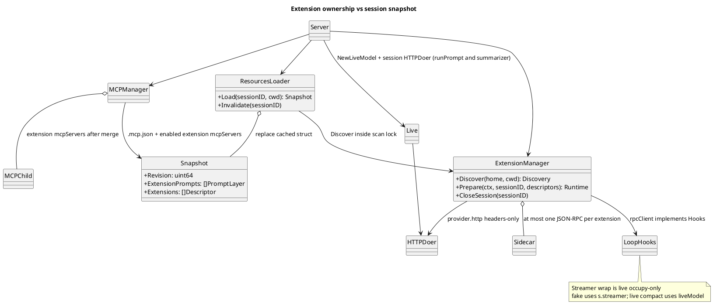
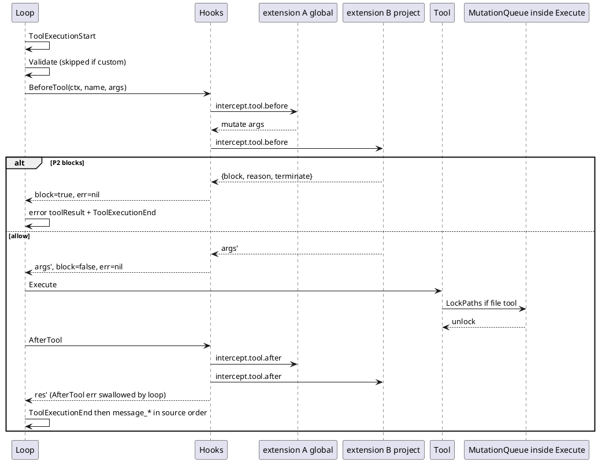
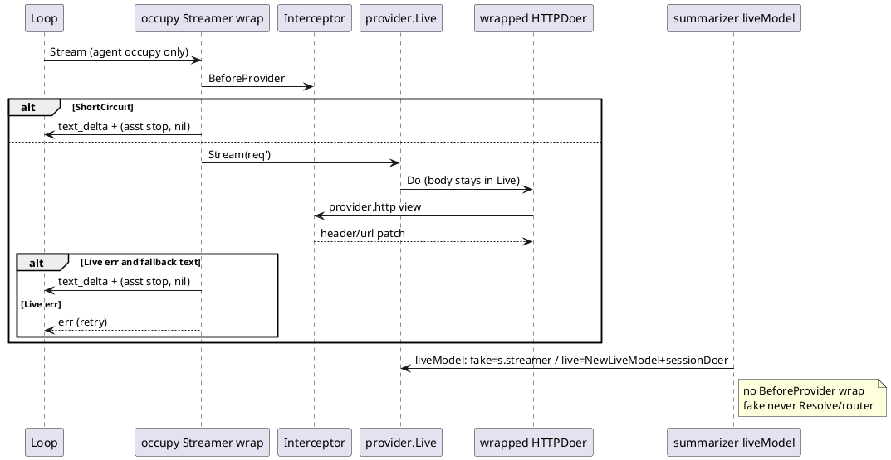
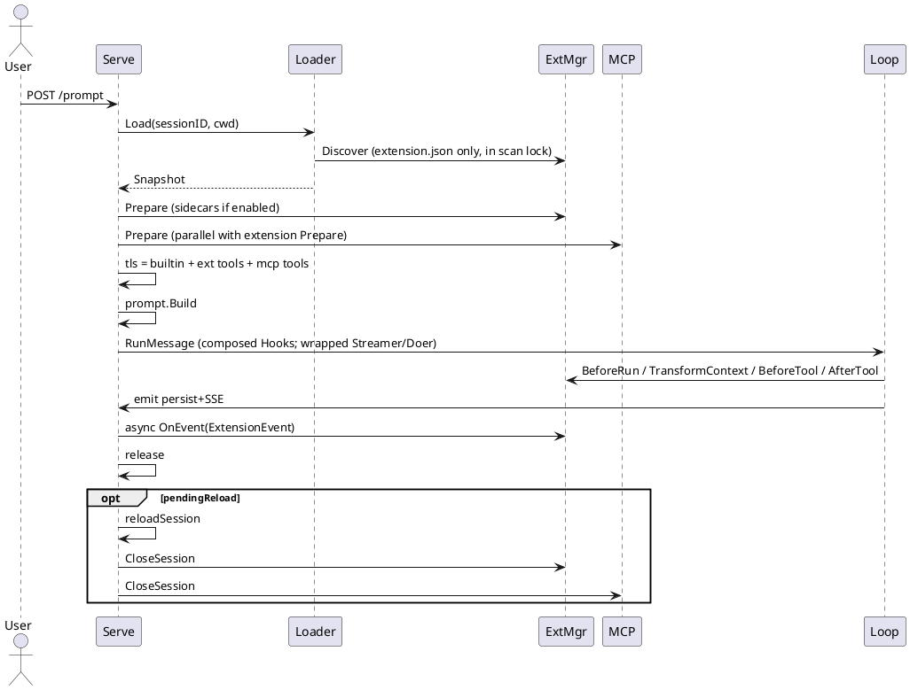

# ki 扩展系统设计

| 字段 | 值 |
|---|---|
| Title | ki extension 系统 |
| Author | design-doc-writer |
| Date | 2026-08-24 |
| Status | Draft |
| Audience | ki 核心开发者 |
| Destination | `docs/todo/extension.md`（实现落地后迁到 `docs/extension.md`） |

---

## Overview

ki 已经具备第一方扩展能力：分层 system prompt（含 `APPEND_SYSTEM.md`）、MCP 工具、slash command、skills、`loop.Hooks`（`BeforeTool` / `AfterTool` / `BeforeRun` / `TransformContext` / `OnContextOverflow`）、以及 provider registry。这些能力分散在 `internal/prompt`、`internal/mcp`、`internal/command`、`internal/skills`、`internal/loop`、`internal/provider` 中，用户无法以统一的包把它们组合、分发、开关。

本设计把上述能力收敛成一套 **extension 系统**（文档与 API 一律用 extension，不用 plugin）。作者路径只有两条，**都不把扩展编进 ki 二进制**：

1. **声明式贡献**（无扩展 sidecar）：在现有子系统上多一组由 `extension.json` 声明的文件根 / spec，合并规则见 §1.0。
2. **JSON-RPC sidecar**（语言无关）：可执行 slash、hooks、工具/provider 拦截、自定义工具。协议是 NDJSON JSON-RPC 2.0，不是 MCP，也不是每个扩展一个 HTTP 服务。

Host（发现、合并、拉起/杀掉 sidecar、把 RPC 接到 `loop.Hooks`）仍是 ki 里的 Go。扩展作者不 `import` `internal/`，不 `dlopen`。不引入 Go `plugin.Plugin`（.so）、jiti、npm marketplace、shell hook 脚本表面。

核心约束沿用 `AGENTS.md`：单二进制、WebUI 同源、不发明 loop 已有数据的 REST、资源按 session 做不可变快照、reload 复用 `POST /v1/reload`、跨平台 `filepath`。

---

## Background & Motivation

### 现状

一次 `runPrompt`（`internal/server/server.go`）的组装顺序已经固定：

1. `tools.Set.Build(profile)` 按模型能力构造内置工具。
2. `resources.Loader.Load(sessionID, cwd)` 取出不可变 `Snapshot`。
3. `mcp.Manager.Prepare` 按 `toggles.json` 连接启用的 MCP server，把成功的 `loop.Tool` 追加进本轮工具集。
4. `prompt.Build` 纯渲染 system prompt。
5. `loop.RunMessage` 以同一份 tools / system 写入 `request_header`，经 `loop.Streamer` 调模型。

现有扩展点：

| 能力 | 现状入口 | 缺口 |
|---|---|---|
| append system prompt | `{KI_HOME}/prompt/APPEND_SYSTEM.md` 或 `<cwd>/.ki/prompt/APPEND_SYSTEM.md`，项目覆盖全局（`resources.loadAppendSystemPrompt`） | 只能一份；不能按扩展叠加 |
| tools / MCP | `{KI_HOME}/.mcp.json` + `<cwd>/.ki/.mcp.json`；`toggles.json` 过滤 | 不能把 MCP 和 skills/commands 打成一个包；没有语言无关的自定义工具 / 拦截 |
| slash command | builtin `compact`/`reload` + `prompts/*.md` + `/skill:name`（`internal/command`） | 不能注册可执行 handler（只能展开成 user text） |
| skills | `{KI_HOME}/skills`、`~/.agents/skills`、`<cwd>/.ki/skills`、祖先 `.agents/skills` | 扩展无法自带 SKILL.md 树 |
| hooks | `loop.Event` 只给 persist/SSE 订阅；`loop.Hooks` 目前 server 只用了 `TransformContext`（附件物化）和 `OnContextOverflow` | 用户无法订阅 `agent_start` / `tool_execution_*`；`BeforeTool`/`AfterTool` 空置 |
| tool intercept | `Hooks.BeforeTool` 已支持 rewrite / `{block, reason}` / `terminate`；prepare 阶段同步、无副作用 | 没有实现者；MCP 与内置工具走同一路径但无人接入 |
| provider intercept | `provider.Live` 直接 `HTTPDoer.Do`；三套协议形状严禁混用 | 无法加 header、改 `loop.Request`、短路或 fallback |

### 痛点

- 想做「保护 `.env` / 危险 Bash 确认 / 公司网关 header」必须改核心。
- 想把「一段 prompt + 两个 skill + 一个 MCP + 一条 slash」发给同事，没有包格式。
- `loop.Hooks` 已经按 pi 语义预留了拦截，但没有扩展去填充，形成「半开」的扩展面。

### 参考：pi 的优秀部分

主参考：`/data/hgy/pi/packages/coding-agent/docs/extensions.md`。ki 明确借用：

- **一个扩展 = manifest + 可选单一 sidecar + `on(event)`**，而不是平行的多套子系统。ki 把观察/拦截/执行落在 Host 的 JSON-RPC 方法表上；声明式文件只做贡献，不另开观察通道。
- **tool_call 可 `{block, reason, terminate}`，input 可变，后处理器看见前者的 mutation**。
- **tool_result 链式 patch**（`content` / `details` / `isError`）。
- **provider 拦截分层**：headers 就地改；**不**把协议 payload 交给扩展。
- **`/reload` 拆掉旧 runtime、重读磁盘、再 `session_start`**。
- **工厂里不拉长生命周期资源**；sidecar / watcher 放到 Prepare（session_start 同类），在 session_shutdown 关。

次参考 Claude Code：扩展目录约定（`commands/` / `skills/` / `hooks/` / MCP）有用；marketplace、GUI 商店、TUI overlay **不抄**。

### 明确不从 pi 复制

| pi | 不抄的原因 |
|---|---|
| jiti 加载 TypeScript | ki 是 Go 单二进制；运行期编译 TS 引入 Node 运行时，破坏「一个 `ki` 文件」 |
| npm / `pi install` / packages gallery | 供应链与版本地狱；v1 只发现本地目录 |
| TUI `ctx.ui.custom` / widget / snake / doom | ki 的第一方客户端是同源 WebUI，不是终端组件树 |
| `registerTool` 在 turn 中立刻对模型可见 | 与 `resources.Snapshot` + `request_header` 固定本轮工具集冲突 |
| `resources_discover` 在 `session_start` 之后贡献路径 | ki 的 Discover 发生在 `Loader.scan` 锁内、Prepare 之前，以保证 Snapshot 原子；这是对 Snapshot 不可变的让步，不是 pi 的时序 |
| `registerProvider` 自定义 stream + 混用协议 payload | ki 三套协议形状不能混；自定义供应商走已有 `models.json` / `/v1/providers` |
| `sendMessage` 自定义消息进 LLM context | session jsonl 角色已有约定；v1 只用 sideband，避免污染 replay |
| keybinding / CLI flag 注册 | Cobra flags 与 WebUI 快捷键保持第一方 |
| `tool_call` 错误 fail-safe（拦工具） | ki 在 **扩展层** fail-open，以免一个坏 sidecar 卡死 agent；`loop.Hooks.BeforeTool` 返回 `error` 仍拦工具（见 Key Decision 12） |
| 项目扩展 `trust.json` | 用户决定：不引入 trust。启用只走 `toggles.json`，与 skills/MCP 相同，默认开（见 Key Decision 5） |
| `before_provider_headers` 一次组装、重试复用 | ki `streamWithRetry` 每次 `Stream` 都走拦截，扩展可在重试时改 header（见 10.3） |

---

## Goals & Non-Goals

### Goals

1. 统一扩展模型：声明式贡献进现有子系统；需要跑代码时 **只** 走 JSON-RPC sidecar（语言无关）。
2. 至少覆盖：append system prompt、tools（含 MCP）、slash command、skills、hooks、tool interception、provider interception。
3. 能力表开放，后续可加 custom compact / session entry / UI widget，而不重写核心。
4. 与现有 `Snapshot` / `POST /v1/reload` / `loop.Event` / `toggles.json` 组合，而不是再做一套。
5. 每个 extension 有进程级 toggle，放全局设置，形态对齐 skills/MCP（`toggles.json` `extensions.disabled`）。**缺省启用**。关掉则不贡献、不 spawn。
6. **扩展不编进 ki。** 生产路径没有进程内 Go 扩展、没有 `RegisterBuiltin`。Go 写扩展 = 独立可执行文件讲同一套 JSON-RPC。Manager 单测可用 `_test.go` fake `Interceptor`（不是 Discover 里的扩展）。

### Non-Goals（v1）

- 扩展市场、npm/git 安装器、签名仓库。
- WebUI 扩展自绘组件、自定义 Markdown transformer、改 composer 布局。
- 把扩展编进 ki 二进制、进程内 Go 作者 API、`internal/extension/builtin`、`runtime.kind=inprocess`。
- v1 shell hook 脚本表面（`hooks/*.sh`）。观察一律 sidecar `event`。
- Go `plugin`（`.so`）与 wazero WASM runtime（接口预留，实现不做）。
- 每个扩展起一个 HTTP 服务作为 Host 协议（与 MCP Streamable HTTP 撞车；拦截热路径不走端口）。
- 交互式权限弹窗（tool 执行中 `confirm`）。**用户决定 v1 不做**；拦截只非交互 block/allow/mutate。
- 自定义 compact 算法。**完整自定义 provider 协议（`CapProvider` / 自定义 Streamer）用户决定 v1 不开放**；私有流协议先扩 `internal/provider`。
- 运行中热增删本轮工具列表。
- 扩展改写 AGENTS.md 搜索规则或替换 ki 身份层 prompt。
- `trust.json`、按 cwd 信任、启动确认模态。项目 `.ki/extensions` 与项目 `.mcp.json` / `.ki/skills` 同一模型：发现即默认启用，用户用 toggle 关。
- 对 `runtime.command` 做 hash/mtime 钉死。

---

## Key Decisions

1. **声明式贡献 + 唯一代码运行时（JSON-RPC sidecar）。** 语言无关。不 `dlopen`、不把扩展编进 ki、不提供进程内 Go 作者 API、v1 不提供 shell hook 脚本。Go 若用来写扩展，产出的是 `runtime.command` 指向的独立二进制，讲 NDJSON，禁止 `import` `internal/`。Host 内部的 `Interceptor` 接口由 `rpcClient` 实现，不是作者表面。
2. **`Registration` 在 `Init`/`initialize` 返回后冻结，直到 Reload。** 扩展不能在 turn 中途改工具目录或 Snapshot。这是与 pi `registerTool` 即时生效的根本分歧。
3. **拦截挂在已有 `loop.Hooks` 与 `loop.Streamer` 上，不新发明 REST。** 新数据走 `loop.Event` + jsonl + 现有 SSE。`extension_error` 用 `session.AppendSidebandEvent`，与 MCP 相同，不用 `AppendEvent`。
4. **Host 只暴露协议中立的 `loop.Request`；HTTP 拦截只接触 header 与 URL，永远不把 Completions/Responses/Anthropic body 交给扩展。** 即使 intercept 点含 `provider.http` 也不能读/写 body。Host 在调用前剥离 `Authorization` 与 `X-Api-Key`（Anthropic，`internal/provider/anthropic.go`）。**两层包装必须拆开：** live 路径上 intercept 点 `provider.http` 的 `HTTPDoer` 按 session 注入 `NewLiveModel`（`runPrompt` 与 compact 共用 helper）。**禁止**把 Doer 存进进程级 `router`。`KI_FAKE` / 注入 `opt.Streamer` 时 `requireModelCredential == false`，`runPrompt` 与 `summarizer` 继续用 `s.streamer`（`Scripted`），**不得**走 `Resolve`+`NewLiveModel`。`router` 仍是「未注入 Streamer」时的 live 默认（`liveFromRegistry`）；fake **从不**进 `router.Stream`。`BeforeProvider` 只包 **live** occupy 的 `loop.Config.Streamer`。compact **不得**看见 BeforeProvider。
5. **不引入 trust。启用只走 `toggles.json`，与 skills/MCP 同形。** `toggles.File.Extensions session.Toggle`，按 `extension.json` 的 `name` 列入 `disabled` 即关。未列入 = 启用（缺省全开）。全局 `{KI_HOME}/extensions` 与项目 `<cwd>/.ki/extensions` 同一套开关。禁用：不贡献 prompt/skills/commands/MCP、不启动 sidecar，仍出现在 `GET /v1/extensions` 列表（`enabled: false`）。WebUI 全局设置页签对齐 Skills/MCP。这与现有项目 `.mcp.json` 默认就会 spawn 的模型一致（用户拍板）。
6. **MCP 仍是工具的标准运输。** 扩展贡献的 server spec 合并进 `Snapshot.MCP` 后由 `mcp.Manager` 拥有。不要让每个扩展自己再实现一套 tools/list。仅 `toggles.extensions`（扩展名）与 `toggles.mcp`（MCP server 名）过滤。**扩展贡献的 MCP 工具名强制前缀** `{extension.json name}/{wireName}`（用户决定，见 KD 21）；用户 `.mcp.json` 的工具名不前缀。
7. **slash 可执行 handler 忙时 409。** 与现有「非 `/reload` 的 slash 且 busy → 409」一致。v1 不给扩展 `AllowBusy`。markdown 模板继续用 `KindTemplate`，不新增 Kind。
8. **v1 不做 marketplace、WASM、交互审批 UI。** 用户决定：permission-gate 保持非交互 block/allow/mutate；不开放 `CapProvider` 自定义 Streamer。能力表把它们留成空槽。
9. **启用开关进 `toggles.json`，不进 session `config.json`。** 与 skills/MCP 同一粒度：进程级、reload 后生效。
10. **日志与扩展事件都不含 prompt、工具参数、文件内容、API key。** 扩展只收到红线后的 `ExtensionEvent` DTO，不是原始 `loop.Event`。
11. **`capabilities` 是门闸，不是文档。** 未声明的能力：对应 manifest 字段忽略；`initialize` 返回的 Tools/Commands/Interceptor 方法也丢弃并 `extension_error`。未知 capability 字符串 warning、不失败。`intercept[]` 同样是门闸：未列出的 intercept 点不调用对应 RPC。
12. **扩展层 fail-open；`loop.Hooks.BeforeTool` 的 `error` 仍拦工具。** Manager 组合器 **从不**把 sidecar/panic/超时变成 `BeforeTool` 的 `error`（否则 `executeTools` 会 fail-closed）。扩展失败：记 `extension_error`，本 occupy 内跳过 **该扩展**，其它扩展继续，工具放行。`failClosed: true` 只覆盖两条**同步拦截**入口：BeforeTool 失败 → 合成 `{block:true}`；BeforeProvider 失败 → canned `(asst, nil)` 且 `StopReason: "stop"`（不打 HTTP，见 KD 19）。**不**作用于 AfterTool（loop 已吞 hook error）和 TransformContext（扩展 err 必须 fail-open，否则整次 Run 被干掉）。这与 pi「`tool_call` 错误拦工具」相反，见「明确不从 pi 复制」。
13. **动态改 system 只用 `intercept.provider.beforeRun`（映射 `loop.Hooks.BeforeRun`），且只在 occupy 开头跑一次。** `loop.RunMessage` 在 turn 循环外调用 BeforeRun；随后每次模型调用才 `drainInbox` + `TransformContext` + `Stream`。因此 BeforeRun **看不见** steer 文本，也不能在工具回合之后改 system。`BeforeProvider` 禁止改 `System`。v1 **没有**按 turn 改 system 的入口。只声明 intercept 点 `tool` 的扩展永远看不到 system 或对话正文；必须列出 `provider`。
14. **sidecar 环境变量只含 `runtime.env` 白名单 + Host 注入的非秘密元数据，不继承 `os.Environ()`。** 与 MCP stdio（`spec.Env` 非空时 `cmd.Env = os.Environ()` 再追加）刻意不同，避免 `*_API_KEY` 漏进第三方进程。
15. **设置 API 克隆 skills/MCP，不发明 trust 路由。** `GET/PATCH /v1/extensions?workspaceId=`：Scan 展示 home+该 workspace 的包；PATCH body 只有 `{ "disabled": [] }`，出现则整表替换 `toggles.extensions.disabled`，然后 `Reload()`。不设 `trustCwd`。无 `ki extension trust`。可选 `ki extension list` 只读。
16. **扩展不编进 ki，Discover 没有 `builtin` scope。** 禁止 `internal/extension/builtin`、禁止 `server` 构造时 `RegisterBuiltin`、禁止功能包 `init()` 注册。第一方行为继续改 `internal/tools` / `internal/prompt` / `internal/command`。`_test.go` 可构造 fake `Interceptor` 测链，不进 `Snapshot.Extensions`。
17. **sidecar 进程组模板是 `internal/tools/proc_unix.go` / `proc_windows.go`，不是 MCP。** 当前 `mcp.Manager.connect` **没有** `Setpgid`。Reload/Close/`ki serve` 退出必须 `detachCmd` + `killCmd` + `WaitDelay=200ms`。
18. **JSON-RPC 分帧为 NDJSON（一行一个 JSON-RPC 2.0 对象），不是 MCP `Content-Length`。** 扩展 sidecar 不必实现 MCP；MCP 只用于 `mcp.Manager` 连的工具服务器。
19. **对着 `streamWithRetry` 的罐头响应必须 `(assistant, nil)` 且 `StopReason: "stop"`。** `StopReason == "error"` 在 `streamWithRetry` 里会当可重试的供应商失败（最多 5 次，每次再 `message_start`）。short-circuit、fallback 成功替换、BeforeProvider `failClosed` 一律用 `stop`，正文放在 text content（政策拒绝也可写在 text 里）。只有真正的 HTTP/网络失败才返回 `err` 让 retry 运转。v1 不新增 non-retryable sentinel。
20. **`CapTool` 执行器只有 sidecar `tool.execute`。** Host 按 `ToolSpec` 合成 `loop.Tool`（含 `ToolValidator` / `ProgressTool`）。没有作者侧 `Registration.Executors` / `Host.RegisterTool`。
21. **扩展 MCP 工具对模型可见的名字是 `{extensionName}/{wireName}`。** `extensionName` 是 `extension.json` 的 `name`（已是 `^[a-z0-9][a-z0-9-]{0,62}$`，不含 `/` 与空格；Discover 拒绝违规名）。只给**扩展贡献的 MCP server** 加前缀；用户 `{KI_HOME}/.mcp.json` 与 `<cwd>/.ki/.mcp.json` 保持今天的裸 `definition.Name`。`CallTool` 仍用 MCP 线上的原始名（`WireName`）。前缀后仍冲突则 skip + `extension_error`。`myext/Read` 与内置 `Read` 不是同一名字，**允许**。Reload 后 `name` 稳定，前缀不变。
22. **三种进程不可混称「扩展」。** (1) ki Host；(2) 每个启用且声明了代码能力的扩展 **最多一个** JSON-RPC sidecar；(3) 扩展 `mcp.mcpServers` 仍是 **MCP 进程**，由 `mcp.Manager` 拥有、讲 MCP。sidecar 不实现 `tools/list`；MCP 不实现 slash / hooks / intercept。纯声明式扩展 **不起** sidecar。
23. **`hook` 与 `intercept` 是两个能力族，不是按对象再拆 Cap*。** `hook` = 异步、红线 `event`、不能改控制流。`intercept` = 同步、能改控制流。tool / provider / provider.http 是 **intercept 点**（`extension.json` 的 `intercept[]` 开放列表）。以后加 compact 等只往列表加字符串。Host 只对已声明的点发对应 RPC。

---

## Proposed Design

### 1. 扩展模型：什么是扩展

一个扩展是一个目录（跨平台用 `filepath`）：

```
protected-paths/
├── extension.json          # 必填 manifest
├── prompt/
│   └── APPEND.md        # 可选：追加 system prompt
├── skills/
│   └── review/
│       └── SKILL.md
├── commands/
│   └── ship.md          # 可选：slash 模板（KindTemplate）
└── bin/
    └── extension        # 可选：JSON-RPC sidecar 可执行文件（语言不限）
```

单文件扩展不支持。必须有 `extension.json`，避免把任意 `.md` 当成代码入口。v1 **没有** `hooks/*.sh` 作者表面。

#### 1.0 两类贡献、三种进程（作者模型）

「只是加了发现路径」只适用于 **声明式** 四项，而且 MCP 这一项其实是 **合并 spec 再交给现有 MCP 运行时**，不是多扫一个 `.mcp.json`。

| 能力 | 作者写什么 | Host 做什么 | 起什么进程 | 协议 |
|---|---|---|---|---|
| `prompt.append` | Markdown 文件列表 | 插入 system prompt **第 6 层**（用户 APPEND 仍是第 5 层互斥覆盖） | 无 | 无 |
| `skill` | `skills/` 下 SKILL.md 树 | `skills.Scan` **extra roots**，`seen[name]` 先到先得，插入顺序见 §7 | 无 | 无 |
| slash 模板 | `commands/*.md` | `command.Catalog` extra 模板，`KindTemplate`，`Extension` 字段 | 无 | 无 |
| `mcp` | `extension.json` 内联 `mcpServers` spec | 合并进 `Snapshot.MCP`（不是再发现一条 `.mcp.json` 路径） | **MCP server**（stdio 或 URL），`mcp.Manager` 拥有 | **MCP**（官方 SDK / `Content-Length` 或 Streamable HTTP） |
| 可执行 slash | sidecar 实现 `command.invoke` | occupy 前分发 `KindExtension` | 该扩展的 JSON-RPC sidecar | Host JSON-RPC |
| `hook` | sidecar 收 `event` 通知 | persist/SSE **之后异步** fan-out，不能改控制流 | 该扩展的 JSON-RPC sidecar | Host JSON-RPC |
| `intercept` | sidecar 实现 `intercept.*` 方法 | **同步** await，接到 `loop.Hooks` / Streamer / HTTPDoer | 同上（仍最多一个 sidecar） | Host JSON-RPC |
| 自定义工具 `tool` | sidecar 实现 `tool.execute` | Host 合成 `loop.Tool`，进本轮工具切片 | 同上 | Host JSON-RPC |
| 内置工具 | **不是扩展** | 继续 `tools.Set.Build` | 无 | — |

必须钉死的边界：

1. **声明式扩展不起 sidecar。** `runtime` 缺省或 `kind=none`。只有声明了代码能力（`tool` / `hook` / `intercept`，或 sidecar 要返回 `CommandSpec`）且 `runtime.kind=rpc` 才 `exec`。
2. **一个扩展一个 sidecar，不是一个能力一个进程。** 同一进程上 `initialize` 一次，同时提供 intercept + `command.invoke` + `tool.execute` + 收 `event`。
3. **自定义工具 ≠ 扩展 MCP。** `tool.execute` 是 ki 专属、模型看见裸名（受内置名保留约束）。扩展 MCP 是独立进程、模型看见 `{extensionName}/{wireName}`、其它 MCP host 也能用。一个包可以两种都贡献，那是 **sidecar + N 个 MCP 进程**。
4. **「语言无关」指 sidecar 的 `runtime.command`，不是 MCP，也不是 HTTP 扩展端口。** Python/Node/Go/Rust 均可；Go 也是子进程，不是链进 ki。
5. **声明式也不是无规则地加 PATH。** 合并顺序、冲突、toggles、前缀见各节。把扩展 `skills/` 当成又一个 `~/.agents/skills` 乱扫是错的。
6. **ki 二进制里没有扩展。** `_test.go` fake 不是作者 API。

#### 1.1 `extension.json`

```json
{
  "name": "protected-paths",
  "version": "0.1.0",
  "description": "Block writes to .env and inject a short policy prompt",
  "capabilities": [
    "prompt.append",
    "skill",
    "command",
    "mcp",
    "hook",
    "tool",
    "intercept"
  ],
  "intercept": ["tool", "provider", "provider.http"],
  "failClosed": false,
  "prompt": { "append": ["prompt/APPEND.md"] },
  "skills": ["skills"],
  "commands": ["commands"],
  "mcp": {
    "mcpServers": {
      "time": { "command": "uvx", "args": ["mcp-server-time"] }
    }
  },
  "runtime": {
    "kind": "rpc",
    "command": "bin/extension",
    "args": [],
    "env": { "PROTECTED_EXTRA": "1" }
  }
}
```

字段规则：

- `name`：`^[a-z0-9][a-z0-9-]{0,62}$`，目录名不必相同（与 ki skills 现状一致：frontmatter `name` 可不同于父目录）。
- `capabilities`：**门闸**。未列入的能力：对应 JSON 字段忽略；sidecar `initialize` 返回里属于该能力的成员丢弃并 `extension_error`。未知字符串保留（开放表），加载 warning，不失败。
- `failClosed`：缺省 `false`。为 true 时：BeforeTool 失败 → `{block}`；BeforeProvider 失败 → canned `stop`。AfterTool / TransformContext / OnEvent 仍 fail-open（Key Decision 12）。
- `runtime.kind`：`none`（缺省，无 sidecar）| `rpc`。**没有** `inprocess`。`kind=rpc` 必须声明 `tool` / `hook` / `intercept` 之一，或 sidecar 要返回 `CommandSpec`；否则不起进程，descriptor.Error。反过来：这些代码能力若声明了但没有 `runtime.kind=rpc`，该能力丢弃并 `extension_error`（markdown `commands/` 仍可用）。
- `intercept`：开放的 **点名** 列表，仅当 `capabilities` 含 `intercept` 时生效。缺省或空数组 = Discover 报错（声明了 intercept 却没有点）。v1 认识：`tool`、`provider`、`provider.http`。未知字符串 warning、忽略该点、不失败（给后续 compact 等留口）。未列入的点：对应 RPC 根本不调用，所以只写 `["tool"]` 的包看不到 system/messages。没有 `capabilities: ["intercept"]` 则整段 `intercept` 字段忽略。
- 路径相对扩展根目录，禁止 `..` 逃逸。解析一律 `filepath`，最终必须落在扩展根的 `EvalSymlinks` 之下。
- `mcp.mcpServers` 复用 `mcp.ServerSpec`：`command` 与 `url` 互斥，校验走 `mcp.ValidateServerSpec`。项目扩展的该项 **算代码执行**，见 1.4。**不起 sidecar**；由 `mcp.Manager` 另起 MCP 进程。
- **无 `hooks` 脚本字段。** `capabilities` 含 `hook` 表示 sidecar 要收 `event` 通知。
- `runtime.env`：白名单，原样注入 sidecar。Host 另外注入 `KI_EXTENSION`、`KI_SESSION_ID`、`KI_CWD`、`KI_HOME`、`KI_EXTENSION_ROOT`。不继承用户环境。
- `command` 能力同时覆盖：声明式 `commands/*.md`（无 sidecar）和 `initialize.commands`（要 sidecar）。仅有 markdown 时不要 `runtime`。

#### 1.2 发现路径与优先级

| 位置 | Scope | 进程派生（sidecar / 扩展 MCP） |
|---|---|---|
| `{KI_HOME}/extensions/<name>/extension.json` | 全局 | 默认启用；`toggles.extensions.disabled` 可关 |
| `<cwd>/.ki/extensions/<name>/extension.json` | 项目 | 同上，无额外 trust 门 |

不扫描 session 目录。扩展不是 session 附件。

**身份 vs 链序（两套规则，不要混）：**

- **身份（同名只留一份）：** `name` 是主键。项目扩展替换同名全局扩展（这个仓库想用这个仓库的版本）。被替换者记 `extension_skipped` 日志（只含 name/path）。`name` 禁止 `ki.` 前缀（留给将来第一方，v1 无 builtin 扩展）。Toggle 按这个 `name`。
- **链序（prompt 追加与拦截）：** 1) 仍启用的全局扩展按名字 → 2) 仍启用的项目扩展按名字。确定性排序，避免 readdir 抖动。无编译进 ki 的扩展，故没有 builtin 段。

禁用的扩展 **仍出现在 Discover / 设置列表**（`enabled=false`），但不进入链序、不合并 MCP、不 Prepare sidecar。

#### 1.3 启用 / 禁用

扩展 `toggles.json`：

```json
{
  "skills": { "disabled": [] },
  "mcp": { "disabled": [] },
  "extensions": { "disabled": ["experimental-foo"] },
  "message": { "busy": "steer" }
}
```

`toggles.File` 增加 `Extensions session.Toggle`（`internal/toggles` 与 Skills/MCP 并列）。`Load` 缺文件 = 全部启用。禁用的扩展：不贡献 prompt / skills / commands / MCP、不启动 sidecar，仍出现在设置列表。

设置页没有 session，用 `resources.Loader.Scan(cwd)` 展示磁盘上的包，不 Prepare sidecar（对齐 `GET /v1/mcp`）。

PATCH 成功后 `Server.Reload()`，与 skills/MCP 相同。语义：body **只有** `{ "disabled": [] }`；出现则整表替换。

不写 `trust.json`，不按 cwd 门控进程。项目 sidecar / 扩展 MCP 的威胁模型 = 今天的 `<cwd>/.ki/.mcp.json`。

#### 1.4 `/reload` 集成

现有路径保持不变：

- `POST /v1/reload`（可带 `sessionId`）
- slash `/reload`（busy 时排队到 `release`）
- skills/MCP/extensions toggle 变更成功
- 成功 compaction（session 级 `requestReload`）

Reload 语义扩展为：

1. `resources.Loader.Invalidate*`（已有）
2. `mcp.Manager.CloseSession` / `CloseExcept`（已有；MCP 本身仍不 Setpgid）
3. `extension.Manager.CloseSession` / `CloseExcept`：对 sidecar 使用 `tools.detachCmd` / `killCmd` 杀 **进程组**，`WaitDelay = 200ms`（`internal/tools/jobs.go` 的 `shellWaitDelay`）。**不要**声称复用 MCP 的 pgid——MCP `connect` 没有 `Setpgid`。
4. 下次 `Load` 重扫 `extension.json` 并重新 `Init`

活跃 session 仍把 reload 排到 occupy 的 `release` 之后（`release` → `reloadSession`），避免本轮 `request_header` 中途换工具集。

---

### 2. 能力注册表（开放）

```go
// internal/extension/capability.go
package extension

type Kind string

const (
    CapPromptAppend Kind = "prompt.append"
    CapSkill        Kind = "skill"
    CapCommand      Kind = "command"
    CapMCP          Kind = "mcp"
    CapTool         Kind = "tool"
    CapHook         Kind = "hook"      // 异步 event，不能改控制流
    CapIntercept    Kind = "intercept" // 同步；具体点见 InterceptPoint
    // v1 reserved Kind（不是 intercept 点）：
    // CapUIWidget, CapSessionEntry, CapProvider（自定义 Streamer，非 intercept.provider）
)

// InterceptPoint 是开放字符串，不是新的 Kind。
const (
    InterceptTool         = "tool"
    InterceptProvider     = "provider"
    InterceptProviderHTTP = "provider.http"
    // 以后：compact、… 只加常量，不加 Cap*
)
```

- `CapHook`：sidecar 收 `event` 通知。未声明则 Host 不发 `event`（仍可做 intercept）。
- `CapIntercept`：同步拦截族。真正开哪些 RPC 由 `intercept[]` 决定。

未知 Kind / 未知 intercept 点：warning，不失败。未声明 Kind：该能力的贡献与 Registration 字段丢弃。

---

### 3. 包与所有权

新增 `internal/extension`。DTO（`Descriptor`、`PromptLayer`）放在 `internal/extension/manifest`（或 `internal/resources` 内的同构 struct），**避免 `resources` import 整个 extension runtime**。`Discover` 以函数注入 `Loader`（`scan` 调 `func(home, cwd string) manifest.Discovery`）。

Server 持有 `extension.Manager`，与 `mcp.Manager`、`resources.Loader` 并列。

Snapshot 的替换语义：`UpdateMCP` 今天是「替换缓存 struct + 克隆 map」，不是深拷贝一切切片。扩展字段同样：Invalidate 后下次 Load 整份重扫。



```go
// internal/resources — DTO, no runtime handles
type Snapshot struct {
    Environment        Environment
    ContextFiles       []ContextFile
    AppendSystemPrompt string
    ExtensionPrompts      []PromptLayer // 有序追加层；定义在 resources 或 manifest
    Skills             []skills.Skill
    Prompts            []PromptTemplate
    MCP                mcp.File
    MCPServers         map[string]mcp.ServerState
    Extensions         []Descriptor // 发现结果，不含 RPC 客户端
    Revision           uint64
}

type PromptLayer struct {
    ExtensionID string
    Text        string
}

type Descriptor struct {
    Name         string
    Version      string
    Description  string
    Path         string // 宿主绝对路径；WebUI 只展示，禁止当 href
    Scope        string // home | project
    Enabled      bool   // toggles.extensions.Allowed(name)；缺省 true
    Capabilities []string
    Intercept    []string // 已声明的 intercept 点；无 CapIntercept 时为空
    Error        string
}
```

`scan()` 在锁内调 Discover：**只读** `extension.json` 与声明式小文件，不 exec。这与 pi `resources_discover` 在 session_start 之后相反，是 Snapshot 原子性要求。

---

### 4. Capability: append system prompt

`docs/system_prompt.md` 现有 9 层。插入扩展层后是 **10 层**（实现时改那份文档，不要把 6–9 偷偷重编号却仍写「保持 1–9」）：

1. 身份与职责
2. Ki 配置位置
3. 可用工具（内置 + 扩展工具 + MCP，同一份 `[]loop.Tool`）
4. 通用行为约束
5. 用户追加：项目 `APPEND_SYSTEM.md` 覆盖全局（互斥，不拼接两份用户文件）
6. **扩展 `prompt.append`，按链序拼接，每段 `<extension_instructions name="…">`**
7. Skills XML
8. AGENTS/CLAUDE
9. 运行系统（OS / arch）
10. 当前环境（cwd / 日期 / 时区）

扩展不能替换第 1/4 层，也不能改 AGENTS 搜索。静态追加在 `Loader.scan` 读入 `ExtensionPrompts`。单文件 64 KiB，总和 256 KiB，超出截断并 `extension_error`。

动态改 system **只**走 `Interceptor.BeforeRun` → `loop.Hooks.BeforeRun`，且 **每个 occupy 一次**（在 turn 循环外、第一条 user `message_end` 之后）。随后每次模型调用仍 `emit(request_header)`，用的是这次 BeforeRun 得到的同一份 `system` 字符串——工具回合和 steer **不会**再跑 BeforeRun。`BeforeProvider` 禁止改 `System`。v1 因此没有「每 turn 改 system」的能力；需要随 steer 变的指令应写成 user 消息，而不是改 system。

---

### 5. Capability: tools（含 MCP）

```
builtin (tools.Set.Build)
  + extension sidecar tools（tool.execute → Host 合成 loop.Tool）
  + MCP tools（.mcp.json ∪ 已启用扩展 mcpServers，经 mcp.Manager.Prepare）
```

同一份切片进入 `prompt.Build`、`loop.Config.Tools`、`request_header`。

`Prepare`：extension sidecar 与 MCP 握手 **并行**（各自超时），然后拼接切片。Steer 不重新 Prepare（与现有 MCP 相同）。

#### 5.1 扩展贡献 MCP server

合并进 `Snapshot.MCP` 的顺序：

1. `mcp.Load(home, cwd)`（全局 `.mcp.json` 再项目，项目赢）。
2. 已启用的全局扩展 `mcpServers`（链序）。
3. 已启用的项目扩展 `mcpServers`。`toggles.extensions` 禁用的包此步整段跳过。

**MCP server 名**冲突（配置键，不是工具名）：

- **`.mcp.json` 赢过任何扩展**（用户显式配置）。
- **扩展与扩展同名 server：** 先到先得（全局先于项目），后者 skip + `extension_error`。

合并时 `File.Sources[server] = "extension:<extension.json name>"`，供绑定时知道该前缀。

**MCP 工具名**（模型 / `request_header` / prompt 可用工具 / WebUI `availableMcp`）：

用户决定 v1 **强制前缀**，只作用于扩展贡献的 server：

```
modelName = extensionJSON.name + "/" + wireName
```

| 项 | 规则 |
|---|---|
| `extensionJSON.name` | Discover 已校验 `^[a-z0-9][a-z0-9-]{0,62}$`，不含 `/`、空格。非法名整包拒载。 |
| `wireName` | MCP `tools/list` 的原始 `Name`。若含 `/`，该工具 skip + `extension_error`（保证模型侧恰好一段前缀）。 |
| `.mcp.json` 工具 | **不**加前缀，`Name() == definition.Name`（现状）。 |
| `loop.Tool.Name()` / Snapshot `ToolDefinition.Name` | 前缀后的 `modelName`。 |
| `ToolDefinition.WireName` | 新增字段：MCP `CallTool` 用的原始名。用户 `.mcp.json` 可空，表示等于 `Name`。 |
| `sdkTool.Execute` | `CallTool(ctx, WireName, args)`，**不是**带前缀的 Name。 |
| 前缀后冲突 | 先到先得；后者 skip + `extension_error`。 |
| 内置保留名 | 精确匹配 `Read` 等才拒绝。`myext/Read` 是另一名字，**允许**。 |
| Reload | `extension.json` `name` 稳定 ⇒ 前缀稳定。 |

禁用的扩展不合并、不 spawn ⇒ **不出现**该包的 `extensionName/…` 工具。

Toggle 仍按 MCP **server 名**（未前缀）。生命周期 100% `mcp.Manager`（握手 20s、失败不阻断、stale 直到 Reload）。`mcp.command` 的进程组仍是 MCP 现状（无 pgid）；这是既有洞，不在扩展 PR 里假装已修。扩展 **sidecar** 必须有 pgid。

#### 5.2 扩展自定义工具（sidecar `tool.execute`，不是 MCP）

JSON `Registration.tools` 是 `[]ToolSpec`。Host 合成 `loop.Tool`：`Execute` / `ExecuteWithProgress` 发 `tool.execute`，进度收 `tool.progress`（`params.id` = 该 JSON-RPC 请求 id）。Host 包装 `ToolValidator`（`loop.SchemaErrors`）和 `ProgressTool`。没有 executor 的 spec 不可能出现——sidecar 没实现 `tool.execute` 则调用失败走 fail-open/`extension_error`。

这与 §5.1 的 MCP **不是同一条路**：不经 `mcp.Manager`，模型侧用裸名，其它 MCP host 看不见这些工具。

- 默认超时 120s，可在 ToolSpec.timeoutMs 覆盖。
- 扩展工具不走 `MutationQueue`。要串行写盘的第一方工具继续放 `internal/tools`。

#### 5.3 名字冲突

保留内置名（**精确匹配**）：`Read` `Write` `Edit` `apply_patch` `Grep` `Glob` `Bash` `PowerShell` `TaskOutput` `TaskStop` `Monitor`。sidecar `CapTool` 登记这些名字 → 拒绝。扩展 MCP 的 `myext/Read` **不是**精确匹配，允许。

装配顺序：builtin → 扩展 sidecar 工具（裸名）→ MCP（用户 `.mcp.json` 裸名，扩展 MCP 已是 `extensionName/wireName`）。冲突 skip + `extension_error`。不做 `:1` 后缀。

同一轮里两个扩展都贡献 MCP 工具 `foo` → 模型看到 `exta/foo` 与 `extb/foo`，不冲突。

---

### 6. Capability: slash command

**不要**给 markdown 模板增加 `KindExtension`。今天 `Parse` 只把 `compact`/`reload` 标成 `KindBuiltin`，其余 `/name` 是 `KindUnknown`，再 `ResolveUnknown` → `KindTemplate`（`internal/command/parse.go`）。继续这条路。

#### 6.1 声明式命令（模板）

`commands/*.md` 复用 `resources.PromptTemplate`（`description`、`argument-hint`）。`PromptTemplate.Source` 保持扫描来源类，另加 `Extension` 字段存 id。Catalog 行：

```go
type Item struct {
    Name         string `json:"name"`
    Description  string `json:"description,omitempty"`
    ArgumentHint string `json:"argumentHint,omitempty"`
    Source       string `json:"source"` // 封闭：builtin | prompt | skill | extension
    Extension    string `json:"extension,omitempty"`
}
```

markdown 模板的 `Source` 是 `prompt`（与用户 `prompts/*.md` 同一展开路径），`Extension` 非空表示来自扩展。排序 map 必须列出全部封闭值，避免未知 source 被当成 0 与 builtin 排在一起：

```
builtin=0, prompt=1, extension=2, skill=3
```

`Source: "extension"` **只**用于 runtime `CommandSpec`（可执行 handler）。

名字冲突（用户仓库的 slash 模板比扩展可执行 handler 更具体）：

- `compact` / `reload` 保留，扩展同名拒绝。
- **用户/home `prompts/*.md`（`Extension == ""`）赢过扩展 markdown 和扩展 `CommandSpec`。**
- 扩展 `CommandSpec` 赢过同名扩展 markdown（可执行盖过包内模板）；该模板不进 Catalog。

#### 6.2 可执行命令（runtime）

`Parse` 之后、occupy 之前的分发顺序：

1. `KindBuiltin`
2. `ResolveUnknown` 命中 **非扩展** `PromptTemplate`（home 或 `<cwd>/.ki/prompts`）→ `KindTemplate`，走 `ExpandTemplate`
3. Catalog 查找 runtime `CommandSpec` → 升为 `KindExtension`（**新 Kind，仅 handler**）
4. 扩展 markdown 模板 → `KindTemplate`
5. `KindSkill`
6. unknown → `writeHandled`

忙时：非 `/reload` 一律 409，**在 invoke 之前**（handler 返回 `{prompt}` 也不能在 busy 时 occupy）。attachments 拒绝与今天相同。

`command.invoke` 的 `args` 是命令名后的 **原始字符串**（与模板 `$ARGUMENTS` 相同），不是 argv。

超时 15s，绑定 **HTTP request ctx**（此时尚未 occupy）。超时 `writeHandled` 错误 toast。

返回（JSON 与 Go 同构）：

```json
{ "handled": true, "notice": "shipped v1.2" }
```

或

```json
{ "handled": false, "prompt": "请按 runbook 发布 …" }
```

`handled=true` → 现有 `writeHandled`。`handled=false` 且 `prompt` 非空 → 把 `body.Content` 换成这段文字，**落入 occupy**，走普通 `runPrompt`。禁止 handler 直接碰 `runs` 表。

WebUI palette 继续读 `commands[]`，点选只填 composer。`SessionCommand.source` 已是开放字符串；运行时 handler 为 `extension`，模板仍为 `prompt` 外加 `extension` 字段。

---

### 7. Capability: skills

`skills.Scan` 增加 extra roots 参数（PR 2 的 API 变更；今天只有 `(home, cwd)`）。每个扩展 `skills/` 仍走 `walkSkillRoot`（不 Walk 包内部）。

`skills.Skill.Source` 增加 `extension:<id>`。

`seen[name]` 仍然先到先得。在 **不改变** 现有 home 赢过 project 的前提下，扩展根的插入位置让仓库本地名字赢过扩展包：

1. `{KI_HOME}/skills`（既有，继续赢）
2. `~/.agents/skills`
3. `<cwd>/.ki/skills`（项目 SKILL.md 赢过任何扩展 skill）
4. **项目扩展** skills
5. **全局扩展** skills（后到，所以输给项目扩展）
6. 祖先 `.agents/skills`

Toggle 仍按 skill **name**（`toggles.skills`）以及扩展包名（`toggles.extensions`）：禁用的扩展不贡献 extra roots。`/skill:name` 走现有 `ExpandSkill`。

---

### 8. Capability: hooks（事件总线）

**一个语义面。** 只读观察是 sidecar 上的 JSON-RPC 通知 `event`（Host 侧 `rpcClient.OnEvent(ExtensionEvent)`）。没有 shell 适配器、没有进程内扩展。

控制流入口（BeforeTool 等）**不是** hook，见第 9–10 节。

#### 8.1 投递给扩展的事件

人类 SSE/jsonl 继续用完整 `loop.Event`。扩展 **永不** 收到 `loop.Event`（其字段含 `System`、`Messages`、`Args`、`Result`、`PartialResult`、`Message`；`tool_execution_start` 在 Execute 前就带原始 args）。

```go
// 红线 DTO：无 prompt、无 args、无结果体、无 system
type ExtensionEvent struct {
    Type       string `json:"type"`
    SessionID  string `json:"sessionId,omitempty"`
    ToolCallID string `json:"toolCallId,omitempty"`
    ToolName   string `json:"toolName,omitempty"`
    IsError    bool   `json:"isError,omitempty"`
    DurationMs int64  `json:"durationMs,omitempty"`
    Reason     string `json:"reason,omitempty"` // compaction reason 等短枚举，不是错误正文
    OK         bool   `json:"ok,omitempty"`
    Provider   string `json:"provider,omitempty"`
    Model      string `json:"model,omitempty"`
}
```

v1 投递：

| type | 来源 |
|---|---|
| `session_start` / `session_shutdown` / `reload` | Manager 生命周期（不是 loop.EventType） |
| `agent_start` / `agent_end` | loop |
| `turn_start` / `turn_end` | loop |
| `message_start` / `message_end` | loop（无 message 体；只有 type。`message_update` v1 不投，太吵） |
| `request_header` | loop（无 system/tools 体） |
| `tool_execution_start` / `tool_execution_end` | loop（有 toolName/id/isError/duration；无 args/result） |
| `compaction_start` / `compaction_end` | loop（reason + ok） |
| `steer_accepted` / `run_aborted` / `queue_changed` | server sideband |
| `mcp_server_failed` / `mcp_tools_changed` | mcp（server 名放在 Reason） |
| `extension_error` | 不回投给肇事扩展；可投给其它扩展 |

v1 **不投递**（作者若「对齐 EventType」会误以为有）：`message_update`、`tool_execution_update`、`context_usage`、`patch_apply_updated`。文档写明 omitted，不是疏漏。

`OnEvent` 不可改变控制流。返回值忽略；错误 → `extension_error` + 本 occupy 跳过该扩展的后续 OnEvent。

#### 8.2 投递时序

- **只读 `event`：** `emit` persist/SSE 之后 **异步** fan-out 到已启动的 sidecar，不阻塞模型。`agent_end` 不等扩展。未声明 `hook` 或不含 sidecar 的扩展不投。
- **拦截器：** `loop.Hooks` 里同步 await sidecar RPC，有超时。
- 若作者想跑 shell，自己在 sidecar 里 `exec`；Host 不提供 `hooks/*.sh`。

#### 8.3 `extension_error` 落盘

与 MCP 相同，**不要** `Session.AppendEvent`（会设 `ParentID: leafID`，且要求打开的 Session）。异步超时 / `release` 之后与 `publishMCPEvent` 一样可能没有 Session 对象。

落盘与推送 **克隆 `publishMCPEvent`**，不要第三套 SSE 路由、也不让客户端读 jsonl `details`：

1. `entry, err := session.AppendSidebandEvent(dir, "extension_error", details)`
2. 构造

```go
ev := loop.Event{
    Type:        loop.ExtensionError, // "extension_error"
    Server:      extension,           // 扩展名，对齐 MCP 的 server 字段
    Reason:      code,             // 如 intercept_timeout
    MessageText: message,
    EntryID:     entry.ID,
}
```

3. 若 `s.runs[sessionID]` 仍在，把 `ev` 追加进 `st.evs` 并 `Broadcast`。
4. 向该 session 的 `mcpSubscribers`（idle `?notifications=1`）非阻塞投递同一 `ev`。WebUI toast 只看 `type` + `server` + `reason` + `messageText`，与 MCP 失败相同。

jsonl `details` 仍写完整字段供轨迹回放：

```json
{
  "type": "extension_error",
  "id": "…",
  "timestamp": "2026-08-24T00:00:00.000000000Z",
  "sideband": true,
  "details": {
    "extension": "protected-paths",
    "capability": "intercept",
    "point": "tool",
    "code": "intercept_timeout",
    "message": "BeforeTool exceeded 2s"
  }
}
```

Host 只提供 `EmitExtensionError(name, capability, code, message string)`。

---

### 9. Capability: 工具拦截

`loop.Hooks.BeforeTool` / `AfterTool` 的第一位实现者。对内置、MCP、扩展工具同样生效（`executeTools` 不区分来源）。

#### 9.1 时序

`executeTools` 现状（必须遵守）：

1. 对每个 call **顺序** prepare：`ToolExecutionStart`（含原始 args）→ 非 custom 则 `ToolValidator.Validate` → `BeforeTool`。失败/block 立即 error result，不 Execute。
2. execute 默认并行。`AfterTool` 在各 goroutine 内、Execute 返回后调用。
3. `Wait` 之后按 **assistant 源序** 发 toolResult `message_*`。因此 AfterTool 完成序 ≠ 模型可见结果序。
4. `MutationQueue` 在 Write/Edit/apply_patch 的 **Execute 内部**，不在 loop。BeforeTool 不持锁。
5. custom / `apply_patch`：**跳过** `ToolValidator`，args 为 `{ "input": "<raw string>" }`。拦截器必须按 `ToolType`/`Name` 区分。



Schema Validate 在 BeforeTool **之前**。扩展不能靠 mutation 把非法 args 变合法再过 schema（与 pi 相同）。Validate 已通过后的 mutation 不再二次校验。

#### 9.2 错误策略与链序

Go 签名保持现状：

```go
BeforeTool func(ctx context.Context, name string, args map[string]any) (args map[string]any, block bool, reason string, terminate bool, err error)
AfterTool  func(ctx context.Context, name string, args map[string]any, res ToolResult) (ToolResult, error)
```

Manager 包装器契约：

| 扩展结果 | Manager 返回给 loop |
|---|---|
| `{block:true}` | `block=true, err=nil`（后续 Before **不**调用） |
| 改 args | 传给下一个扩展，最后交给 loop |
| RPC/panic/超时，`failClosed=false` | **吞掉**，`extension_error`，本 occupy 跳过 **该扩展**，链继续，工具放行 |
| 同上且 `failClosed=true`（BeforeTool） | 合成 `block=true, reason="extension X failed closed"` |
| AfterTool 扩展失败 | 吞掉（loop 也会吞 AfterTool err）；v1 无 failClosed |

**跳过范围：** 失败扩展在 **本次 occupy**（当前 `loop.Run`）内不再调用其拦截器与 OnEvent。其它扩展不受影响。Reload 后重置。

**先 block 胜出：** 链序 global → project。全局若 block，项目政策看不到这次 call（工具已拦）。全局若只 mutate，项目看见 mutation。项目不能 unblock。只读审计用 `tool_execution_end` OnEvent（仍投递给未失败的扩展）。

这与 pi fail-safe 相反：pi 的 `tool_call` handler throw 会拦工具。ki 选择扩展层 fail-open，避免坏 sidecar 把所有 Write 变成错误。需要 fail-safe 的防护扩展设 `failClosed: true`。

#### 9.3 与 Bash abort / mutation queue

- occupy `ctx` 取消必须传到 RPC `cancel`（见 11.3）。超时后 Host 丢弃迟到结果。
- 拦截器禁止再起无 pgid 的孙子进程。
- 显式后台 Bash（`WithoutCancel`）不随 prompt abort 结束；AfterTool 可能看不到最终结果。
- MCP transport 失败仍 `mcp.Manager.drop` + `mcp_server_failed`；AfterTool 能看到 error `ToolResult`。

v1 无交互审批（**用户决定**）。permission-gate 只能非交互 block。

---

### 10. Capability: provider 拦截

两层，都由同一 `Interceptor` 表达，JSON-RPC 有对应 method。**body 永不暴露。**

#### 10.0 三个方法的寿命（对照 `loop.RunMessage`）

| 方法 | 调用时机 | 能看见 steer / 工具结果 | 能改 system |
|---|---|---|---|
| `BeforeRun` | occupy **一次**，turn 循环外、首条 user 已 `message_end` 之后 | 否（Inbox 尚未 drain） | 是；结果写入之后每次 `request_header` |
| `TransformContext` | **每个**模型调用，`drainInbox` 之后、`Stream` 之前 | 是 | 否（只改 messages；attachments 已物化） |
| `BeforeProvider` | **每个** `Streamer.Stream`（含 `streamWithRetry` 的每次尝试） | 是（messages 已在 Request 里） | **禁止** |

因此「工具回合之后 / steer 之后改 system」在 v1 **做不到**。作者不要把按 turn 逻辑放进 BeforeRun。

#### 10.1 层 A：`loop.Request`（intercept 点 `provider`）— 仅 agent occupy 的 Streamer

只包 `loop.Config.Streamer`（`runPrompt` 传进 `loop.RunMessage` 的那一个）。**不要**包 `s.streamer` / `summarizer()`。

签名与 JSON 都是 `*ShortCircuit`，不要再写 `*types.Message`：

```go
BeforeProvider(ctx, req ProviderRequest) (ProviderRequest, *ShortCircuit, error)
```

- 可改：`Messages`、`Tools`、`Model`、`ThinkingEffort`、`MaxTokens`。
- **不可改：** `API`、`System`。
- `shortCircuit != nil`：包装器 **不**调用 `Live.Stream`。按 Key Decision 19 返回给 `streamWithRetry`：

```go
asst := types.Message{
    Role: "assistant", StopReason: "stop",
    Content: []types.Content{{Type: "text", Text: sc.Text}},
}
_ = emit(loop.AssistantDelta{Type: "text_delta", Delta: sc.Text, Partial: asst})
return asst, nil
```

  `streamWithRetry` 在 `Stream` 之前已经 `emit(MessageStart)`；包装器必须再 `text_delta`，否则 UI/TTFT 是一对空的 start/end。`Usage` 可空。`ShortCircuit` 没有 `StopReason` 字段：Host 一律填 `"stop"`。v1 不把政策拒绝做成 `StopReason=error`。
- 扩展 `error`（RPC/panic/超时）：fail-open 用原 `req` 继续 `Live.Stream`。`failClosed`：同样走上面的 canned `stop`（text = `"extension X failed closed"`），返回 `(asst, nil)`，不打 HTTP，不 `err`。

`BeforeRun`：映射 `loop.Hooks.BeforeRun`。扩展 err fail-open。Manager 不向 loop 返回 err。门闸 intercept 点 `provider`。

`TransformContext`：在 **`materializeAttachments` 成功之后** 调扩展。attachments 失败仍 abort Run。扩展 err fail-open。门闸 intercept 点 `provider`。

#### 10.2 层 B：HTTP（intercept 点 `provider.http`）— 按 session 的 `NewLiveModel`，不进 `router`

`router` 是进程级 `struct{ registry *provider.Registry }`，`Stream` 里 `NewLiveModel(m, key, nil)` **没有 session**。`summarizer()` 今天走 `s.streamer`（即 router）。扩展 `provider.http` 点的拦截器却是 `extension.Manager` 按 sessionID 持有的。若把一个 Doer 挂在 router 上，session A 的项目扩展 header 会进 session B 的 compact（e2e 已并行跑两个 session）。

正确装配：

```go
// Align with NewServer: opt.Streamer != nil ⇒ requireModelCredential == false
// (KI_FAKE / tests inject Scripted). Do not Resolve a real model on that branch.
func (s *Server) liveModel(sessionID, providerID, model string) (loop.Streamer, error) {
    if !s.requireModelCredential {
        return s.streamer, nil // injected Scripted; never router, never NewLiveModel
    }
    _, m, key, err := s.registry.Resolve(providerID, model)
    if err != nil { return nil, err }
    doer := s.ext.HTTPDoer(sessionID) // headers-only; nil if intercept point provider.http absent
    return provider.NewLiveModel(m, key, doer), nil
}
```

- **Fake：** `runPrompt` 与 `summarizer` 都拿回 `s.streamer`。不包 occupy Streamer（BeforeProvider 只在 live `runPrompt`）。
- **Live `runPrompt`：** `liveModel` 的 `NewLiveModel` 再外包 occupy Streamer。
- **Live compact：** `summarizer(sessionID, …)` / `compactSession` / `doCompact` 用同一 helper，**不再**经 `s.streamer`/`router`。无 BeforeProvider。
- **`router`：** 仍是未注入 Streamer 时 `s.streamer` 的默认实现（`liveFromRegistry`）。不要给它加 Doer 字段。fake 流量不到这里。

单元测试：fake compact 仍走 `Scripted`、不 `Resolve`；BeforeProvider short-circuit 不得阻止 live `compactSession`；双 session 并行 compact 不得交叉 header。

包装器交给扩展的是 **安全投影**，不是 `*http.Request`：

```go
type HTTPRequestView struct {
    URL     string            `json:"url"`
    Method  string            `json:"method"`
    Headers map[string]string `json:"headers"` // 无 Authorization / X-Api-Key / Cookie
}
type HTTPRequestPatch struct {
    URL     *string           `json:"url,omitempty"`
    Headers map[string]string `json:"headers,omitempty"` // 增改；值为 "" 表示删除
}
```

Host 把 patch 打到真正的 `http.Request` 上，**不替换 Body**（body 已是协议 JSON）。没有「注释说不许改 body」——类型上就不给 body。

`AfterProviderHTTP(status int, headers map[string]string)`：去掉敏感 header。无 body。

#### 10.3 Retry、overflow、fallback

对照 `streamWithRetry`（`internal/loop/loop.go`）：`emit(MessageStart)` 后调 `Streamer.Stream`；返回 `(msg, nil)` 且 `StopReason=="error"` 会 `continue` 重试；返回 `err` 也会重试（overflow/`ctx.Err()` 除外）。

因此包装器契约：

| 情况 | 返回给 `streamWithRetry` |
|---|---|
| short-circuit / failClosed BeforeProvider / fallback 成功替换 | `(asst StopReason=stop, nil)`，并已 `text_delta` |
| `Live.Stream` HTTP/网络失败且扩展 `Skip` 或未订阅 fallback | `err`（让 retry 跑） |
| `ctx.Err()` 或 overflow | 原样传递，**不**问扩展 fallback |
| fallback 给出 `errorMessage` | 把该文本当成 canned `stop` 正文，`(asst, nil)`，**消耗这次尝试** |

- agent occupy 的每次 `Stream`（含 retry）都跑 BeforeProvider；compact 的 HTTP 走同一套 **session** `HTTPDoer`，但没有 BeforeProvider。
- 与 pi「headers 组装一次、重试复用」不同：ki 每次 `Stream`/每次 `Do` 都问扩展。
- 不能换成另一个真实供应商。不能返回完整任意 `types.Message`（只用 `ShortCircuit`/`Fallback`）。
- 扩展不得把 rate-limit 改写成 overflow 短语。



---

### 11. Host API（Go 与 JSON-RPC 同构）

**权威是 JSON-RPC 方法表（§11.3）。** 下面的 Go 类型是 Host 内部：`rpcClient` 实现 `Interceptor`，把 `loop.Hooks` 转成 RPC。扩展作者不实现这些接口，不 `import` 本包。`Registration` 在 sidecar `initialize` 的 result 返回后冻结。

#### 11.1 Host 内部 Go（不是作者 API）

```go
package extension

// rpcClient is the only production Interceptor: one sidecar per extension.
type HostView struct {
    SessionID  string
    CWD        string
    Home       string
    ExtensionRoot string
}

type Registration struct {
    Tools    []ToolSpec    `json:"tools"`
    Commands []CommandSpec `json:"commands"`
    Fallback bool          `json:"fallback"`
}

type Interceptor interface {
    BeforeRun(ctx context.Context, system string, msgs []types.Message) (string, []types.Message, error)
    TransformContext(ctx context.Context, msgs []types.Message) ([]types.Message, error)
    BeforeTool(ctx context.Context, in ToolCall) (ToolCall, *Block, error)
    AfterTool(ctx context.Context, in ToolCall, res ResultPatch) (ResultPatch, error)
    BeforeProvider(ctx context.Context, req ProviderRequest) (ProviderRequest, *ShortCircuit, error)
    BeforeProviderHTTP(ctx context.Context, view HTTPRequestView) (HTTPRequestPatch, error)
    AfterProviderHTTP(ctx context.Context, status int, headers map[string]string) error
    AfterProviderError(ctx context.Context, errClass string) (Fallback, error)
    OnEvent(ctx context.Context, ev ExtensionEvent) error
}

type ToolSpec struct {
    Name        string         `json:"name"`
    Description string         `json:"description"`
    Snippet     string         `json:"snippet,omitempty"`
    Parameters  map[string]any `json:"parameters"`
    TimeoutMs   int            `json:"timeoutMs,omitempty"`
}

type CommandSpec struct {
    Name         string `json:"name"`
    Description  string `json:"description,omitempty"`
    ArgumentHint string `json:"argumentHint,omitempty"`
}

type ToolCall struct {
    ID       string         `json:"id"`
    Name     string         `json:"name"`
    Args     map[string]any `json:"args"`
    ToolType string         `json:"toolType,omitempty"` // "custom" => Args["input"] is string
}

type Block struct {
    Reason    string `json:"reason"`
    Terminate bool   `json:"terminate,omitempty"`
}

type ResultPatch struct {
    Content   []types.Content `json:"content,omitempty"`
    Details   any             `json:"details,omitempty"`
    IsError   *bool           `json:"isError,omitempty"`
    Terminate *bool           `json:"terminate,omitempty"`
}

type ProviderRequest struct {
    Messages       []types.Message `json:"messages"` // image data 剥掉，只留 mediaType+size
    Tools          []loop.ToolSpec `json:"tools"`
    Provider       string          `json:"provider"`
    Model          string          `json:"model"`
    MaxTokens      int             `json:"maxTokens,omitempty"`
    ThinkingEffort string          `json:"thinkingEffort,omitempty"`
    // 无 System、无 API、无 key
}

type ShortCircuit struct {
    Text string `json:"text"` // becomes assistant text; StopReason forced to stop
}

type Fallback struct {
    Text string `json:"text,omitempty"` // non-empty => canned stop, consume attempt
    Skip bool   `json:"skip,omitempty"` // true => return err, let streamWithRetry retry
}
```

`Interceptor` 仍是 Host 内部接口（方法与 §11.3 一一对应），由 `rpcClient` 实现。单测可塞 fake。未声明的能力对应 method 根本不会被 Host 调用。`NopInterceptor` 仅测试用。

#### 11.2 分帧与 JSON-RPC 2.0

**NDJSON：** stdin/stdout 各一行一个 UTF-8 JSON 对象，以 `\n` 结束。不是 MCP `Content-Length`（官方 SDK `CommandTransport` 才用那种）。stderr 给人类诊断，Host 不解析。

请求：

```json
{"jsonrpc":"2.0","id":"1","method":"initialize","params":{…}}
```

成功：`{"jsonrpc":"2.0","id":"1","result":{…}}`。失败：`{"jsonrpc":"2.0","id":"1","error":{"code":-32001,"message":"timeout"}}`。

通知（无 id）：`{"jsonrpc":"2.0","method":"event","params":{…}}`。

标准与扩展 error code：

| code | 含义 |
|---|---|
| `-32700` | parse error |
| `-32600` | invalid request |
| `-32601` | method not found |
| `-32602` | invalid params |
| `-32603` | internal error |
| `-32001` | timeout（Host 或扩展） |
| `-32002` | cancelled |
| `-32003` | capability denied（未在 manifest 声明） |
| `-32004` | registration frozen（initialize 之后再注册） |

#### 11.3 方法表（Host → sidecar，除非注明）

| method | 能力门闸 | params | result |
|---|---|---|---|
| `initialize` | — | `{sessionId,cwd,home,extensionRoot,capabilities[]}` | `Registration` JSON（tools/commands/fallback；无 Go 接口） |
| `shutdown` | — | `{}` | `{}` |
| `tool.execute` | `tool` | `{toolCallId,name,args}` | `{content,isError,details}` |
| `command.invoke` | `command` | `{name,args}` | `{handled,notice,prompt}` |
| `intercept.provider.beforeRun` | `intercept` ∩ 点 `provider` | `{system,messages}` | `{system,messages}` |
| `intercept.provider.transformContext` | `intercept` ∩ 点 `provider` | `{messages}` | `{messages}` |
| `intercept.tool.before` | `intercept` ∩ 点 `tool` | `ToolCall` | `{args}` 或 `{block,reason,terminate}` |
| `intercept.tool.after` | `intercept` ∩ 点 `tool` | `{call,result}` | `ResultPatch` |
| `intercept.provider.request` | `intercept` ∩ 点 `provider` | `ProviderRequest` | `{request}` 或 `{shortCircuit: {text}}` |
| `intercept.provider.http` | `intercept` ∩ 点 `provider.http` | `HTTPRequestView` | `HTTPRequestPatch` |
| `intercept.provider.http.after` | `intercept` ∩ 点 `provider.http` | `{status,headers}` | `{}` |
| `intercept.provider.error` | `intercept` ∩ 点 `provider` 且 Registration.Fallback | `{errClass}` | `Fallback` |
| `event`（通知） | `hook` | `ExtensionEvent` | （无） |
| `cancel`（通知） | — | `{id}` | （无） |
| `tool.progress`（**sidecar→Host 通知**） | `tool` | `{id,toolCallId,partial}` | （无） |

`initialize` 的 result 即冻结的 Registration。之后 Host 若收到试图「再注册」的非协议消息，回 `-32004`。

`intercept.provider.beforeRun` / `transformContext` / `request` **只**在 `intercept[]` 含 `provider` 时调用。只声明点 `tool` 的权限扩展（block `.env`）**永远看不到** system 或对话 messages；只读 `event` 同样没有这些字段。需要改 system 必须列出 `provider`。以后新增点（如 `compact`）只加方法前缀 `intercept.compact.*`，不新增 Cap*。

#### 11.4 取消、超时、进度

- 每个带 `id` 的请求，Host 在 `ctx.Done()` 或超时时刻发 `{"jsonrpc":"2.0","method":"cancel","params":{"id":"…"}}`，然后 **丢弃** 迟到的 result。扩展应停下手上的工作。
- 超时：initialize 10s（只允许本地 Init，禁止在工厂里连网；MCP 握手 20s 是因为要 `tools/list`）；拦截 2s；`tool.execute` 120s（或 spec）；`command.invoke` 15s。超时 Host 记 `-32001` 等价的 `extension_error`，按 fail-open/failClosed 处理。
- `tool.progress.id` 必须等于正在进行的 `tool.execute` 的请求 id，否则忽略。

#### 11.5 两种作者形态

1. **仅 manifest：** 无 `runtime`。Host 不 `exec` sidecar。贡献来自文件 + 可选 MCP spec（MCP 进程另起）。
2. **manifest + 一个 sidecar：** `runtime.kind=rpc`。`initialize` 返回 JSON `{tools,commands,fallback}`。Host 按 spec 合成 RPC `loop.Tool`。

一个包可以同时：`prompt.append` + `skills` + `mcp` + `commands/*.md` + sidecar `intercept: ["tool"]`。作者只学 `extension.json` + 上表 method。语言任意（`runtime.command` 可以是 `python extension.py` / `node extension.js` / `bin/extension.exe`）。

---

### 12. 生命周期 vs Snapshot



不变量：Discover ⊂ `scan` 锁；Prepare 在锁外并用 Revision 防迟到写回；本轮 tools 切片是值；Steer 不重新 Prepare。`Scan(cwd)` 只 Discover 不 Prepare。

---

### 13. WebUI

`GET /v1/sessions/{id}` 增加 `availableExtensions`（与 `availableSkills` / `availableMcp` 同模式）。`path` 是宿主绝对路径字符串，**禁止**写成 `href` 或打开原生选择器。

```json
{
  "availableExtensions": [
    {
      "name": "protected-paths",
      "version": "0.1.0",
      "source": "project",
      "path": "/abs/repo/.ki/extensions/protected-paths",
      "enabled": true,
      "capabilities": ["prompt.append", "mcp", "intercept"],
      "intercept": ["tool"],
      "error": ""
    }
  ]
}
```

`commands[]` 用封闭 `source` + 可选 `extension`。`availableMcp[].tools[].name` 对扩展贡献的 server 已是 `extensionName/wireName`（与 `request_header.tools`、prompt 可用工具同一字符串）。Info 页 Extensions 节；Reload 仍 `POST /v1/reload`。`extension_error` toast 对齐 MCP。

设置 Extensions 页签：克隆 Skills/MCP。`GET /v1/extensions?workspaceId=` 只 Scan、不 Prepare sidecar；每行一个开关，写入 `PATCH { "disabled": [...] }`。默认全开。v1 无商店、无安装 picker、无信任按钮。

---

### 14. 与现有子系统的组合规则（汇总）

| 子系统 | 组合 |
|---|---|
| `internal/prompt` | 第 6 层 `ExtensionPrompts`；动态 system 仅 BeforeRun |
| `internal/resources` | scan 锁内 Discover；DTO 不持 runtime |
| `internal/skills` | extra roots；项目 skill 赢过扩展 skill |
| `internal/command` | 模板仍 KindTemplate；handler 才 KindExtension；Catalog source 封闭 |
| `internal/mcp` | 仅合并 **已启用** 扩展 spec；`Sources` 记 `extension:<id>`；绑定后工具名加 `{extensionName}/` 前缀，`CallTool` 用 `WireName` |
| `internal/toggles` | `extensions` |
| `internal/loop` | 不改 BeforeTool 签名；新增 EventType `extension_error`；Manager 不把扩展失败变成 BeforeTool err |
| `internal/provider` | live 时 session `liveModel` 注入 wrapped Doer；fake 仍用 `s.streamer`；body 只由本包生成；不改 router |
| `internal/server` | 不注册 builtin 扩展；runPrompt 组合 Hooks（attachments → 扩展 TransformContext；保留 OnContextOverflow）；slash 分发 |
| `internal/session` | `AppendSidebandEvent` |
| `internal/tools` | 内置集合不变；`proc_*.go` 借给 sidecar |

---

## API / Interface Changes

### HTTP

| 方法 | 路径 | 作用 |
|---|---|---|
| GET | `/v1/extensions?workspaceId=` | Scan 扩展目录，无 sidecar |
| PATCH | `/v1/extensions?workspaceId=` | 见下 |
| GET | `/v1/sessions/{id}` | 增 `availableExtensions`；`commands[].extension` |
| POST | `/v1/reload` | 额外杀 extension 进程组 |

PATCH body（与 `/v1/skills` `/v1/mcp` 同形）：

```json
{
  "disabled": ["experimental-foo"]
}
```

`disabled` 出现则整表替换 `toggles.extensions.disabled`，然后 `Reload()`，响应体同 GET。空数组 = 全部启用。不传其它字段。`workspaceId` 只影响 GET 的 Scan cwd（列出哪些包），不进 toggle 键：toggle 按 **name**、进程级。

不新增 `/v1/sessions/{id}/extensions/...`。

### CLI

无 `ki extension trust`。开关走设置页 / `PATCH /v1/extensions`。可选只读：

```
ki extension list [--workspace-id ID]
```

走运行中 server（`server.json`）。列出 name / source / enabled / capabilities。不写磁盘。

### `loop.Event`

新增 `extension_error`。其它名字不变。

### `command.Item`

封闭 `source`：`builtin|prompt|skill|extension`。新增 `Extension string`。

---

## Data Model Changes

磁盘：

```
{KI_HOME}/extensions/<name>/extension.json
{KI_HOME}/toggles.json          # 增 extensions.disabled；缺省全开
<cwd>/.ki/extensions/<name>/extension.json
```

无 migration。缺省 = 无扩展目录，或有目录且全部 enabled。无 `trust.json`。

jsonl：`extension_error` 为 `Sideband: true` 的 details 行，见 8.3。

内存：`extension.Manager` `map[sessionID]map[extensionName]*runtime`。runtime = `exec.Cmd`+NDJSON sidecar。关闭路径必须 `killCmd` 进程组。

---

## Alternatives Considered

### A. In-process Go `plugin.Plugin`（`.so`）

同进程、零拷贝，但必须同一 Go 版本/构建标签，Windows 差，崩溃即全进程没。**拒绝。**

### B. WASM guest（wazero）

ABI 稳，但要 import 几乎整个 Host 才能做工具；v1 不做。Host 接口预留 `runtime.kind=wasm`。

### C. 每个扩展是 MCP server

MCP 没有 slash / system prompt / tool intercept / provider intercept。**MCP 只承担贡献工具；扩展协议走 JSON-RPC NDJSON。**

### D. 纯声明式

无法做拦截。作为 Hybrid 的贡献路径保留，不能当唯一 runtime。

### E. 声明式贡献 + 唯一 sidecar 运行时（推荐，用户拍板）

**选定 E。** 对照：

- **进程内 Go 作者 API / 编进 ki：** 与单 exe、跨平台、语言无关冲突。拒绝。Manager `_test.go` fake 不算作者 API。
- **每个扩展一个 HTTP 服务：** 端口、鉴权、残留进程、与 MCP Streamable HTTP 撞车；拦截热路径不适合。拒绝。
- **扩展 = MCP server：** MCP 没有 slash / prompt / intercept。MCP 只承担贡献工具。拒绝把 Host 协议塞进 MCP。
- **纯声明式：** 无法做拦截。作为贡献路径保留，不能当唯一 runtime。

不在 WebUI 跑 JS 扩展：浏览器碰不到主机工具，且违背 server 编排。

---

## Security & Privacy Considerations

| 威胁 | 严重度 | 缓解 |
|---|---|---|
| 克隆仓库后 `extension.json` 的 sidecar / `mcpServers` 默认 spawn | High（与现有 `.ki/.mcp.json` 同级） | 全局设置 toggle 关掉；缺省开是用户拍板。文档写明项目扩展会起进程 |
| sidecar 读 `*_API_KEY` | High | 不继承 `os.Environ()`；HTTP 视图去掉 Authorization / X-Api-Key |
| 只读 hook 把 `loop.Event.Args` 送给 sidecar | High | 只发 `ExtensionEvent`；无 shell 脚本通道 |
| abort 后孙子进程残留 | High | `proc_*.go` + WaitDelay；e2e 查孙子；**不**模仿 MCP |
| BeforeTool 死锁 occupy | Med | 2s 超时 fail-open（或 failClosed block） |
| 全局扩展 block 使项目政策看不到 call | Low | 文档说明；审计用 OnEvent end |
| markdown skill 教模型跑 bash | Med（既有） | 与 `.ki/skills` 相同；toggle 关整个扩展包 |
| WebUI `path` 当 href | Low | 验收：只展示字符串 |

v1 无沙箱。信任 cwd = 信任 pull 之后的磁盘（无 hash）。

---

## Observability

`slog` 允许：`extension`、`capability`、`session_id`、`duration_ms`、`code`、`event` type。禁止 args/prompt/header 值/文件内容/key。

计数：`extension_loaded` / `disabled` / `intercept_timeout` / `intercept_block` / `sidecar_start_fail`。

`KI_DEBUG=1` 可打 RPC method 名，仍不打 payload。

---

## Rollout Plan

无扩展目录 ⇒ prompt 字节级不变。

1. PR 1 落地 Discover + `GET/PATCH /v1/extensions` toggle（默认开），设置页开关可用后再合会 spawn 的贡献（便于关掉）。
2. 声明式 markdown 与扩展 MCP 都受同一套 `disabled` 过滤。
3. 回滚：把名字放进 `extensions.disabled` 或删目录 + Reload。

文档：落地后 `docs/extension.md`，`AGENTS.md` docs 列表加 `extension.md`（**不**写 `docs/todo`）。

---

## Testing

### 单元

- manifest 校验、路径逃逸、同名覆盖、`toggles.extensions` 默认开 / `disabled` 过滤、capability 门闸、未知 capability。
- `prompt.Build` 10 层顺序。
- `skills.Scan` extra roots：项目 skill 赢过扩展 skill；项目扩展赢过全局扩展；禁用扩展不贡献 extra roots。
- MCP 合并：`disabled` 的扩展 spec 不进 File；`.mcp.json` 赢；扩展 MCP 工具名为 `{extension.json name}/{wireName}`；两扩展同贡献 `foo` → `a/foo` 与 `b/foo`。`CallTool` 用 `WireName`。
- Catalog 封闭 source 排序；KindTemplate vs KindExtension。
- loop：chain 顺序、block 不 Execute、Validate 先于 mutation、custom `{input}`、Manager 失败不返回 BeforeTool err、failClosed 合成 block、AfterTool 失败不改 loop。
- `provider.Recording` + fake Doer：无 body 交给扩展；Authorization 与 X-Api-Key 缺席。`KI_FAKE` compact 仍走 `Scripted`（`!requireModelCredential`）。live compact 走 session `liveModel` 的 Doer，**没有** BeforeProvider；双 session compact header 不交叉。
- Manager 单测：`_test.go` fake `Interceptor`（不进 Discover）测 chain / fail-open / failClosed。

### sidecar fixture（单元 + `KI_FAKE=1`）

`e2e/testdata/extensions/` 一份 NDJSON 可执行文件，PR 6 与 PR 8 共用：

- Write `.env` → block，工作区无该文件。
- intercept sleep 时 abort：occupy `release`，孙子进程死（对照 bash-abort：不要只 assert cancel 被调用）。
- append 出现在 `request_header.system`。
- `extensions.disabled` 含该 name 时 sidecar 与扩展 MCP **不 spawn**。

不跑 live 模型测拦截。Playwright 测设置页开关，不是拦截正确性的门。

---

## Risks

| 风险 | 严重度 | 缓解 |
|---|---|---|
| sidecar 泄漏 | High | proc_*.go；PR 6 合并门包含孙子测试 |
| fail-open 使防护扩展失效 | Med | `failClosed`；默认 false 保可用性 |
| TransformContext 扩展 err 干掉 Run | High | Manager 吞掉；测试带 image |
| Discover 锁内读盘 | Low | 扩展数 < 20；只读小文件 |
| 用户以为关 skill toggle 会停扩展 sidecar | Med | 设置页文案：扩展有自己的开关；关扩展才停 sidecar/MCP 贡献 |

---

## Open Questions

无未决项。下列由**用户拍板**（不再讨论）：

1. **交互式工具审批 / permission-gate UI：v1 不做。** 保持非交互 block/allow/mutate。以后若做，另开 `approval_requested` 事件，不在本设计范围。
2. **完整自定义 provider 协议（`CapProvider` / 自定义 Streamer）：v1 不开放。** 私有流协议先改 `internal/provider`。
3. **扩展 MCP 工具名：v1 强制 `{extension.json name}/{wireName}`。** 用户 `.mcp.json` 不前缀。见 Key Decision 21 与 §5.1。

更早关闭并写入 Key Decisions 的：sidecar 不继承 environ、动态 system 只走 BeforeRun。

4. **扩展不编进 ki；代码只走 JSON-RPC sidecar**（用户拍板，见 KD 1/16/22）。shell hook 与 `runtime.kind=inprocess` 删除。
5. **不引入 trust；toggle 默认开**（用户拍板，见 KD 5/15）。产品名一律 extension，manifest 为 `extension.json`，事件为 `extension_error`。
6. **`hook` 异步、`intercept` 同步；两个 intercept 收成一个能力族**（用户拍板，见 KD 23）。点名开放列表，不是新的 Cap*。

---

## 与 Claude Code 扩展布局的简短对照

Claude Code 扩展是目录约定 + marketplace。ki v1 吸收目录约定，不吸收商店与 TUI overlay。ki 的 hook 不是 shell 配置文件：观察和拦截都走 sidecar JSON-RPC。

---

## References

- ki：`AGENTS.md`、`docs/architecture.md`、`docs/system_prompt.md`、`docs/mcp.md`、`docs/tools.md`、`docs/provider.md`、`docs/session.md`、`docs/webui.md`、`docs/workspace.md`、`docs/postmortem/2026-08-18-bash-abort.md`
- ki 包：`internal/loop`（`Hooks`、`executeTools`、`Event`）、`internal/prompt.Build`、`internal/resources.Loader`、`internal/command`、`internal/skills`、`internal/mcp`（`CommandTransport`、无 Setpgid、`os.Environ`）、`internal/session.AppendSidebandEvent`、`internal/toggles`、`internal/provider.Live` / `anthropic.go` `X-Api-Key`、`internal/server.runPrompt` / `summarizer` / `publishMCPEvent`、`internal/tools.Set.Build` / `MutationQueue` / `proc_unix.go` / `proc_windows.go` / `jobs.go` `WaitDelay`
- pi：`packages/coding-agent/docs/extensions.md`；`src/core/extensions/{types,loader,runner}.ts`；`trust-manager.ts` `findNearestTrustEntry`；examples `permission-gate` / `protected-paths` / `provider-payload`
- Claude Code：`/data/hgy/claude-code-source-code/ARCHITECTURE.md`

---

## PR Plan

每个 PR 独立可审。合入后主分支保持可构建。依赖只向下。PR 1 先把 toggle 设置页接上（默认开），再合会 spawn 的 PR 2/3。PR 6 不得在本文 Host/RPC 表冻结前开工（本修订已冻结）。

### PR 1 — 发现、toggle、设置 API

- **标题：** `extension: discover extensions and settings toggles`
- **影响：** `internal/extension`（manifest Discover、`doc.go`）、`internal/resources`（Descriptor DTO、scan 注入）、`internal/toggles`（`Extensions session.Toggle`）、`internal/server`（`GET/PATCH /v1/extensions` 对齐 skills/MCP、session `availableExtensions`）、可选 `internal/cli`（`ki extension list`）、WebUI 设置 Extensions 页签（每行开关，**无**信任按钮、**无**可执行 slash）、`docs/todo/extension.md` 落地
- **依赖：** 无
- **内容：** `extension.json` 校验；Discover home+cwd；`toggles.extensions.disabled` 缺省空=全开；PATCH `{disabled}` 整表替换 + Reload。无扩展目录时 prompt 字节级不变。WebUI `path` 不当 href。测试：未列入 disabled 则 `enabled=true`。

### PR 2 — 声明式贡献（prompt / skills / commands / MCP）

- **标题：** `extension: merge declarative prompt, skills, commands, and MCP servers`
- **影响：** `internal/prompt`、`internal/skills`（Scan extra roots）、`internal/command`（Catalog `Extension` 字段、排序 map 含 `extension` 占位）、`internal/mcp` 合并函数、`internal/resources`、`docs/system_prompt.md`（10 层）、`docs/mcp.md`
- **依赖：** PR 1（toggle 可写）
- **内容：** 10 层 prompt；skill 根顺序；`commands/*.md` 仍 `KindTemplate`/`source=prompt`；MCP 合并（`.mcp.json` 赢；`disabled` 扩展 spec 不进 File）；扩展 MCP 工具 `Name = extension.json name + "/" + wireName`，`CallTool` 用 `WireName`。测试：disabled 扩展的 `command` **不 spawn**、不出现前缀工具名；两扩展同暴露 `foo` → `exta/foo` 与 `extb/foo`；用户 `.mcp.json` 的 `foo` 仍叫 `foo`。

### PR 3 — Manager、rpcClient 骨架、ExtensionEvent、`extension_error` sideband

- **标题：** `extension: session-scoped manager and redacted extension events`
- **影响：** `internal/extension`（无 `builtin` 包）、`internal/server`（Reload/release/Close、toast 数据）、`internal/loop`（`extension_error` EventType）、`internal/session`（只调用已有 `AppendSidebandEvent`）、`docs/architecture.md`、WebUI `extension_error` toast
- **依赖：** PR 1
- **内容：** `rpcClient` 实现内部 `Interceptor`；Prepare/Close 与 MCP 同构（先能拉起 testdata sidecar 做 `initialize`/`shutdown`/`event`）；emit 后异步 `event`；`EmitExtensionError` → `AppendSidebandEvent` + `loop.Event{Type:extension_error, Server, Reason, MessageText, EntryID}` 写入 `st.evs` 与 `mcpSubscribers`（克隆 `publishMCPEvent`）。禁止把 `loop.Event` 送给扩展。无 `RegisterBuiltin`。

### PR 4 — 工具拦截链

- **标题：** `extension: BeforeTool/AfterTool chain (fail-open at extension layer)`
- **影响：** `internal/extension`、`internal/server.runPrompt`（组合 Hooks：**保留** `OnContextOverflow`；`TransformContext` = attachments 然后扩展，扩展 err 吞掉）、`internal/loop` 测试、`docs/tools.md`
- **依赖：** PR 3（链的单测用 `_test.go` fake）；完整 RPC 方法在 PR 6
- **内容：** 链序；block/mutate/terminate；Validate 先于 mutation；custom `{input}`；Manager 失败不返回 BeforeTool err；`failClosed`：BeforeTool → `{block}`（AfterTool / TransformContext 仍 fail-open）；skip 范围 = 本 occupy 该扩展。`.env` block 的 e2e 在 sidecar fixture。

### PR 5 — Provider 拦截（Streamer occupy-only + session HTTPDoer）

- **标题：** `extension: occupy Streamer wrap and session-scoped NewLiveModel HTTPDoer`
- **影响：** `internal/extension`、`internal/provider`（Doer 仍在 `postStream`）、`internal/server`（`liveModel`：`!requireModelCredential` 返回 `s.streamer`，否则 `NewLiveModel(..., sessionHTTPDoer)`；compact 与 live `runPrompt` 共用；**不**改 `router`、**不**让 fake 走 `Resolve`；Streamer 拦截只包 live occupy）
- **依赖：** PR 4
- **内容：** BeforeRun occupy 一次；BeforeProvider 禁止改 System；canned `(asst, nil)` + `stop` + `text_delta`；`failClosed` 在 BeforeProvider 上走同一 canned stop。HTTP 视图无 body/keys。测试：fake compact 仍 Scripted；live BeforeProvider short-circuit **不能**挡住 `compactSession`；双 session compact 不串 header。

### PR 6 — JSON-RPC sidecar（含 abort 合并门）

- **标题：** `extension: NDJSON JSON-RPC sidecar with process-group abort`
- **影响：** `internal/extension/rpc`、unix/windows 借 `tools/proc_*.go`、`e2e/testdata/extensions/`（与 PR 8 同一份 fixture）
- **依赖：** PR 3–5（method 表已在设计中冻结）
- **内容：** 11.2–11.4 全部 method、cancel、error code、env 白名单、initialize 冻结。`WaitDelay`。**合并门：** 孙子进程在 abort 后死亡；`disabled` 不启动 sidecar。不要把 abort e2e 留到「打磨 PR」。

### PR 7 — 可执行 slash 分发

- **标题：** `extension: executable slash handlers (KindExtension)`
- **影响：** `internal/command`、`internal/server` slash 分发（busy 409 在 invoke 前；`{prompt}` 落入 occupy）、WebUI `commands[].source=extension`、`docs/webui.md`、`docs/session.md`
- **依赖：** PR 6
- **内容：** 仅 runtime handler。markdown 模板已在 PR 2。用户/home `prompts/*.md` 先于 `CommandSpec` 解析。args 为原始字符串。15s + request ctx。测试：busy 409 不 invoke；handled notice；prompt 走假模型一轮；用户 `ship.md` 不被同名扩展 handler 抢走。

### PR 8 — 端到端补全

- **标题：** `e2e: fake-model extension append, intercept, and disabled MCP`
- **影响：** `e2e/`（复用 PR 6 fixture）
- **依赖：** PR 2、4、6、7
- **内容：** `KI_FAKE=1`：header 含 extension_instructions；block `.env`；disabled 扩展 MCP/sidecar 不 spawn。Playwright 设置开关可选。

### PR 9 — 文档收口

- **标题：** `docs: promote extension design into cross-package notes`
- **影响：** `docs/extension.md`、architecture/system_prompt/mcp/tools/provider/session/webui、各 `doc.go`、`AGENTS.md` docs 列表（加 `extension.md`，不提 `docs/todo`）
- **依赖：** PR 1–8
- **内容：** 最终 schema 与 PlantUML。

建议顺序：1 → (2 ∥ 3) → 6（sidecar 协议可与 4 并行单测）→ 4 → 5 → 7 → 8 → 9。生产拦截必须经过 sidecar；4/5 的 `_test.go` fake 只测 Host 组合器。

---

## Revision Summary

- 初稿（2026-08-24）：Hybrid（声明式 + 进程内 Go + JSON-RPC sidecar）。
- 修订（2026-08-24）：按 review 关闭实现分叉。项目扩展 MCP 纳入 trust；Go/RPC 同构 + NDJSON；扩展只收 `ExtensionEvent`；shell hook 降为 Host 适配器；扩展层 fail-open vs loop BeforeTool error；provider 无 body、含 X-Api-Key 与 compact Doer；BeforeRun 唯一动态 system 槽；trust 产品（CLI、无父目录、PATCH）；slash Kind/source 对齐现有 Catalog；`extension_error` 走 `AppendSidebandEvent`；进程组抄 `tools/proc_*.go` 不抄 MCP；PR 1 先落地 trust UX，PR 7 只留可执行 slash。
- 再修订（2026-08-24）：canned Stream 必须 `(asst, nil)` + `StopReason=stop` + `text_delta`，以对齐 `streamWithRetry`；HTTPDoer 按 session 注入 `NewLiveModel`（`runPrompt` 与 `summarizer`），**不**挂在进程级 `router`；Streamer 拦截只包 occupy；进程内工具走 `RegisterTool`/`Executors`；`hook.beforeRun` 仅 `provider.intercept`；用户 `prompts/*.md` 赢过扩展 `CommandSpec`；CLI trust 必须 `--workspace-id`/`--cwd`；`extension_error` SSE 克隆 `publishMCPEvent`；写明 BeforeRun 每 occupy 一次、v1 不能按 turn 改 system。
- 再修订 2（2026-08-24）：`failClosed` 统一为 BeforeTool→`{block}` 且 BeforeProvider→canned `stop`，AfterTool/TransformContext 仍 fail-open；compact 经 `liveModel(sessionID)` 而不是 `router`。
- 再修订 3（2026-08-24）：`liveModel` 保留 `!requireModelCredential` 分支，直接返回注入的 `s.streamer`（KI_FAKE `Scripted`）；fake 不 `Resolve`、不经 `router`。Occupy Streamer wrap 只包 live `runPrompt`。
- 用户拍板（2026-08-24）：OQ1 交互审批 v1 不做；OQ2 `CapProvider` v1 不开放；OQ3 扩展 MCP 工具强制 `{extension.json name}/{wireName}` 前缀（用户 `.mcp.json` 不前缀；`CallTool` 用 `WireName`；`myext/Read` 允许）。
- 用户拍板（2026-08-24）：扩展不编进 ki；代码统一 JSON-RPC sidecar（语言无关）。声明式四项是额外贡献根/spec，不是第二种 runtime。删除进程内 Go 作者 API、`RegisterBuiltin`、shell hook。MCP 仍是独立进程与独立协议（KD 22）。
- 用户拍板（2026-08-24）：产品名一律 **extension**（manifest `extension.json`，事件 `extension_error`）。**不引入 trust**；每个 extension 在全局设置里有 toggle，形态对齐 skills/MCP，`toggles.json` `extensions.disabled`，**默认开**。
- 用户拍板（2026-08-24）：`hook` 异步只读；`intercept` 同步可改控制流。不再拆 `CapToolIntercept` / `CapProviderIntercept` / `CapProviderHTTP`。具体点写在 `intercept[]`（v1：`tool` / `provider` / `provider.http`），后续 compact 等只加字符串。RPC 改名为 `intercept.tool.*` / `intercept.provider.*`。
