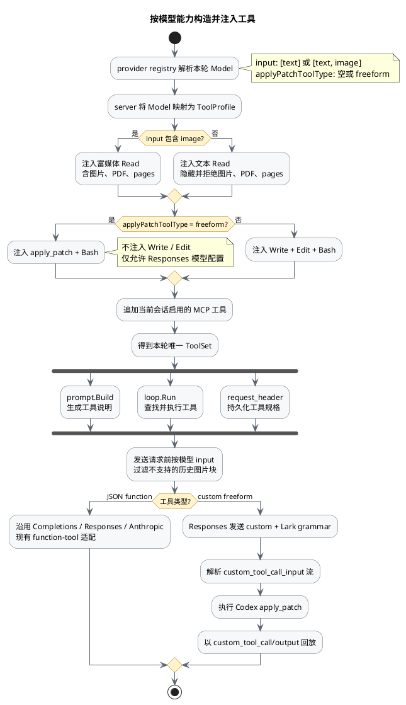

# 按模型能力注入工具

## 目标

根据已解析的模型信息构造模型可见的工具集：

- 仅支持文本输入的模型，其 `Read` 不应声明或提供图片、PDF 读取能力。
- 支持 Codex 补丁工具的 GPT 模型，应注入 `apply_patch`，不再注入 `Write` 和 `Edit`。

不要根据 `gpt-*`、`deepseek-*` 等模型名称硬编码分支，沿用 Codex 的声明式能力字段：

- `input`：继续表示输入模态；包含 `image` 时才启用富媒体 `Read`。
- `applyPatchToolType`：新增可选模型字段，第一阶段只支持 `freeform`，对应 Codex 的 `ApplyPatchToolType::Freeform`。

内置 GPT 模型配置为 `applyPatchToolType: "freeform"`。该字段需要贯穿 `ModelSeed`、模型覆盖、严格校验和 provider API。由于 Completions 和 Anthropic 协议目前无法表达 Codex 的 custom tool，非 Responses 模型配置 `freeform` 时应在模型目录校验阶段直接拒绝。

## 解耦方式

保持依赖方向为 `provider -> server/编排层 -> tools`，`internal/tools` 不直接依赖 `internal/provider`。

`runPrompt` 解析出本轮模型后，由 server 将模型信息映射为一个很小的工具配置，再交给 tools 包构造工具集：

```text
ToolProfile {
    richRead: model.input 包含 "image"
    editor:   apply_patch_freeform | write_edit
}
```

删除无能力语义的 `tools.Set.All()`，只保留 `tools.Set.Build(profile)` 作为内置工具组装入口；MCP 工具仍在其后追加。同一份构造结果同时用于 system prompt、loop 执行和 `request_header` 持久化，避免提示词、可执行工具和记录下来的 schema 不一致。

## 整体流程



`Read` 使用同一个带能力参数的实现，不复制成两个工具：

- 文本模式：schema 只包含 `file_path`、`offset`、`limit`，提示中不出现图片、PDF 和 `pages`；执行时也拒绝图片和 PDF，防止旧上下文或模型幻觉绕过 schema。
- 富媒体模式：保留当前图片结果、PDF 文本提取和 `pages` 参数。

此外，在请求模型前按 `input` 规范化历史消息：目标模型不支持 `image` 时，移除图片块。这一点对齐 Codex，用于兜底旧会话中的图片和可能返回图片的 MCP 工具，但不能代替正确的工具注入。

## 对齐 Codex 的 `apply_patch`

从 `/data/hgy/codex/codex-rs/apply-patch` 移植实现和测试，不要在内部把补丁转换成多次 `Write`/`Edit`。需要保持 Codex 的补丁语言和行为：

- `*** Begin Patch` / `*** End Patch`；
- 新增、删除、更新和移动文件；
- 上下文匹配、错误信息、受影响文件摘要和换行符策略；
- 使用 `filepath` 基于 session cwd 解析路径，保证 Linux、macOS、Windows 一致。

`apply_patch` 是 Responses API 的 grammar-backed `custom` freeform 工具，不是普通 JSON function。为此需要对通用工具链做小范围扩展：

- `loop.ToolSpec` 区分 JSON `function` 和带 grammar 的 `custom` 工具。
- 工具调用同时支持 JSON 参数和原始 freeform 输入。
- Responses 请求按 Codex 格式发送 `type: "custom"` 工具定义及 Lark grammar。
- 流式响应解析 `response.custom_tool_call_input.*` 事件。
- 历史回放使用匹配的 `custom_tool_call` / `custom_tool_call_output`，不能误写成 function call。
- jsonl 保存工具规格和调用类型，保证恢复会话后仍能生成正确的协议形状。
- 现有 Completions、Anthropic、MCP 和普通内置工具继续走 function-tool 路径。

最终的内置工具选择如下：

| 模型能力 | 注入的内置工具 |
|---|---|
| 仅文本，不支持补丁 | 文本 `Read`、`Write`、`Edit`、`Bash` |
| 支持图片，不支持补丁 | 富媒体 `Read`、`Write`、`Edit`、`Bash` |
| 仅文本，支持 freeform 补丁 | 文本 `Read`、`apply_patch`、`Bash` |
| 支持图片和 freeform 补丁 | 富媒体 `Read`、`apply_patch`、`Bash` |

## 实现顺序

1. 扩展模型元数据和校验，为内置 GPT 模型标记 `applyPatchToolType`。
2. 增加 `ToolProfile` 和按能力裁剪的 `Read`，测试上述四种工具组合以及 prompt/schema 一致性。
3. 扩展工具规格、调用 IR、jsonl 和 Responses 适配器，使其支持 custom freeform 工具。
4. 移植 Codex `apply_patch`，复制新增、删除、更新、移动、非法补丁、CRLF 和 Windows 路径等测试用例。
5. 增加 provider wire test 和模型切换 e2e，验证下一轮立即切换 `Read` 能力和编辑工具，且不会泄漏上一模型的工具配置。
6. 更新 `docs/provider.md`、`docs/tools.md`、`internal/provider/doc.go`、`internal/tools/doc.go`，以及模型设置相关的前端类型和表单。

## 验收标准

- DeepSeek V4 Flash 的 `request_header` 和 provider 请求中，`Read` 不含图片/PDF描述及 `pages` 参数。
- 内置 GPT 模型只暴露 `apply_patch`，不暴露且不能执行 `Write`、`Edit`。
- 在文本模型回合伪造或复用富媒体 `Read` 调用时，只返回错误，不产生图片/PDF结果。
- GPT 的 freeform 补丁可以完整经过流式解析、执行、jsonl 持久化、会话恢复，并在下一次 Responses 请求中以配对的 custom call/output 回放。
- 同一会话切换模型后，紧接着的下一轮按照新模型重新构造工具集。
