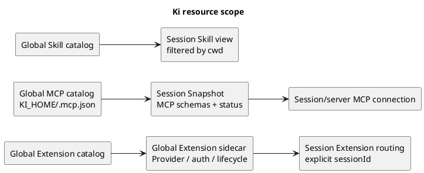

# Extension、MCP 与 Skills 作用域方案

## 目标结论

采用三种不同的作用域，不把发现范围、运行时生命周期和状态存储混成一个概念：

| 内容 | 发现/加载范围 | 运行时或状态范围 |
|---|---|---|
| Extension | 仅全局 `{KI_HOME}/extensions` | Extension sidecar 全局；事件和工具调用按 session 路由 |
| MCP 配置 | 仅全局 `{KI_HOME}/.mcp.json` | MCP connection、工具目录和运行状态按 session/server 隔离 |
| Skills | 全局 + 项目 | 静态 catalog 可复用；每个 session 按 cwd 生成自己的 view |

这个方案解决了 Provider Extension 的生命周期问题，同时保留 MCP 的状态边界和项目级 Skills 能力。

## 设计边界

### 1. Extension 仅全局发现和加载

Extension 只扫描：

```text
{KI_HOME}/extensions/<name>/
```

删除项目目录：

```text
<cwd>/extensions/<name>/
```

具体规则：

- 所有 Extension descriptor 由 server 进程统一发现、校验和管理。
- 普通 Extension sidecar 与 Provider sidecar 都是进程级资源，同一个 Extension 在一个 ki 进程内最多启动一个 sidecar。
- sidecar 可以 lazy start，但 owner 始终是 server，而不是某个 session。
- `KI_SESSION_ID` 和 `KI_CWD` 不再作为 sidecar 的固定身份。每个 session 相关 RPC 必须显式携带目标 session 和必要的 cwd/context。
- `session.*`、`ui.*`、`tools.register` 等能力仍然只能作用于指定 session。全局 Extension 不代表可以跨 session 读写数据。
- Extension 的 prompt、commands、skills 等声明式能力全部视为全局贡献。
- Provider 继续使用全局 sidecar，并通过 `requestId` 关联具体 stream。

Extension manifest 删除 MCP 能力：

- 删除 `mcp` capability。
- 删除 `mcpServers` 字段。
- Extension 不再向全局 MCP 配置贡献 server。

这样 Extension 的全局生命周期与 Provider 一致，MCP 则完全由独立的全局配置入口管理。

### 2. MCP 仅全局发现和加载

MCP 配置只读取：

```text
{KI_HOME}/.mcp.json
```

不再读取或合并：

- `<cwd>/.ki/.mcp.json`
- Extension manifest 中的 `mcpServers`

MCP 的“全局”只表示配置目录和静态配置来源全局，不表示 live connection 全局共享：

- 全局 catalog 保存 server 配置、名称、transport 和静态校验结果。
- 每个 session 根据全局 catalog 建立自己的 MCP connection。
- 每个 `(session, server)` 独立完成握手、`tools/list`、认证、取消、失败处理和关闭。
- `resources.Snapshot` 保存该 session 可见的工具 schema 和 MCP 状态；运行中的 SDK connection 不放进 Snapshot。
- session Reload 或删除时，只关闭该 session 的 MCP connection。

对于 `command` 类型 MCP，配置虽然全局，但启动 server 时仍使用当前 session 的 cwd/context。这样可以保留 MCP 对当前 workspace 文件的访问语义，同时不允许项目通过 `.mcp.json` 注入新的 server 配置。

### 3. Skills 保留全局和项目发现

Skills 继续支持：

- `{KI_HOME}/skills`
- `~/.agents/skills`
- `<cwd>/.ki/skills`
- cwd 到仓库根目录之间的祖先 `.agents/skills`
- 全局 Extension 贡献的 skill roots

推荐的内部模型是：

- 全局目录和 Extension skill roots 建立可复用的静态 catalog。
- 每个 session 根据自己的 cwd 合并项目及祖先目录 Skills。
- 按 skill name 去重，结果固定到该 session 的 Snapshot，直到 Reload。
- Skill 正文仍然按需从文件读取，不创建全局进程或共享连接。

Skills 是静态文件，因此项目级发现不会引入 Extension 或 MCP 那样的生命周期和认证问题。不同 session 的 cwd 不同，得到不同的 Skill view 是预期行为。

## MCP 是否仍需要 session 隔离

需要，但这是 Ki 的应用层隔离策略，不是 MCP 协议强制要求“一个宿主 session 必须对应一个 MCP session”。MCP 既支持传统的有状态 Streamable HTTP session，也支持新版本的无协议 session 模式；无协议 session 只表示服务端不能依赖连接上的隐式状态，业务状态仍可能存在。

对 Ki 而言，默认 session 隔离仍有必要：

- 不同 session 可能有不同 cwd、资源 Snapshot、认证上下文和权限。
- stdio MCP 的子进程、stdin/stdout、环境变量和工作目录需要明确 owner。
- abort 只能取消发起调用的 session，不能影响其他 session。
- 工具列表、认证结果、订阅和失败状态不能跨 session 串联。
- MCP server 可能在业务层保存浏览器上下文、数据库事务、Task 或其他外部状态。
- Reload 和删除 session 时，需要精确释放对应资源。

未来可以为明确声明为无状态的 HTTP MCP 增加全局连接池，但必须是 opt-in 优化，不能改变默认隔离策略。初期不共享：

- stdio MCP
- OAuth 或用户凭据相关 MCP
- 访问 workspace 文件的 MCP
- 使用资源订阅、server-to-client 请求或长生命周期 Task 的 MCP

参考：[MCP 2025-11-25 Transports](https://modelcontextprotocol.io/specification/2025-11-25/basic/transports)、[MCP Draft Transports](https://modelcontextprotocol.io/specification/draft/basic/transports)、[MCP Stateful Tools](https://modelcontextprotocol.io/specification/draft/server/tools#stateful-tools)。

## 目标架构



## 实现改造项

### Extension

- `internal/extension/manifest.go`：只保留 home discovery；移除 project override。
- `internal/extension/merge.go`：移除 Extension MCP merge；保留全局 prompt、commands、skills merge。
- `internal/extension/manager.go`：从 `sessionID -> sidecar` 改为 `extensionName -> sidecar`，增加显式 session 路由。
- `internal/extension/host.go`：所有 session 相关 inbound 调用必须从参数中取得目标 session，不依赖 sidecar 环境变量。
- `internal/server/server.go`：持有全局 Extension Manager；不在删除或 Reload 单个 session 时关闭 Extension sidecar。
- ProviderManager 可以先保持独立的类型化实现，之后再和全局 Extension Manager 合并生命周期基础设施。

### MCP

- `internal/mcp/mcp.go`：`Load` 只读取 `{KI_HOME}/.mcp.json`。
- `internal/mcp/manager.go`：保持 `sessionID -> server -> connection` 的所有权模型。
- 移除 Extension MCP 配置转换、命名空间和相关 merge 逻辑。
- `internal/resources/loader.go`：MCP 静态配置来源改为全局；MCP 状态和工具 schema 仍写入 session Snapshot。
- `internal/server/runtime.go`：session warmup 并行准备 MCP 与全局 Extension 的 session view；Extension sidecar 由 server 级 Manager 管理和复用。

### Skills、WebUI 与状态

- `internal/skills`：保留 home、project、ancestor 扫描；可把全局目录扫描结果抽成 catalog，项目目录继续按 cwd 过滤。
- Extension 设置改为全局，不再使用 workspace scope。
- MCP 设置只管理全局 `.mcp.json` 和 toggle；不再展示项目 MCP 配置入口。
- `availableExtensions` 对所有 session 一致。
- `availableSkills` 仍然按 session cwd 计算。
- `availableMcp` 的配置来源一致，但 server 状态、工具 schema 和连接状态按 session 展示。
- `runtime.ready` 表示当前 session 的 MCP 与 Extension view 都已准备完成；它不代表全局 sidecar 的独立生命周期。若后续需要展示全局扩展启动状态，应增加独立的 server-level readiness，而不是复用该字段。

## 破坏性变化

这是有意的配置边界收缩，不考虑旧行为兼容：

- `<cwd>/extensions` 不再生效。
- `<cwd>/.ki/.mcp.json` 不再生效。
- Extension 中的 `mcpServers` 不再生效，应在 manifest 校验阶段报错或明确忽略。
- 项目不能通过 Extension 分发 MCP server。
- 项目仍可直接分发 Skills，但不能通过项目 Extension 分发其他代码能力。

文档和错误提示需要明确迁移路径：全局 Extension 放到 `{KI_HOME}/extensions`，全局 MCP 放到 `{KI_HOME}/.mcp.json`，项目级知识和流程放到 `.ki/skills` 或 `.agents/skills`。

## 验收标准

- 同一 ki 进程内多个 session 只发现同一套 Extension，Provider 和普通 Extension sidecar 各自最多启动一份。
- Extension lifecycle、UI、工具和 session inbound 调用不会串 session。
- MCP 只来自 `{KI_HOME}/.mcp.json`，Extension 和项目 `.mcp.json` 都不会贡献 server。
- 同一 MCP server 在不同 session 中的连接、认证、工具 schema、失败状态、abort 和 Reload 相互隔离。
- Skills 会合并全局与当前 cwd 可见的项目资源，不同 cwd 的 session 可以拥有不同 Skill view。
- 删除一个 session 不会关闭其他 session 的 MCP connection，也不会关闭全局 Extension sidecar。
