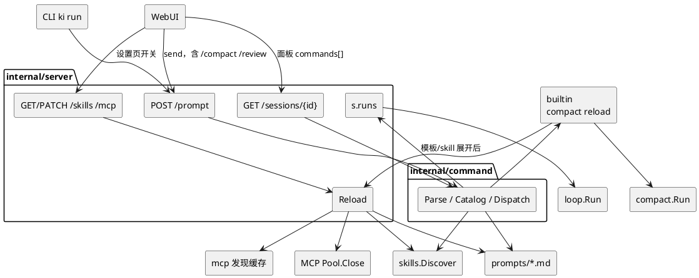

# Slash Commands

| 字段 | 值 |
|---|---|
| 作者 | ki |
| 日期 | 2026-08-21 |
| 状态 | Draft |

## Overview

pi 的很多 slash 是 **TUI 没有按钮** 才存在的（`/model` `/name` `/help` `/new` `/session`）。ki 的一等客户端是 **WebUI**：选模型、改标题、新会话、看 cwd，都已经有控件。这些 **不要做成 slash**。

Slash 只做 WebUI **没有对应控件** 的事：

| 层 | 做什么 | 例子 |
|---|---|---|
| builtin | 没有按钮的操作 | `/compact` `/reload` |
| skill | 把某个 SKILL.md 当本轮用户消息 | `/skill:review` |
| prompt | 磁盘模板展开成本轮用户消息 | `/review staged` |

执行一律 `POST /v1/sessions/{id}/prompt`，**server 解析**。不新增执行用的 `/v1/command`。

面板（点按钮或行首 `/`）要列出可用命令，**含已启用的 skill**。目录和执行共用 `command.Catalog`，挂在 **`GET /v1/sessions/{id}` 的 `commands[]`**。不新开 `GET /v1/commands`。

Skills / MCP 的启用 **不再按 session**。设置里 **Skills、MCP 各一页**。会话 tab 改成 **Info**（只读：skills、MCP 及工具、slash 命令）+ **Reload** + **Edit**（打开全局设置）。`.mcp.json` 也按 session 缓存，不能每条消息读盘。

## 为什么不抄 pi 的 UI 命令

| pi TUI | ki 已有 | 结论 |
|---|---|---|
| `/model` | composer 模型芯片 + 选择器 | 不要 |
| `/name` | 侧栏重命名 | 不要 |
| `/help` | 命令面板本身就是目录 | 不要 |
| `/session` | 配置页 cwd / 模型 / id | 不要 |
| `/new` | 侧栏「新会话」 | 不要 |
| `/fork` `/tree` `/copy` | 气泡 fork、分支条、copy | 不要 |
| `/settings` `/login` `/quit` `/hotkeys` | 设置页 / 无 TUI | 不要 |
| `/compact` | **没有**按钮（只有 `ki session compact`） | **要** |
| `/reload` | **没有**按钮 | **要** |
| 模板 / `/skill:name` | **没有**入口 | **要** |

## 为什么不单独做 command 接口

模板和 skill 展开后就是一条 prompt。WebUI `send()` 和 `ki run /review` 都应打同一个 `POST /prompt`。再做一个 `/v1/command` 等于让两端都分流。

- builtin 做完 → **200** `{handled, notice}`，不开 SSE、不画气泡
- 模板 / skill / 普通文本 → **202**，现有 run + SSE

`POST /v1/sessions/{id}/compact` 留给 `ki session compact`，和 `/compact` **同一函数**。

## Skills / MCP：从 session 拿到全局设置

现在每个 session 的 `config.json` 有 `skills` / `mcp` Toggle，配置页勾选 `PATCH /v1/sessions/{id}`。同一工作区开两个会话要勾两遍，slash 目录还得跟 session Toggle 对齐，复杂且容易漏。

**改成全局一份开关**，所有 session 共用。发现规则不变（磁盘上的 skill 包、`.mcp.json` 仍按 home + 当前 cwd 算），只是「开不开」不再存在会话里。

### 存哪

`{KI_HOME}/toggles.json`（和 `models.json` 一样由 UI 写，不进 `ki.toml`）：

```json
{ "skills": { "disabled": ["foo"] }, "mcp": { "disabled": ["bar"] } }
```

只要 `disabled`。去掉 session 用过的 `only`（WebUI 本来就没暴露）。不读旧 `config.json` 里的 skills/mcp（不做兼容）。

PATCH 开关后 `Reload()`（见下，**所有 session** 的发现缓存都清）。

### 列表用哪个 cwd

发现仍依赖 cwd（`<cwd>/.ki/skills`、项目 `.mcp.json`）。设置页用 **侧栏当前工作区** 的 path 当 cwd；没有选工作区则只扫全局（`KI_HOME/skills`、`~/.agents/skills`、`KI_HOME/.mcp.json`）。

名字存在全局 disabled 里：在任何 session 都关。

### HTTP

这不是 loop 里已有的数据，从 session 上撕下来需要自己的读写口：

| 方法 | 路径 | |
|---|---|---|
| GET | `/v1/skills?workspaceId=` | 发现列表 + `enabled`（按全局 disabled）。`workspaceId` 可选 |
| PATCH | `/v1/skills` | `{disabled:["foo"]}` 写 `toggles.json` 的 skills，然后 Reload |
| GET | `/v1/mcp?workspaceId=` | 同上，不 spawn |
| PATCH | `/v1/mcp` | `{disabled:["bar"]}` |

GET/PATCH session **不再写 Toggle**。prompt.Build / mcp.Bind 读全局 Toggle。GET session **仍带只读目录**（Info 页）：skills、mcp（含已缓存 tools）、`commands[]`。

### 发现缓存

键一律 `home + cwd + sessionID`。skills、AGENTS.md 已经如此。**`.mcp.json` 也改成这样**：同 session 后续 prompt 不再读盘；新 session 会再读。连接 / tools schema 仍是 serve 级池。

### `Reload()`：对，所有 session

现在就是 `InvalidateAll`：整个进程的 skills / AGENTS 缓存丢掉，下次 Discover 才扫盘。正在跑的一轮仍用已 Bind 的 tools。

改成同一入口再清：模板缓存、`.mcp.json` 发现缓存，并 `Pool.Close`。Info / 设置 / `/reload` / 压缩成功 / PATCH 开关都走它。没有「只 reload 当前 session」。

### WebUI

会话 tab 改成 **Info**（只读）：元数据、skills、MCP（含已缓存工具）、slash `commands[]`。**没有启用开关。**

- **Reload**：`POST /v1/reload` 再 GET（清全进程缓存）
- **Edit**：打开设置（Skills 或 MCP 页签）

设置四个页签：供应商、**Skills**、**MCP**、主题和语言。各页也有 Reload。开关只在设置里。

## 命令

### builtin

| 命令 | 忙时 | 行为 |
|---|---|---|
| `/compact` | **否** | 占 `s.runs` 全程压缩；release 后再 200；WebUI GET 刷树 |
| `/reload` | 允许 | `Server.Reload()`：清 **所有 session** 的 skills / AGENTS / 模板 / `.mcp.json` 缓存，并关掉 MCP 连接池 |

### skill

`/skill:<name> [args]`：当前 session 发现到且 Toggle 允许的 skill。正文（去 frontmatter）包成 `<skill name location>`，后面跟上用户参数，当 user 消息进 loop（202）。未知 → 200 错误，不进模型。

### prompt 模板

pi 全量发现还有 package、`settings.prompts`、`--prompt-template`、project trust。ki **只映射两个默认目录**（没有包管理器和 trust）：

| ki | pi |
|---|---|
| `{KI_HOME}/prompts/*.md` | `~/.pi/agent/prompts`（ki home 即 `~/.ki`，无 `agent/`） |
| `<cwd>/.ki/prompts/*.md` | `<cwd>/.pi/prompts` |

非递归 `*.md`；文件名 = `/review`。frontmatter：`description`、`argument-hint`；否则第一行非空当 description。替换与 pi 相同：`$1` `$2` `$@` `$ARGUMENTS` `${1:-default}` `${@:N}`。

同名：**项目覆盖全局**（有意不同于 pi 的 first-wins）。与 builtin 同名的模板丢掉。展开写入 jsonl 再 loop。`/reload` 后重读盘。

## 模块关系



WebUI 和 CLI 都只打 prompt。设置页打 `/v1/skills` `/v1/mcp`。Info 只读 GET session。Reload 清全部 session 缓存。

```plantuml
@startuml
skinparam componentStyle rectangle

[KI_HOME/prompts/*.md] as GP
[cwd/.ki/prompts/*.md] as PP
[SKILL.md 发现] as GS
[command.Catalog] as C

GP --> C
PP --> C : 同名项目覆盖
GS --> C : 启用的才进面板，名字 skill:foo
[toggles.json] as TG
TG --> C
C --> [GET session.commands[]] : 面板
C --> [POST /prompt] : 执行
@enduml
```

## 解析（只在 server）

从 content 拼纯文本。命令带附件 → 400。

```
trim 后
 ├─ 不以 / 开头                      → 普通 prompt 202
 ├─ /^\/skill:([^\s]+)(?:\s+(.*))?$/ → skill
 ├─ /^\/([A-Za-z][\w-]*)(?:\s+(.*))?$/
 │     ├─ compact / reload           → builtin
 │     ├─ 模板名                     → 展开 202
 │     └─ 其它（help、model、name…） → 200 错误「未知命令」
 └─ /usr/bin 这类                    → 普通 prompt 202
```

先 Parse 再谈 409：`/reload` 忙时也能跑；`/compact` 和模板/skill 忙则 409。

`/compact`：open（404）→ occupy → `compact.Run(r.Context())` → **release 后** 200。取消 409 `compact aborted`。太小 409。不 abort-then-compact。

## 面板用哪条接口

人体工学：命令按钮，或输入框**第一个字符是 `/`**，弹出列表（过滤、↑↓ Enter Esc）。列表必须和 server 能执行的集合一致，包括 `/skill:foo`。

**不加 `GET /v1/commands`。** 发现已经按 session 的 home/cwd/Toggle 算（和 `availableSkills` 同一套）。继续挂在 `GET /v1/sessions/{id}`：

```json
"commands": [
  {"name": "compact", "description": "…", "source": "builtin"},
  {"name": "reload", "description": "…", "source": "builtin"},
  {"name": "review", "description": "…", "argumentHint": "[diff]", "source": "prompt"},
  {"name": "skill:docx", "description": "…", "source": "skill"}
]
```

| 做法 | 为什么否 / 是 |
|---|---|
| 前端用 GET 的 skills 列表拼 `/skill:name` | 漏模板；Info 要显示停用项，面板只能列启用的 |
| `GET /v1/commands` | 和 GET session 重复发现 cwd/Toggle。违反「能挂现有 session 资源就不要新路由」 |
| `commands[]` 来自 **同一个** `command.Catalog` | 面板和 `POST /prompt` 的 Parse 看到同一张表 |

设置页 `/v1/skills` 含停用项以便开关。Info 的 skills/mcp 是只读全表。面板 `commands[]` 只有启用的 skill。

**无 session**（hero）：skill/项目模板依赖 cwd。不新开 workspace 级命令 API。打开面板时若没有 `currentId`，用当前工作区走已有 `POST /v1/sessions`（和第一次发消息一样），再 GET。浏览一下会留下空 session，可接受。

打开会话时 GET 已带 `commands[]`，放进 view。`/reload` 成功后再 GET 一次。输入 `/rev` 只在本地过滤 `name` + description，不打搜索接口。

## WebUI

- cwd 芯片去掉（保留 `basename` 给附件）。换成命令按钮。
- 会话 tab = **Info**（skills / MCP+tools / slash，只读）+ Reload + Edit。开关只在设置里。
- **按钮**或**空输入框敲 `/`**：打开面板，数据 = 当前 session 的 `commands[]`（含已启用的 `skill:…`）。锚点：命令按钮。键盘抄 `Select.tsx`。
- 选中一行：写入 `/name `（模板可带 argumentHint）并可以马上 send。一律 `POST /prompt`。
- 200 → notice，不 listen、不画气泡。202 → 现逻辑。
- 忙时 slash Enter 不走 Stop；Stop 按钮仍 abort。

## CLI

server 解析，所以：

```bash
ki run --session <id> /compact
ki run --session <id> /reload
ki run --session <id> /review staged
ki run --session <id> /skill:docx
```

已有短命令，不必为 slash 再加一套：

```bash
ki session compact --session <id>
ki reload    # 无 session：POST /v1/reload，只连活 daemon
```

不要 `ki session name` / `ki run /model` 当功能入口（WebUI 已有）。

## API

| 接口 | 变更 |
|---|---|
| `POST /v1/sessions/{id}/prompt` | 先 Parse。200 handled / 202 run / 409 |
| `GET /v1/sessions/{id}` | Info：只读 skills、mcp（`tools[]` 来自 schema 缓存，不 spawn）、`commands[]`。不 PATCH Toggle |
| GET/PATCH | `/v1/skills`、`/v1/mcp` | 全局开关 |
| `POST /v1/sessions/{id}/compact` | 与 `/compact` 同一占槽实现 |
| `POST /v1/reload` | **所有 session** 清发现缓存 + 关 MCP 池。Info/设置按钮、`/reload`、`ki reload` 都走它 |

无新 `loop.Event`。未知 `/foo` 不进模型。

## 备选（已否）

- 单独 `POST /v1/command` 执行、单独 `GET /v1/commands` 列目录：执行和列目录都能挂现有 session。否。
- 前端用 session `availableSkills` 拼 skill 命令。否。
- skills/MCP 继续按 session Toggle：两个会话两套勾选。否。改为 `toggles.json` + 设置页。
- `/model` `/name` `/help` `/new` `/session` 做 slash：和已有 WebUI 重复，还会逼出「前端截住弹窗」。否。
- 搬 pi 的 package / settings.prompts / trust。否。
- loop 里 parse。否。
- JS `registerCommand`。否。自定义就是模板 + skill。
- pi abort-then-compact。否（双写 jsonl）。

## Key Decisions

1. **Slash 不是 TUI 菜单的翻版。** 只保留没有现成控件的操作 + 模板/skill。
2. **执行入口 `POST /prompt`**。列目录挂 GET session `commands[]`。不新开 `/v1/commands`。
3. **Skills、MCP 启用全局**（`toggles.json`），设置里各一页。会话 tab 是 Info + Reload + Edit。
4. **`.mcp.json` 与 skills/AGENTS 一样按 session 缓存。** `Reload()` 是进程级 `InvalidateAll`，对**所有 session** 生效，并关掉 MCP 连接池。新 session 仍会自己扫一遍盘。
5. **`internal/command`**：Parse / Catalog / Dispatch。builtin 只有 compact、reload。
6. **模板 = pi 两个默认目录映射到 KI_HOME / `.ki`。** 项目覆盖全局。
7. **200 / 202** 区分操作和开跑。`/compact` 占槽全程。

## PR Plan

### PR 0 — 全局开关 + MCP session 缓存 + Info 页

- `{KI_HOME}/toggles.json`；GET/PATCH `/v1/skills`、`/v1/mcp`
- session `config.json` 去掉 Toggle；PATCH session 不再收 skills/mcp
- `mcp.Load` session 缓存（同 skills 键）；`Reload()` = InvalidateAll（skills/AGENTS/mcp 发现）+ `Pool.Close`
- GET session 只读 skills、mcp+tools、（稍后 commands）
- 会话 tab → Info + Reload + Edit；设置 **Skills**、**MCP** 各一页，也有 Reload
- Playwright：Info 无开关；Edit 进设置；Reload
- `docs/session.md`、`docs/webui.md`、各 `doc.go`

### PR 1 — command 包 + compact/reload + 改 prompt

- `internal/command`：Parse、两枚 builtin、Dispatch
- `server.prompt` 先 Parse；compact 占槽；GET session 带 `commands[]`（先只有 builtin）
- `POST /v1/reload` 给无 session 的 `ki reload`
- 文档：`architecture.md`、`server/doc.go`、`command/doc.go`

### PR 2 — 模板 + `/skill:name`

- `{KI_HOME}/prompts`、`<cwd>/.ki/prompts`；项目覆盖
- Catalog 合并；展开进 `runPrompt`；`/reload` 清缓存
- 测试：`ki run /review` 假模型吃到展开文本；未知 `/name` 200 不进模型

### PR 3 — WebUI 面板

- 去 cwd 芯片；按钮和行首 `/` 打开面板（`commands[]`，含 skill）
- send 全走 prompt；200 notice；忙时 Enter 不 abort
- Playwright：按钮/首位 `/` 列出 compact、reload、模板、`skill:…`；过滤；`/compact` 出 compaction 节点（spawn 前 `keep_recent_tokens = 1`）；未知 `/model` 是错误 notice 不是弹窗
- `docs/webui.md`；编 `web/dist` 再 `go build`
